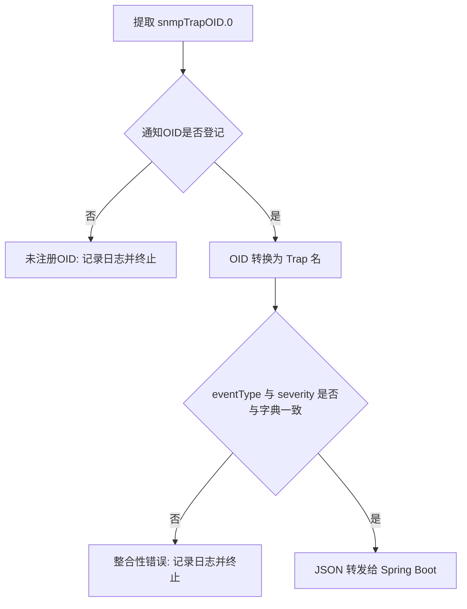

# Trap 名称转换与一致性校验

字典里既有 Trap 名，也有"期望值"，这一章看它们究竟怎样共同防止数据被篡改或误配置。

## 核心要点

* 转换的第一优先级是数值 snmpTrapOID.0，而不是报文里携带的 eventType 字段——不会用 eventType 反推 Trap 名。
* 如果通知 OID 根本没有在字典中登记，会被当作 unknownTrap，直接终止转发并输出"Trap 名转换失败"到标准错误。
* 如果 OID 已登记，但报文里实际的 eventType、severity 和字典中的"期望值"不一致，也会终止转发，因为这可能意味着数据被篡改或发送端实现有误。
* 这种双重校验（OID 是否已知 + 内容是否一致）保证了最终写入数据库的每一条记录，其 OID、名字、类型三者之间是自洽的。

---

## 本章测验

本章共 5 道单项选择题。

### 第 1 题

转换 Trap 名的时候，脚本以什么作为第一优先级的判断依据？

- A. 报文里的 eventType 字段
- B. 接收到的数值 snmpTrapOID.0
- C. message 字段的内容
- D. 设备的 IP 地址

选择答案后查看结果

正确答案：B

答案解析：设计文档明确规定转换优先级以收到的 snmpTrapOID.0 数值为第一key，不会用 eventType 反推 Trap 名，避免逻辑倒置带来的安全隐患。

### 第 2 题

如果收到的通知 OID 没有在字典中注册，会发生什么？

- A. 自动当作 NORMAL 事件处理
- B. 自动写入一条新的字典记录
- C. 转发给 Spring Boot 让它自己判断
- D. 被视为未注册 OID，终止转发并记录"Trap名变换失敗"

选择答案后查看结果

正确答案：D

答案解析：未登记的通知 OID 会被当作 unknownTrap，脚本不会转发，而是把"Trap名変換失敗"输出到标准错误。

### 第 3 题

报文中的 eventType、severity 与字典中的期望值不一致，可能意味着什么？

- A. 说明 Oracle 数据库出现故障
- B. 可能是数据被篡改，或发送端实现与字典不一致
- C. 只是无关紧要的格式差异，可以忽略
- D. 说明 snmptrapd 版本过旧

选择答案后查看结果

正确答案：B

答案解析：设计文档把这种不一致定性为"改ざんまたは送信実装不整合"（篡改或发送实现不一致），因此选择终止转发而不是继续处理。

### 第 4 题

为什么校验逻辑不直接信任报文里携带的 eventType 字段来确定 Trap 名？

- A. 因为 eventType 是可被篡改或拼写错误的自由文本，OID 才是权威标识
- B. 因为 eventType 字段在协议中是可选的
- C. 因为 eventType 字段本身格式复杂难以解析
- D. 因为 eventType 只在 Java 代码里才存在

选择答案后查看结果

正确答案：A

答案解析：eventType 是报文中携带的字符串数据，理论上可以被篡改或写错；而 snmpTrapOID.0 是协议层面的通知标识，字典把它作为权威依据，再用 eventType 做一次交叉核对而非反向依赖。

### 第 5 题

综合来看，本章描述的两层校验分别防止了什么问题？

- A. 分别防止浏览器渲染错误和 CSS 加载失败
- B. 分别防止 Oracle 主键冲突和字符集错误
- C. 分别防止 UDP 丢包和 TCP 超时
- D. 分别防止未知类型的通知被误处理、以及内容与声明类型不符的数据被静默接受

选择答案后查看结果

正确答案：D

答案解析：第一层（未注册 OID 校验）防止处理完全未知的通知类型；第二层（一致性校验）防止已知类型但内容与期望不符的数据被悄悄接受，两者共同保证数据的可信度。

<!-- QUIZ_DATA_START
{
  "chapter": "12",
  "questions": [
    {
      "id": 1,
      "question": "转换 Trap 名的时候，脚本以什么作为第一优先级的判断依据？",
      "options": {
        "B": "接收到的数值 snmpTrapOID.0",
        "A": "报文里的 eventType 字段",
        "C": "message 字段的内容",
        "D": "设备的 IP 地址"
      },
      "answer": "B",
      "explanation": "设计文档明确规定转换优先级以收到的 snmpTrapOID.0 数值为第一key，不会用 eventType 反推 Trap 名，避免逻辑倒置带来的安全隐患。"
    },
    {
      "id": 2,
      "question": "如果收到的通知 OID 没有在字典中注册，会发生什么？",
      "options": {
        "D": "被视为未注册 OID，终止转发并记录\"Trap名变换失敗\"",
        "A": "自动当作 NORMAL 事件处理",
        "B": "自动写入一条新的字典记录",
        "C": "转发给 Spring Boot 让它自己判断"
      },
      "answer": "D",
      "explanation": "未登记的通知 OID 会被当作 unknownTrap，脚本不会转发，而是把\"Trap名変換失敗\"输出到标准错误。"
    },
    {
      "id": 3,
      "question": "报文中的 eventType、severity 与字典中的期望值不一致，可能意味着什么？",
      "options": {
        "B": "可能是数据被篡改，或发送端实现与字典不一致",
        "A": "说明 Oracle 数据库出现故障",
        "C": "只是无关紧要的格式差异，可以忽略",
        "D": "说明 snmptrapd 版本过旧"
      },
      "answer": "B",
      "explanation": "设计文档把这种不一致定性为\"改ざんまたは送信実装不整合\"（篡改或发送实现不一致），因此选择终止转发而不是继续处理。"
    },
    {
      "id": 4,
      "question": "为什么校验逻辑不直接信任报文里携带的 eventType 字段来确定 Trap 名？",
      "options": {
        "A": "因为 eventType 是可被篡改或拼写错误的自由文本，OID 才是权威标识",
        "B": "因为 eventType 字段在协议中是可选的",
        "C": "因为 eventType 字段本身格式复杂难以解析",
        "D": "因为 eventType 只在 Java 代码里才存在"
      },
      "answer": "A",
      "explanation": "eventType 是报文中携带的字符串数据，理论上可以被篡改或写错；而 snmpTrapOID.0 是协议层面的通知标识，字典把它作为权威依据，再用 eventType 做一次交叉核对而非反向依赖。"
    },
    {
      "id": 5,
      "question": "综合来看，本章描述的两层校验分别防止了什么问题？",
      "options": {
        "D": "分别防止未知类型的通知被误处理、以及内容与声明类型不符的数据被静默接受",
        "A": "分别防止浏览器渲染错误和 CSS 加载失败",
        "B": "分别防止 Oracle 主键冲突和字符集错误",
        "C": "分别防止 UDP 丢包和 TCP 超时"
      },
      "answer": "D",
      "explanation": "第一层（未注册 OID 校验）防止处理完全未知的通知类型；第二层（一致性校验）防止已知类型但内容与期望不符的数据被悄悄接受，两者共同保证数据的可信度。"
    }
  ]
}
QUIZ_DATA_END -->
