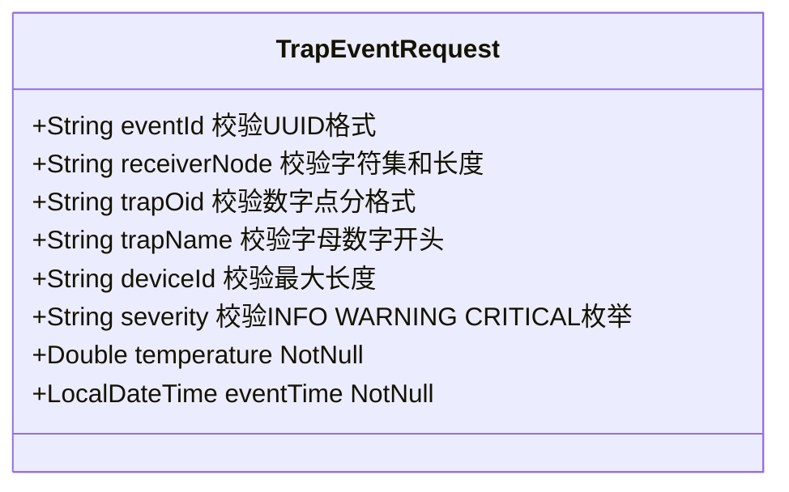

# 12. TrapEventRequest：输入校验DTO

进入Spring Boot的每一条Trap数据，首先要通过TrapEventRequest这个record的Bean Validation注解层层把关。

## 核心要点

* eventId用正则强制要求标准UUID格式(8-4-4-4-12的十六进制分组)
* trapOid用正则要求必须是数字加点号的合法OID格式，且最大长度128
* severity用正则限制只能是INFO、WARNING、CRITICAL三个枚举值之一，和字典文件里的约束保持一致
* 所有字符串字段都同时使用@NotBlank和@Size/@Pattern，防止空值、超长值和格式错误的值进入系统
* 校验失败会被ApiExceptionHandler捕获，统一返回400和具体出错字段名，而不是暴露底层堆栈信息

---

## 本章测验

本章共 5 道单项选择题。

### 第 1 题

TrapEventRequest对eventId字段使用了什么样的校验规则？

- A. 只允许纯数字
- B. 不做任何校验
- C. 只要求非空，不限制格式
- D. 用正则要求必须是标准的8-4-4-4-12格式UUID

选择答案后查看结果

正确答案：D

答案解析：代码里的Pattern正则是^[0-9a-fA-F]{8}-[0-9a-fA-F]{4}-[0-9a-fA-F]{4}-[0-9a-fA-F]{4}-[0-9a-fA-F]{12}$，严格匹配标准UUID的分段格式。

### 第 2 题

severity字段的校验规则是什么？

- A. 用正则限制只能是INFO、WARNING、CRITICAL三者之一
- B. 只允许小写字母
- C. 必须是纯数字
- D. 允许任意字符串

选择答案后查看结果

正确答案：A

答案解析：Pattern正则是^(INFO|WARNING|CRITICAL)$，这和trap-definitions.tsv字典文件里定义的severity取值范围完全一致，保证前后端和shell脚本对severity的理解统一。

### 第 3 题

temperature字段为什么用@NotNull而不是@NotBlank？

- A. 两者完全等价，可以互换
- B. temperature是Double数值类型，@NotBlank只能用于字符串类型，数值类型只能用@NotNull判断非空
- C. @NotNull的校验效果比@NotBlank弱
- D. 这是代码笔误，本应使用@NotBlank

选择答案后查看结果

正确答案：B

答案解析：@NotBlank要求参数实现CharSequence接口并检查去除空白后的长度，Double是数值类型不适用；@NotNull只判断引用是否为null，适合温度这类数值字段。

### 第 4 题

如果一条Trap数据的trapName字段不满足Bean Validation的Pattern规则，会发生什么？

- A. 直接导致应用崩溃重启
- B. Spring会自动修正成合法值后继续处理
- C. 抛出MethodArgumentNotValidException，被ApiExceptionHandler捕获并返回400和出错字段名
- D. 数据会被静默丢弃，不返回任何响应

选择答案后查看结果

正确答案：C

答案解析：Controller方法参数上有@Valid注解，校验失败会抛出MethodArgumentNotValidException，ApiExceptionHandler里专门处理这个异常，返回400状态码及具体是哪个字段出错。

### 第 5 题

DTO层的这些格式校验和上游forward-trap.sh脚本里的格式校验是什么关系？

- A. DTO层校验会覆盖并禁用shell层的校验
- B. 两者校验的字段完全不同，没有重叠
- C. 完全重复，其中一层是多余的
- D. 是纵深防御的两层独立校验，即使shell脚本出现漏检或被绕过，Spring Boot这一层依然能拦截非法数据

选择答案后查看结果

正确答案：D

答案解析：forward-trap.sh在shell层做了一轮格式和字典一致性校验，TrapEventRequest在Java层又独立做了一轮Bean Validation，这是典型的纵深防御思路，任何一层被绕过或存在疏漏，另一层依然能兜底拦截。

<!-- QUIZ_DATA_START
{
  "chapter": "12",
  "questions": [
    {
      "id": 1,
      "question": "TrapEventRequest对eventId字段使用了什么样的校验规则？",
      "options": {
        "A": "只允许纯数字",
        "B": "不做任何校验",
        "C": "只要求非空，不限制格式",
        "D": "用正则要求必须是标准的8-4-4-4-12格式UUID"
      },
      "answer": "D",
      "explanation": "代码里的Pattern正则是^[0-9a-fA-F]{8}-[0-9a-fA-F]{4}-[0-9a-fA-F]{4}-[0-9a-fA-F]{4}-[0-9a-fA-F]{12}$，严格匹配标准UUID的分段格式。"
    },
    {
      "id": 2,
      "question": "severity字段的校验规则是什么？",
      "options": {
        "A": "用正则限制只能是INFO、WARNING、CRITICAL三者之一",
        "B": "只允许小写字母",
        "C": "必须是纯数字",
        "D": "允许任意字符串"
      },
      "answer": "A",
      "explanation": "Pattern正则是^(INFO|WARNING|CRITICAL)$，这和trap-definitions.tsv字典文件里定义的severity取值范围完全一致，保证前后端和shell脚本对severity的理解统一。"
    },
    {
      "id": 3,
      "question": "temperature字段为什么用@NotNull而不是@NotBlank？",
      "options": {
        "A": "两者完全等价，可以互换",
        "B": "temperature是Double数值类型，@NotBlank只能用于字符串类型，数值类型只能用@NotNull判断非空",
        "C": "@NotNull的校验效果比@NotBlank弱",
        "D": "这是代码笔误，本应使用@NotBlank"
      },
      "answer": "B",
      "explanation": "@NotBlank要求参数实现CharSequence接口并检查去除空白后的长度，Double是数值类型不适用；@NotNull只判断引用是否为null，适合温度这类数值字段。"
    },
    {
      "id": 4,
      "question": "如果一条Trap数据的trapName字段不满足Bean Validation的Pattern规则，会发生什么？",
      "options": {
        "A": "直接导致应用崩溃重启",
        "B": "Spring会自动修正成合法值后继续处理",
        "C": "抛出MethodArgumentNotValidException，被ApiExceptionHandler捕获并返回400和出错字段名",
        "D": "数据会被静默丢弃，不返回任何响应"
      },
      "answer": "C",
      "explanation": "Controller方法参数上有@Valid注解，校验失败会抛出MethodArgumentNotValidException，ApiExceptionHandler里专门处理这个异常，返回400状态码及具体是哪个字段出错。"
    },
    {
      "id": 5,
      "question": "DTO层的这些格式校验和上游forward-trap.sh脚本里的格式校验是什么关系？",
      "options": {
        "A": "DTO层校验会覆盖并禁用shell层的校验",
        "B": "两者校验的字段完全不同，没有重叠",
        "C": "完全重复，其中一层是多余的",
        "D": "是纵深防御的两层独立校验，即使shell脚本出现漏检或被绕过，Spring Boot这一层依然能拦截非法数据"
      },
      "answer": "D",
      "explanation": "forward-trap.sh在shell层做了一轮格式和字典一致性校验，TrapEventRequest在Java层又独立做了一轮Bean Validation，这是典型的纵深防御思路，任何一层被绕过或存在疏漏，另一层依然能兜底拦截。"
    }
  ]
}
QUIZ_DATA_END -->
