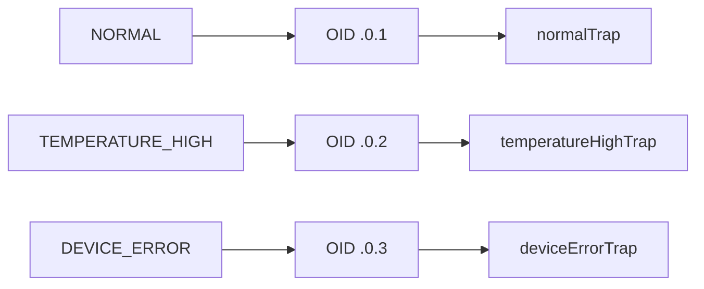

# 12 三种业务事件类型详解

整个演示只覆盖三类事件，本章把它们的 OID、Trap 名称和业务含义对照清楚。

## 核心要点

* 三类事件的通知 OID 分别是 1.3.6.1.4.1.99999.0.1（NORMAL）、.0.2（TEMPERATURE_HIGH）、.0.3（DEVICE_ERROR）。
* 每个通知 OID 都对应一个唯一的 MIB Trap 名称：normalTrap、temperatureHighTrap、deviceErrorTrap，三者一一对应，不会混用。
* 命令行触发方式分别是 normal、temperature-high、device-error 三个参数，对应 IoT Simulator 的运行入口。
* 每种事件在 Trap 定义辞书里还绑定了期望的 eventType 和 severity，例如 TEMPERATURE_HIGH 对应严重程度 WARNING，DEVICE_ERROR 对应 CRITICAL。

## 关键信息

| 事件 | 通知 OID | Trap 名 | 期望 severity |
| --- | --- | --- | --- |
| NORMAL | 1.3.6.1.4.1.99999.0.1 | normalTrap | INFO |
| TEMPERATURE_HIGH | 1.3.6.1.4.1.99999.0.2 | temperatureHighTrap | WARNING |
| DEVICE_ERROR | 1.3.6.1.4.1.99999.0.3 | deviceErrorTrap | CRITICAL |

---

## 本章测验

本章共 5 道单项选择题。

### 第 1 题

事件 TEMPERATURE_HIGH 对应的通知 OID 是什么？

- A. 1.3.6.1.4.1.99999.0.1
- B. 1.3.6.1.4.1.99999.0.3
- C. 1.3.6.1.4.1.99999.1.2
- D. 1.3.6.1.4.1.99999.0.2

选择答案后查看结果

正确答案：D

答案解析：对照表显示 TEMPERATURE_HIGH 对应通知 OID 1.3.6.1.4.1.99999.0.2，对应 MIB Trap 名 temperatureHighTrap。

### 第 2 题

DEVICE_ERROR 事件在 Trap 定义辞书中期望的严重程度是什么？

- A. INFO
- B. ERROR
- C. CRITICAL
- D. WARNING

选择答案后查看结果

正确答案：C

答案解析：对照表明确 DEVICE_ERROR 对应期望的 severity 为 CRITICAL，这是辞书中预设的业务规则。

### 第 3 题

触发 NORMAL 事件的 IoT Simulator 命令行参数是什么？

- A. default
- B. normal
- C. ok
- D. info

选择答案后查看结果

正确答案：B

答案解析：README 中的示例命令 docker compose run --rm iot-simulator normal 对应 NORMAL 事件。

### 第 4 题

三个 MIB Trap 名称 normalTrap、temperatureHighTrap、deviceErrorTrap 与通知 OID 之间的关系是什么？

- A. 多对一，多个 OID 可以对应同一个 Trap 名
- B. 一对一，每个 OID 唯一对应一个 Trap 名
- C. 没有固定关系，运行时随机分配
- D. 一对多，一个 OID 可以对应多个 Trap 名

选择答案后查看结果

正确答案：B

答案解析：文档强调每个通知 OID 与 Trap 名称是一一对应关系，这样才能保证按 OID 检索时结果唯一确定。

### 第 5 题

Trap 定义辞书中给每个事件预设的 eventType 和 severity 期望值，主要用途是什么？

- A. 用于 Oracle 数据库自动分表
- B. 用于转发脚本做一致性校验，防止数据被篡改或实现不一致
- C. 用于生成 Web 页面的样式颜色
- D. 仅作为文档说明，运行时不参与任何校验

选择答案后查看结果

正确答案：B

答案解析：这些期望值会在转发脚本处理阶段用来与实际收到的 VB 值做比对，用来发现数据篡改或实现不一致的问题。

<!-- QUIZ_DATA_START
{
  "chapter": "12",
  "questions": [
    {
      "id": 1,
      "question": "事件 TEMPERATURE_HIGH 对应的通知 OID 是什么？",
      "options": {
        "A": "1.3.6.1.4.1.99999.0.1",
        "B": "1.3.6.1.4.1.99999.0.3",
        "C": "1.3.6.1.4.1.99999.1.2",
        "D": "1.3.6.1.4.1.99999.0.2"
      },
      "answer": "D",
      "explanation": "对照表显示 TEMPERATURE_HIGH 对应通知 OID 1.3.6.1.4.1.99999.0.2，对应 MIB Trap 名 temperatureHighTrap。"
    },
    {
      "id": 2,
      "question": "DEVICE_ERROR 事件在 Trap 定义辞书中期望的严重程度是什么？",
      "options": {
        "A": "INFO",
        "B": "ERROR",
        "C": "CRITICAL",
        "D": "WARNING"
      },
      "answer": "C",
      "explanation": "对照表明确 DEVICE_ERROR 对应期望的 severity 为 CRITICAL，这是辞书中预设的业务规则。"
    },
    {
      "id": 3,
      "question": "触发 NORMAL 事件的 IoT Simulator 命令行参数是什么？",
      "options": {
        "A": "default",
        "B": "normal",
        "C": "ok",
        "D": "info"
      },
      "answer": "B",
      "explanation": "README 中的示例命令 docker compose run --rm iot-simulator normal 对应 NORMAL 事件。"
    },
    {
      "id": 4,
      "question": "三个 MIB Trap 名称 normalTrap、temperatureHighTrap、deviceErrorTrap 与通知 OID 之间的关系是什么？",
      "options": {
        "A": "多对一，多个 OID 可以对应同一个 Trap 名",
        "B": "一对一，每个 OID 唯一对应一个 Trap 名",
        "C": "没有固定关系，运行时随机分配",
        "D": "一对多，一个 OID 可以对应多个 Trap 名"
      },
      "answer": "B",
      "explanation": "文档强调每个通知 OID 与 Trap 名称是一一对应关系，这样才能保证按 OID 检索时结果唯一确定。"
    },
    {
      "id": 5,
      "question": "Trap 定义辞书中给每个事件预设的 eventType 和 severity 期望值，主要用途是什么？",
      "options": {
        "A": "用于 Oracle 数据库自动分表",
        "B": "用于转发脚本做一致性校验，防止数据被篡改或实现不一致",
        "C": "用于生成 Web 页面的样式颜色",
        "D": "仅作为文档说明，运行时不参与任何校验"
      },
      "answer": "B",
      "explanation": "这些期望值会在转发脚本处理阶段用来与实际收到的 VB 值做比对，用来发现数据篡改或实现不一致的问题。"
    }
  ]
}
QUIZ_DATA_END -->
