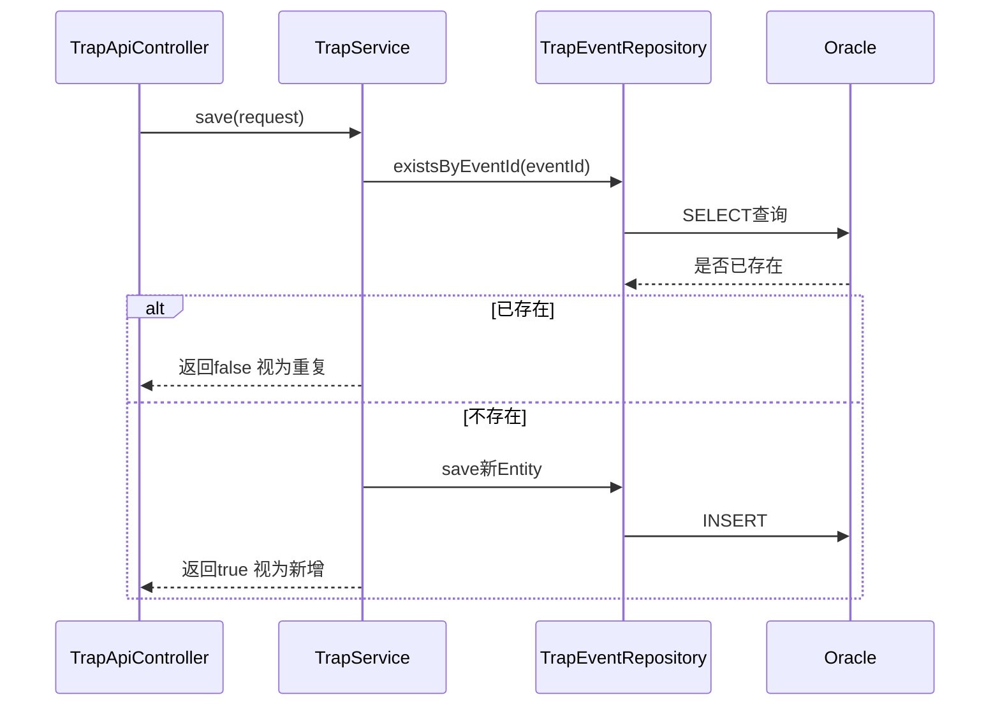

# 13. TrapService：业务逻辑与幂等去重

TrapService是DTO和Entity之间的桥梁，也是实现幂等去重的关键一环。

## 核心要点

* save方法先调用existsByEventId做一次预检查，命中则直接返回false，不再写入数据库
* TrapEventRequest转换为TrapEvent时，会额外补上receivedTime字段(LocalDateTime.now())，记录实际入库时间
* 整个save方法标注了@Transactional，保证查重和写入在同一个事务里执行
* findAll方法调用findAllByOrderByReceivedTimeDesc，让Web页面看到的是按接收时间倒序的列表，最新告警排在最前面

---

## 本章测验

本章共 5 道单项选择题。

### 第 1 题

TrapService.save方法在写入数据库之前，第一步做了什么？

- A. 先调用existsByEventId检查该eventId是否已存在
- B. 先发送一封告警邮件
- C. 先查询Oracle的表结构
- D. 直接调用repository.save写入

选择答案后查看结果

正确答案：A

答案解析：代码里save方法一开始就调用了repository.existsByEventId(request.eventId())，命中就直接返回false，不再执行后续插入。

### 第 2 题

TrapEvent中的receivedTime字段和eventTime字段有什么区别？

- A. 两者含义完全相同，只是字段名不同
- B. eventTime来自设备侧上报的事件发生时间，receivedTime是Spring Boot实际写入数据库时用LocalDateTime.now()生成的入库时间
- C. receivedTime是设备生成的，eventTime是数据库自动生成的
- D. 两个字段都是由前端页面手动填写的

选择答案后查看结果

正确答案：B

答案解析：eventTime来自TrapEventRequest，是设备/模拟器构造报文时记录的事件时间；receivedTime是TrapService.save里用LocalDateTime.now()生成的，代表这条记录真正落库的时间点，二者用途不同。

### 第 3 题

@Transactional注解加在save方法上的意义是什么？

- A. 自动记录方法执行耗时
- B. 仅仅是为了让代码看起来更规范，没有实际作用
- C. 保证查重(existsByEventId)和写入(repository.save)在同一个数据库事务中执行，避免并发场景下出现不一致
- D. 让方法变成异步执行

选择答案后查看结果

正确答案：C

答案解析：事务保证了这一系列数据库操作的原子性，配合Oracle上的唯一约束，即使高并发下多个请求几乎同时到达，也能保证数据的一致性和正确性。

### 第 4 题

findAll方法调用的findAllByOrderByReceivedTimeDesc是Spring Data JPA的什么特性？

- A. 这是一个存储过程调用
- B. 这是Java反射机制自动生成的代码
- C. 需要手写SQL的原生查询
- D. 方法名派生查询(Derived Query)，Spring根据方法名自动生成对应的排序查询语句

选择答案后查看结果

正确答案：D

答案解析：Spring Data JPA支持根据方法名自动推导查询逻辑，findAllByOrderByReceivedTimeDesc会被解析为按receivedTime字段降序排列的SELECT语句，无需手写SQL。

### 第 5 题

如果existsByEventId返回true，save方法会做什么？

- A. 记录一条日志说明丢弃重复Trap，然后直接返回false，不再执行写入
- B. 抛出异常终止整个应用
- C. 更新已存在的记录为最新内容
- D. 仍然执行insert，让数据库自己去重

选择答案后查看结果

正确答案：A

答案解析：代码里对应分支是log.info打印重复丢弃的日志，然后return false，Controller根据这个返回值决定HTTP状态码是200还是201。

<!-- QUIZ_DATA_START
{
  "chapter": "13",
  "questions": [
    {
      "id": 1,
      "question": "TrapService.save方法在写入数据库之前，第一步做了什么？",
      "options": {
        "A": "先调用existsByEventId检查该eventId是否已存在",
        "B": "先发送一封告警邮件",
        "C": "先查询Oracle的表结构",
        "D": "直接调用repository.save写入"
      },
      "answer": "A",
      "explanation": "代码里save方法一开始就调用了repository.existsByEventId(request.eventId())，命中就直接返回false，不再执行后续插入。"
    },
    {
      "id": 2,
      "question": "TrapEvent中的receivedTime字段和eventTime字段有什么区别？",
      "options": {
        "A": "两者含义完全相同，只是字段名不同",
        "B": "eventTime来自设备侧上报的事件发生时间，receivedTime是Spring Boot实际写入数据库时用LocalDateTime.now()生成的入库时间",
        "C": "receivedTime是设备生成的，eventTime是数据库自动生成的",
        "D": "两个字段都是由前端页面手动填写的"
      },
      "answer": "B",
      "explanation": "eventTime来自TrapEventRequest，是设备/模拟器构造报文时记录的事件时间；receivedTime是TrapService.save里用LocalDateTime.now()生成的，代表这条记录真正落库的时间点，二者用途不同。"
    },
    {
      "id": 3,
      "question": "@Transactional注解加在save方法上的意义是什么？",
      "options": {
        "A": "自动记录方法执行耗时",
        "B": "仅仅是为了让代码看起来更规范，没有实际作用",
        "C": "保证查重(existsByEventId)和写入(repository.save)在同一个数据库事务中执行，避免并发场景下出现不一致",
        "D": "让方法变成异步执行"
      },
      "answer": "C",
      "explanation": "事务保证了这一系列数据库操作的原子性，配合Oracle上的唯一约束，即使高并发下多个请求几乎同时到达，也能保证数据的一致性和正确性。"
    },
    {
      "id": 4,
      "question": "findAll方法调用的findAllByOrderByReceivedTimeDesc是Spring Data JPA的什么特性？",
      "options": {
        "A": "这是一个存储过程调用",
        "B": "这是Java反射机制自动生成的代码",
        "C": "需要手写SQL的原生查询",
        "D": "方法名派生查询(Derived Query)，Spring根据方法名自动生成对应的排序查询语句"
      },
      "answer": "D",
      "explanation": "Spring Data JPA支持根据方法名自动推导查询逻辑，findAllByOrderByReceivedTimeDesc会被解析为按receivedTime字段降序排列的SELECT语句，无需手写SQL。"
    },
    {
      "id": 5,
      "question": "如果existsByEventId返回true，save方法会做什么？",
      "options": {
        "A": "记录一条日志说明丢弃重复Trap，然后直接返回false，不再执行写入",
        "B": "抛出异常终止整个应用",
        "C": "更新已存在的记录为最新内容",
        "D": "仍然执行insert，让数据库自己去重"
      },
      "answer": "A",
      "explanation": "代码里对应分支是log.info打印重复丢弃的日志，然后return false，Controller根据这个返回值决定HTTP状态码是200还是201。"
    }
  ]
}
QUIZ_DATA_END -->
