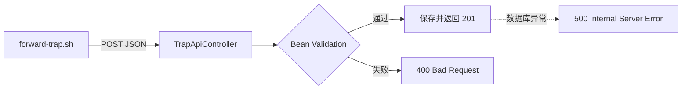

# REST API 设计：POST /api/traps

forward-trap.sh 发出去的 JSON，最终会敲开哪个接口的门？这一章看 Spring Boot 这一侧怎么接。

## 核心要点

* 接口地址是 POST /api/traps，Content-Type 固定为 application/json。
* 9 个必填字段：trapOid、trapName、deviceId、deviceName、eventType、severity、temperature、message、eventTime，每个都有各自的类型和长度限制。
* 成功保存返回 201 Created；必填值缺失或格式不对返回 400 Bad Request；数据库保存失败返回 500 Internal Server Error。
* eventTime 要求 ISO-8601 本地日期时间格式；trapOid 和 trapName 分别限制为数据库列的 128 字符。

---

## 本章测验

本章共 5 道单项选择题。

### 第 1 题

接收 Trap 数据的 REST API 端点是什么？

- A. GET /traps
- B. PUT /api/events
- C. POST /api/traps
- D. POST /snmp/receive

选择答案后查看结果

正确答案：C

答案解析：详细设计书明确接口为 POST /api/traps，Content-Type 为 application/json，这是 forward-trap.sh 投递数据的目标地址。

### 第 2 题

当请求缺少某个必填字段时，API 会返回什么状态码？

- A. 201 Created
- B. 400 Bad Request
- C. 500 Internal Server Error
- D. 200 OK 但内容为空

选择答案后查看结果

正确答案：B

答案解析：必须值不足属于客户端请求本身有问题，按照 REST 规范返回 400 Bad Request。

### 第 3 题

数据成功保存到数据库后，API 返回什么状态码？

- A. 202 Accepted
- B. 204 No Content
- C. 201 Created
- D. 200 OK

选择答案后查看结果

正确答案：C

答案解析：详细设计书写明成功场景返回 201 Created，表示资源已被成功创建并持久化。

### 第 4 题

接口一共要求多少个必填 JSON 字段？

- A. 5 个
- B. 9 个
- C. 7 个
- D. 12 个

选择答案后查看结果

正确答案：B

答案解析：字段表列出 trapOid、trapName、deviceId、deviceName、eventType、severity、temperature、message、eventTime 共 9 个必填字段。

### 第 5 题

如果 forward-trap.sh 发送的请求格式完全正确，但此时 Oracle 数据库连接异常，接口最可能返回什么？

- A. 500 Internal Server Error，因为数据库保存失败
- B. 接口会挂起等待数据库恢复，不返回任何状态
- C. 201 Created，因为请求格式正确
- D. 400 Bad Request，因为请求本身有问题

选择答案后查看结果

正确答案：A

答案解析：请求格式正确说明能通过 Bean Validation，但保存阶段如果数据库出现异常，属于服务端内部错误，应返回 500。

<!-- QUIZ_DATA_START
{
  "chapter": "13",
  "questions": [
    {
      "id": 1,
      "question": "接收 Trap 数据的 REST API 端点是什么？",
      "options": {
        "C": "POST /api/traps",
        "A": "GET /traps",
        "B": "PUT /api/events",
        "D": "POST /snmp/receive"
      },
      "answer": "C",
      "explanation": "详细设计书明确接口为 POST /api/traps，Content-Type 为 application/json，这是 forward-trap.sh 投递数据的目标地址。"
    },
    {
      "id": 2,
      "question": "当请求缺少某个必填字段时，API 会返回什么状态码？",
      "options": {
        "B": "400 Bad Request",
        "A": "201 Created",
        "C": "500 Internal Server Error",
        "D": "200 OK 但内容为空"
      },
      "answer": "B",
      "explanation": "必须值不足属于客户端请求本身有问题，按照 REST 规范返回 400 Bad Request。"
    },
    {
      "id": 3,
      "question": "数据成功保存到数据库后，API 返回什么状态码？",
      "options": {
        "C": "201 Created",
        "A": "202 Accepted",
        "B": "204 No Content",
        "D": "200 OK"
      },
      "answer": "C",
      "explanation": "详细设计书写明成功场景返回 201 Created，表示资源已被成功创建并持久化。"
    },
    {
      "id": 4,
      "question": "接口一共要求多少个必填 JSON 字段？",
      "options": {
        "B": "9 个",
        "A": "5 个",
        "C": "7 个",
        "D": "12 个"
      },
      "answer": "B",
      "explanation": "字段表列出 trapOid、trapName、deviceId、deviceName、eventType、severity、temperature、message、eventTime 共 9 个必填字段。"
    },
    {
      "id": 5,
      "question": "如果 forward-trap.sh 发送的请求格式完全正确，但此时 Oracle 数据库连接异常，接口最可能返回什么？",
      "options": {
        "A": "500 Internal Server Error，因为数据库保存失败",
        "B": "接口会挂起等待数据库恢复，不返回任何状态",
        "C": "201 Created，因为请求格式正确",
        "D": "400 Bad Request，因为请求本身有问题"
      },
      "answer": "A",
      "explanation": "请求格式正确说明能通过 Bean Validation，但保存阶段如果数据库出现异常，属于服务端内部错误，应返回 500。"
    }
  ]
}
QUIZ_DATA_END -->
