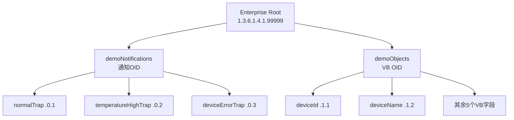

# 13 MIB文件与OID体系设计

MIB 是整个 OID 命名体系的正本，本章讲清楚它管理了哪些内容。

## 核心要点

* 整个项目的企业根 OID 固定为 1.3.6.1.4.1.99999，这是自定义的私有企业编号，仅用于演示。
* 通知 OID 归在 demoNotifications 分支下，VB（Variable Binding）OID 归在 demoObjects 分支下，两类 OID 各自独立编号，不会冲突。
* MIB 文件路径是 trap-receiver/mibs/SNMP-TRAP-DEMO-MIB.txt，它是通知名、通知 OID、VB OID、类型、含义的唯一正本。
* 7 个 VB 字段依次是 deviceId、deviceName、eventType、severity、temperature、message、eventTime，对应 OID 从 .1.1 到 .1.7。

---

## 本章测验

本章共 5 道单项选择题。

### 第 1 题

本项目使用的企业根 OID 是什么？

- A. 1.3.6.1.6.3.1
- B. 1.3.6.1.2.1.1
- C. 1.3.6.1.4.1.2021
- D. 1.3.6.1.4.1.99999

选择答案后查看结果

正确答案：D

答案解析：详细设计文档明确 Enterprise root 设为 1.3.6.1.4.1.99999，这是本项目专用的私有 OID 前缀。

### 第 2 题

MIB 中通知 OID 和 VB OID 分别归属于哪两个分支？

- A. demoTraps 和 demoFields
- B. trapGroup 和 vbGroup
- C. demoNotifications 和 demoObjects
- D. notifyRoot 和 objectRoot

选择答案后查看结果

正确答案：C

答案解析：详细设计文档写明通知 OID 归在 { demoNotifications N }，VB OID 归在 { demoObjects N }。

### 第 3 题

MIB 文件在 Git 仓库中的路径是什么？

- A. iot-simulator/mibs/SNMP-TRAP-DEMO-MIB.txt
- B. docs/SNMP-TRAP-DEMO-MIB.txt
- C. trap-receiver/mibs/SNMP-TRAP-DEMO-MIB.txt
- D. monitoring-app/mibs/SNMP-TRAP-DEMO-MIB.txt

选择答案后查看结果

正确答案：C

答案解析：详细设计书的目录表中列出该 MIB 文件位于 trap-receiver/mibs/SNMP-TRAP-DEMO-MIB.txt。

### 第 4 题

VB OID 从 .1.1 到 .1.7 共对应几个字段，分别是什么类型的信息？

- A. 5 个字段，全部是数值类型
- B. 7 个字段：deviceId、deviceName、eventType、severity、temperature、message、eventTime
- C. 3 个字段，仅对应三种事件类型
- D. 7 个字段，但都统一为布尔类型

选择答案后查看结果

正确答案：B

答案解析：SNMP OID 一节的表格列出了从 .1.1 到 .1.7 依次对应 deviceId、deviceName、eventType、severity、temperature、message、eventTime 共 7 个字段。

### 第 5 题

MIB 文件在整个辞书体系中扮演的角色是什么？

- A. 负责浏览器页面的样式定义
- B. 负责数据库表结构的自动生成
- C. 只是可选的说明文档，运行时不会被使用
- D. 是通知名、OID、类型、含义的唯一正本，其他地方需要与其保持一致

选择答案后查看结果

正确答案：D

答案解析：详细设计文档明确 MIB 是 OID 阶层与シンボル名的正本，其他辞书和脚本中的定义都需要与其保持一致，并会在构建时进行交叉验证。

<!-- QUIZ_DATA_START
{
  "chapter": "13",
  "questions": [
    {
      "id": 1,
      "question": "本项目使用的企业根 OID 是什么？",
      "options": {
        "A": "1.3.6.1.6.3.1",
        "B": "1.3.6.1.2.1.1",
        "C": "1.3.6.1.4.1.2021",
        "D": "1.3.6.1.4.1.99999"
      },
      "answer": "D",
      "explanation": "详细设计文档明确 Enterprise root 设为 1.3.6.1.4.1.99999，这是本项目专用的私有 OID 前缀。"
    },
    {
      "id": 2,
      "question": "MIB 中通知 OID 和 VB OID 分别归属于哪两个分支？",
      "options": {
        "A": "demoTraps 和 demoFields",
        "B": "trapGroup 和 vbGroup",
        "C": "demoNotifications 和 demoObjects",
        "D": "notifyRoot 和 objectRoot"
      },
      "answer": "C",
      "explanation": "详细设计文档写明通知 OID 归在 { demoNotifications N }，VB OID 归在 { demoObjects N }。"
    },
    {
      "id": 3,
      "question": "MIB 文件在 Git 仓库中的路径是什么？",
      "options": {
        "A": "iot-simulator/mibs/SNMP-TRAP-DEMO-MIB.txt",
        "B": "docs/SNMP-TRAP-DEMO-MIB.txt",
        "C": "trap-receiver/mibs/SNMP-TRAP-DEMO-MIB.txt",
        "D": "monitoring-app/mibs/SNMP-TRAP-DEMO-MIB.txt"
      },
      "answer": "C",
      "explanation": "详细设计书的目录表中列出该 MIB 文件位于 trap-receiver/mibs/SNMP-TRAP-DEMO-MIB.txt。"
    },
    {
      "id": 4,
      "question": "VB OID 从 .1.1 到 .1.7 共对应几个字段，分别是什么类型的信息？",
      "options": {
        "A": "5 个字段，全部是数值类型",
        "B": "7 个字段：deviceId、deviceName、eventType、severity、temperature、message、eventTime",
        "C": "3 个字段，仅对应三种事件类型",
        "D": "7 个字段，但都统一为布尔类型"
      },
      "answer": "B",
      "explanation": "SNMP OID 一节的表格列出了从 .1.1 到 .1.7 依次对应 deviceId、deviceName、eventType、severity、temperature、message、eventTime 共 7 个字段。"
    },
    {
      "id": 5,
      "question": "MIB 文件在整个辞书体系中扮演的角色是什么？",
      "options": {
        "A": "负责浏览器页面的样式定义",
        "B": "负责数据库表结构的自动生成",
        "C": "只是可选的说明文档，运行时不会被使用",
        "D": "是通知名、OID、类型、含义的唯一正本，其他地方需要与其保持一致"
      },
      "answer": "D",
      "explanation": "详细设计文档明确 MIB 是 OID 阶层与シンボル名的正本，其他辞书和脚本中的定义都需要与其保持一致，并会在构建时进行交叉验证。"
    }
  ]
}
QUIZ_DATA_END -->
