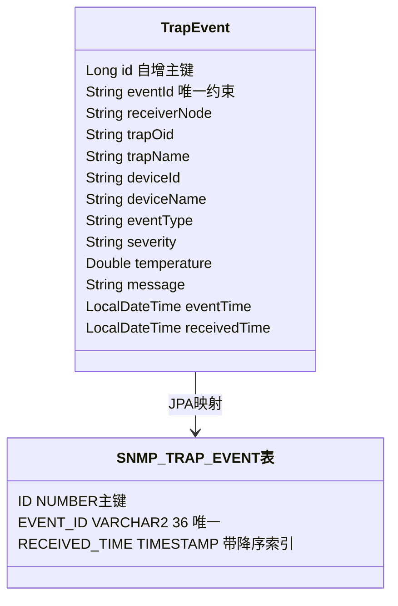

# 14. TrapEvent Entity 与 Oracle 持久化

这一章看TrapEvent这个JPA Entity如何映射到Oracle的SNMP_TRAP_EVENT表，以及各字段的约束设计。

## 核心要点

* TrapEvent的主键id使用GenerationType.IDENTITY，对应Oracle的GENERATED BY DEFAULT AS IDENTITY自增列
* 受保护的无参构造函数protected TrapEvent()是JPA规范要求的，专门给ORM框架反射创建对象使用，业务代码不会调用它
* 所有列都设置了length限制，和数据库表DDL里的VARCHAR2长度一一对应，双重保证不会因超长字符串写入失败
* IDX_SNMP_TRAP_RECEIVED_TIME这个索引专门为按接收时间降序查询做了优化，配合findAllByOrderByReceivedTimeDesc使用

---

## 本章测验

本章共 5 道单项选择题。

### 第 1 题

TrapEvent的主键id使用了什么生成策略？

- A. GenerationType.SEQUENCE配合独立序列
- B. GenerationType.IDENTITY，依赖数据库自增列
- C. 手动在代码里生成UUID作为主键
- D. 不生成主键，靠eventId充当主键

选择答案后查看结果

正确答案：B

答案解析：代码里@GeneratedValue(strategy = GenerationType.IDENTITY)对应V1迁移脚本里的GENERATED BY DEFAULT AS IDENTITY，把主键生成完全交给Oracle数据库处理。

### 第 2 题

TrapEvent类里的protected TrapEvent()这个无参构造函数是用来做什么的？

- A. 用于单元测试的Mock对象创建
- B. 业务代码手动创建空对象时使用
- C. JPA框架在从数据库读取记录并通过反射还原Java对象时需要的构造函数
- D. 这是多余的代码，可以直接删除

选择答案后查看结果

正确答案：C

答案解析：JPA规范要求Entity类必须提供一个无参构造函数供ORM框架反射调用，protected修饰符既满足了JPA的要求，又避免业务代码误用这个构造函数创建出字段全为空的对象。

### 第 3 题

Entity上的@Column(length=...)注解和数据库DDL里VARCHAR2的长度分别起什么作用？

- A. 只有数据库层的长度会生效，Entity层的完全无用
- B. 只有Entity层的长度会生效，数据库层会被忽略
- C. 两者没有任何关系
- D. 两者是双重防线：Entity层的length主要影响DDL自动生成，实际生产环境以Flyway迁移里手写的VARCHAR2长度为准，二者应保持一致

选择答案后查看结果

正确答案：D

答案解析：由于项目配置了ddl-auto: validate（不是update或create），实际表结构完全由Flyway脚本控制，Entity上的length注解此时主要起到文档说明和validate阶段核对的作用，两者数值必须保持一致。

### 第 4 题

IDX_SNMP_TRAP_RECEIVED_TIME这个索引的设计目的是什么？

- A. 优化按receivedTime降序查询列表的性能，这也是Web页面展示Trap列表时最常用的查询模式
- B. 用于保证eventId的唯一性
- C. 这是Oracle强制要求的系统索引
- D. 加快按eventId查重的速度

选择答案后查看结果

正确答案：A

答案解析：TrapEventRepository.findAllByOrderByReceivedTimeDesc生成的SQL会按RECEIVED_TIME降序排序，有了这个索引，即使数据量增长，Web页面加载列表的速度也不会明显下降。

### 第 5 题

关于EVENT_ID列的唯一性约束，是在哪一版本的迁移脚本中添加的？

- A. V1版本一开始就有
- B. V2版本才通过ALTER TABLE和ADD CONSTRAINT添加
- C. 从未添加过唯一约束，只在Java代码层做校验
- D. 由Hibernate的ddl-auto自动生成

选择答案后查看结果

正确答案：B

答案解析：V1只创建了基础表，并不包含EVENT_ID和RECEIVER_NODE列；V2迁移脚本才新增这两列、回填历史数据，最后添加UK_SNMP_TRAP_EVENT_ID唯一约束，这体现了平台从最初版本演进到支持去重的过程。

<!-- QUIZ_DATA_START
{
  "chapter": "14",
  "questions": [
    {
      "id": 1,
      "question": "TrapEvent的主键id使用了什么生成策略？",
      "options": {
        "A": "GenerationType.SEQUENCE配合独立序列",
        "B": "GenerationType.IDENTITY，依赖数据库自增列",
        "C": "手动在代码里生成UUID作为主键",
        "D": "不生成主键，靠eventId充当主键"
      },
      "answer": "B",
      "explanation": "代码里@GeneratedValue(strategy = GenerationType.IDENTITY)对应V1迁移脚本里的GENERATED BY DEFAULT AS IDENTITY，把主键生成完全交给Oracle数据库处理。"
    },
    {
      "id": 2,
      "question": "TrapEvent类里的protected TrapEvent()这个无参构造函数是用来做什么的？",
      "options": {
        "A": "用于单元测试的Mock对象创建",
        "B": "业务代码手动创建空对象时使用",
        "C": "JPA框架在从数据库读取记录并通过反射还原Java对象时需要的构造函数",
        "D": "这是多余的代码，可以直接删除"
      },
      "answer": "C",
      "explanation": "JPA规范要求Entity类必须提供一个无参构造函数供ORM框架反射调用，protected修饰符既满足了JPA的要求，又避免业务代码误用这个构造函数创建出字段全为空的对象。"
    },
    {
      "id": 3,
      "question": "Entity上的@Column(length=...)注解和数据库DDL里VARCHAR2的长度分别起什么作用？",
      "options": {
        "A": "只有数据库层的长度会生效，Entity层的完全无用",
        "B": "只有Entity层的长度会生效，数据库层会被忽略",
        "C": "两者没有任何关系",
        "D": "两者是双重防线：Entity层的length主要影响DDL自动生成，实际生产环境以Flyway迁移里手写的VARCHAR2长度为准，二者应保持一致"
      },
      "answer": "D",
      "explanation": "由于项目配置了ddl-auto: validate（不是update或create），实际表结构完全由Flyway脚本控制，Entity上的length注解此时主要起到文档说明和validate阶段核对的作用，两者数值必须保持一致。"
    },
    {
      "id": 4,
      "question": "IDX_SNMP_TRAP_RECEIVED_TIME这个索引的设计目的是什么？",
      "options": {
        "A": "优化按receivedTime降序查询列表的性能，这也是Web页面展示Trap列表时最常用的查询模式",
        "B": "用于保证eventId的唯一性",
        "C": "这是Oracle强制要求的系统索引",
        "D": "加快按eventId查重的速度"
      },
      "answer": "A",
      "explanation": "TrapEventRepository.findAllByOrderByReceivedTimeDesc生成的SQL会按RECEIVED_TIME降序排序，有了这个索引，即使数据量增长，Web页面加载列表的速度也不会明显下降。"
    },
    {
      "id": 5,
      "question": "关于EVENT_ID列的唯一性约束，是在哪一版本的迁移脚本中添加的？",
      "options": {
        "A": "V1版本一开始就有",
        "B": "V2版本才通过ALTER TABLE和ADD CONSTRAINT添加",
        "C": "从未添加过唯一约束，只在Java代码层做校验",
        "D": "由Hibernate的ddl-auto自动生成"
      },
      "answer": "B",
      "explanation": "V1只创建了基础表，并不包含EVENT_ID和RECEIVER_NODE列；V2迁移脚本才新增这两列、回填历史数据，最后添加UK_SNMP_TRAP_EVENT_ID唯一约束，这体现了平台从最初版本演进到支持去重的过程。"
    }
  ]
}
QUIZ_DATA_END -->
