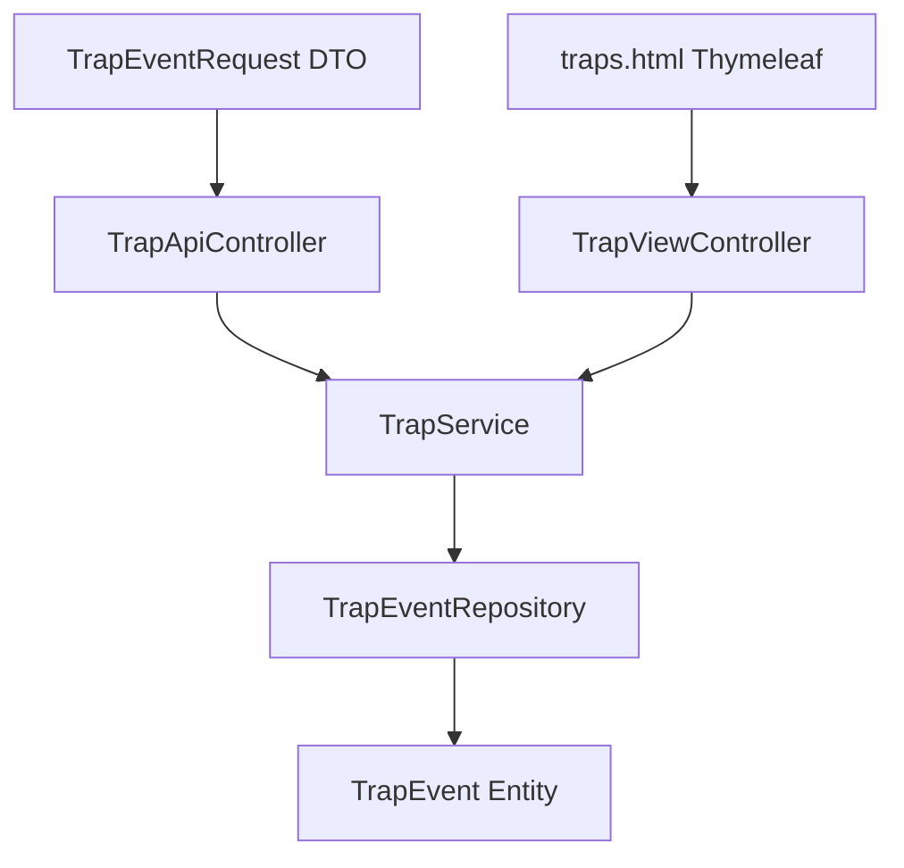

# Spring Boot 分层架构

接口收到请求之后，代码内部是怎么一层一层把数据传下去的？

## 核心要点

* TrapApiController 负责接收 POST /api/traps；TrapViewController 负责 / 和 /traps 页面展示。
* TrapEventRequest 是 DTO，承担 JSON 反序列化和 Bean Validation 校验的职责。
* TrapService 负责把 DTO 转成 Entity（或反过来），并调用 Repository 完成保存与查询，是业务逻辑的中枢。
* TrapEventRepository 基于 JPA，负责持久化操作，以及按接收时间倒序查询。
* ApiExceptionHandler 统一处理输入校验错误和数据库异常，给出最简洁的错误响应。
* traps.html 是一个不依赖 JavaScript 的纯 HTML 表格页面，由 Thymeleaf 服务端渲染。

---

## 本章测验

本章共 5 道单项选择题。

### 第 1 题

在这个 Spring Boot 应用中，负责 DTO/Entity 转换与业务保存逻辑的组件是什么？

- A. ApiExceptionHandler
- B. TrapService
- C. TrapEventRepository
- D. TrapApiController

选择答案后查看结果

正确答案：B

答案解析：详细设计书明确 TrapService 的职责是 DTO/Entity 转换、保存、取得，是连接 Controller 和 Repository 的业务逻辑层。

### 第 2 题

TrapEventRepository 是基于什么技术实现的？

- A. 直接调用存储过程
- B. 原生 JDBC 手写 SQL
- C. JPA
- D. MyBatis

选择答案后查看结果

正确答案：C

答案解析：设计文档写明 TrapEventRepository 负责 JPA 永久化和按接收日期时间降序检索。

### 第 3 题

TrapEventRequest 这个 DTO 主要承担什么职责？

- A. 负责 JSON 反序列化以及 Bean Validation 校验
- B. 负责 SNMP 报文解析
- C. 负责数据库连接池管理
- D. 负责渲染 HTML 页面

选择答案后查看结果

正确答案：A

答案解析：设计文档说明 TrapEventRequest 负责"JSON 与 Bean Validation"，即接收 API 请求体并做输入校验。

### 第 4 题

traps.html 页面在技术实现上有什么特点？

- A. 直接由 snmptrapd 生成静态页面
- B. 使用 Thymeleaf 服务端渲染，不依赖 JavaScript
- C. 使用 React 单页应用渲染
- D. 通过 WebSocket 实时推送数据

选择答案后查看结果

正确答案：B

答案解析：设计文档明确 traps.html 是"JavaScript を使わない HTML 表"，即不依赖 JavaScript、由 Thymeleaf 在服务端渲染的纯 HTML 表格。

### 第 5 题

如果要在这个分层架构中新增一个按 severity 过滤 Trap 列表的功能，最合理的改动路径大致是什么？

- A. 在 Repository 增加查询方法，在 Service 调用并处理，在 Controller 暴露参数，最后模板展示结果
- B. 直接在 TrapEvent 实体类里写 SQL 拼接逻辑
- C. 这种功能无法在当前分层架构下实现
- D. 只需要修改 Thymeleaf 模板即可实现全部逻辑

选择答案后查看结果

正确答案：A

答案解析：遵循现有分层职责，新查询能力应从 Repository 开始逐层向上传递到 Controller，再由模板展示，这符合 Controller/Service/Repository 各司其职的设计。

<!-- QUIZ_DATA_START
{
  "chapter": "14",
  "questions": [
    {
      "id": 1,
      "question": "在这个 Spring Boot 应用中，负责 DTO/Entity 转换与业务保存逻辑的组件是什么？",
      "options": {
        "B": "TrapService",
        "A": "ApiExceptionHandler",
        "C": "TrapEventRepository",
        "D": "TrapApiController"
      },
      "answer": "B",
      "explanation": "详细设计书明确 TrapService 的职责是 DTO/Entity 转换、保存、取得，是连接 Controller 和 Repository 的业务逻辑层。"
    },
    {
      "id": 2,
      "question": "TrapEventRepository 是基于什么技术实现的？",
      "options": {
        "C": "JPA",
        "A": "直接调用存储过程",
        "B": "原生 JDBC 手写 SQL",
        "D": "MyBatis"
      },
      "answer": "C",
      "explanation": "设计文档写明 TrapEventRepository 负责 JPA 永久化和按接收日期时间降序检索。"
    },
    {
      "id": 3,
      "question": "TrapEventRequest 这个 DTO 主要承担什么职责？",
      "options": {
        "A": "负责 JSON 反序列化以及 Bean Validation 校验",
        "B": "负责 SNMP 报文解析",
        "C": "负责数据库连接池管理",
        "D": "负责渲染 HTML 页面"
      },
      "answer": "A",
      "explanation": "设计文档说明 TrapEventRequest 负责\"JSON 与 Bean Validation\"，即接收 API 请求体并做输入校验。"
    },
    {
      "id": 4,
      "question": "traps.html 页面在技术实现上有什么特点？",
      "options": {
        "B": "使用 Thymeleaf 服务端渲染，不依赖 JavaScript",
        "A": "直接由 snmptrapd 生成静态页面",
        "C": "使用 React 单页应用渲染",
        "D": "通过 WebSocket 实时推送数据"
      },
      "answer": "B",
      "explanation": "设计文档明确 traps.html 是\"JavaScript を使わない HTML 表\"，即不依赖 JavaScript、由 Thymeleaf 在服务端渲染的纯 HTML 表格。"
    },
    {
      "id": 5,
      "question": "如果要在这个分层架构中新增一个按 severity 过滤 Trap 列表的功能，最合理的改动路径大致是什么？",
      "options": {
        "A": "在 Repository 增加查询方法，在 Service 调用并处理，在 Controller 暴露参数，最后模板展示结果",
        "B": "直接在 TrapEvent 实体类里写 SQL 拼接逻辑",
        "C": "这种功能无法在当前分层架构下实现",
        "D": "只需要修改 Thymeleaf 模板即可实现全部逻辑"
      },
      "answer": "A",
      "explanation": "遵循现有分层职责，新查询能力应从 Repository 开始逐层向上传递到 Controller，再由模板展示，这符合 Controller/Service/Repository 各司其职的设计。"
    }
  ]
}
QUIZ_DATA_END -->
