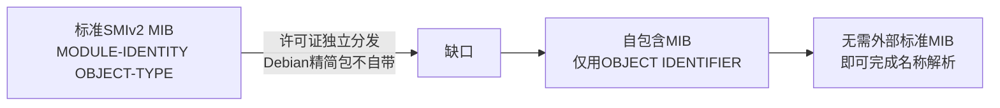

# 14 自包含MIB的设计原则

为什么这个项目没有依赖标准的 SNMPv2-SMI、SNMPv2-TC 等官方 MIB，而是自己写了一份最简 MIB？本章讲清楚背后的原因。

## 核心要点

* Debian bookworm 的最小化 Net-SNMP 软件包，出于许可证原因不自带 SNMPv2-SMI、SNMPv2-TC 等标准 MIB。
* 为了让演示镜像在不依赖外部标准 MIB 的情况下也能正常做名称解析，项目采用了“自包含 MIB”策略，只使用 OBJECT IDENTIFIER 定义结构，不使用完整的 MODULE-IDENTITY、OBJECT-TYPE、NOTIFICATION-TYPE。
* 这意味着本项目的 MIB 是简化版本，正式生产环境如果要用完整的 SMIv2 规范 MIB，需要另外引入经过许可证审核的标准 MIB 包。
* 命名规则也有约定：模块名使用大写加连字符（如 SNMP-TRAP-DEMO-MIB），OBJECT-TYPE 和 NOTIFICATION-TYPE 使用小驼峰命名。

---

## 本章测验

本章共 5 道单项选择题。

### 第 1 题

本项目自定义 MIB 采用“自包含”设计的直接原因是什么？

- A. 为了让 MIB 文件体积更小，加快网络传输
- B. Oracle 数据库不支持标准 MIB 格式
- C. 标准 MIB 语法过于复杂，团队不熟悉
- D. Debian bookworm 最小化 Net-SNMP 包出于许可证原因不自带标准 MIB

选择答案后查看结果

正确答案：D

答案解析：文档明确说明 Debian bookworm 的最小化软件包出于许可证原因，不同捆绑 SNMPv2-SMI 和 SNMPv2-TC 等标准 MIB，因此项目改用自包含设计。

### 第 2 题

本项目的 MIB 主要使用哪种语法元素来定义 OID 结构？

- A. YAML 配置文件
- B. 完整的 MODULE-IDENTITY 与 OBJECT-TYPE
- C. JSON Schema 定义
- D. 仅使用 OBJECT IDENTIFIER

选择答案后查看结果

正确答案：D

答案解析：文档说明自包含 MIB 仅使用 OBJECT IDENTIFIER 进行名称解析，不使用完整的 MODULE-IDENTITY、OBJECT-TYPE、NOTIFICATION-TYPE。

### 第 3 题

如果要在正式生产环境中使用符合 SMIv2 标准的完整 MIB，应该怎么做？

- A. 在 Oracle 数据库中重新定义 MIB
- B. 另外引入经过许可证审核的标准 MIB 包，单独管理
- C. 直接把本项目的自包含 MIB 拿去使用即可
- D. 无需 MIB，直接用数值 OID 即可完全替代

选择答案后查看结果

正确答案：B

答案解析：文档指出完整的、使用标准类型定义的生产级 MIB 需要另外引入并进行许可证管理，本项目的自包含 MIB 仅限演示使用。

### 第 4 题

本项目 MIB 命名规则中，OBJECT-TYPE 和 NOTIFICATION-TYPE 使用什么命名风格？

- A. 短横线分隔
- B. 小驼峰命名
- C. 帕斯卡命名
- D. 全大写下划线

选择答案后查看结果

正确答案：B

答案解析：命名规则中明确 OBJECT-TYPE 和 NOTIFICATION-TYPE 使用 lowerCamelCase（小驼峰），例如 deviceId、temperatureHighTrap。

### 第 5 题

以下哪一项正确描述了自包含 MIB 设计带来的权衡？

- A. 没有任何权衡，自包含 MIB 在功能上完全等同于标准 MIB
- B. 牺牲了完整类型系统，换来在最小化环境下无外部依赖的名称解析能力
- C. 牺牲了 UDP 协议兼容性，换来 TCP 支持
- D. 牺牲了 OID 唯一性，换来更快的传输速度

选择答案后查看结果

正确答案：B

答案解析：自包含 MIB 放弃了标准 SMIv2 的完整类型定义（如 MODULE-IDENTITY、OBJECT-TYPE），以换取在不依赖外部标准 MIB 包的最小化环境中依然可用的名称解析能力。

<!-- QUIZ_DATA_START
{
  "chapter": "14",
  "questions": [
    {
      "id": 1,
      "question": "本项目自定义 MIB 采用“自包含”设计的直接原因是什么？",
      "options": {
        "A": "为了让 MIB 文件体积更小，加快网络传输",
        "B": "Oracle 数据库不支持标准 MIB 格式",
        "C": "标准 MIB 语法过于复杂，团队不熟悉",
        "D": "Debian bookworm 最小化 Net-SNMP 包出于许可证原因不自带标准 MIB"
      },
      "answer": "D",
      "explanation": "文档明确说明 Debian bookworm 的最小化软件包出于许可证原因，不同捆绑 SNMPv2-SMI 和 SNMPv2-TC 等标准 MIB，因此项目改用自包含设计。"
    },
    {
      "id": 2,
      "question": "本项目的 MIB 主要使用哪种语法元素来定义 OID 结构？",
      "options": {
        "A": "YAML 配置文件",
        "B": "完整的 MODULE-IDENTITY 与 OBJECT-TYPE",
        "C": "JSON Schema 定义",
        "D": "仅使用 OBJECT IDENTIFIER"
      },
      "answer": "D",
      "explanation": "文档说明自包含 MIB 仅使用 OBJECT IDENTIFIER 进行名称解析，不使用完整的 MODULE-IDENTITY、OBJECT-TYPE、NOTIFICATION-TYPE。"
    },
    {
      "id": 3,
      "question": "如果要在正式生产环境中使用符合 SMIv2 标准的完整 MIB，应该怎么做？",
      "options": {
        "A": "在 Oracle 数据库中重新定义 MIB",
        "B": "另外引入经过许可证审核的标准 MIB 包，单独管理",
        "C": "直接把本项目的自包含 MIB 拿去使用即可",
        "D": "无需 MIB，直接用数值 OID 即可完全替代"
      },
      "answer": "B",
      "explanation": "文档指出完整的、使用标准类型定义的生产级 MIB 需要另外引入并进行许可证管理，本项目的自包含 MIB 仅限演示使用。"
    },
    {
      "id": 4,
      "question": "本项目 MIB 命名规则中，OBJECT-TYPE 和 NOTIFICATION-TYPE 使用什么命名风格？",
      "options": {
        "A": "短横线分隔",
        "B": "小驼峰命名",
        "C": "帕斯卡命名",
        "D": "全大写下划线"
      },
      "answer": "B",
      "explanation": "命名规则中明确 OBJECT-TYPE 和 NOTIFICATION-TYPE 使用 lowerCamelCase（小驼峰），例如 deviceId、temperatureHighTrap。"
    },
    {
      "id": 5,
      "question": "以下哪一项正确描述了自包含 MIB 设计带来的权衡？",
      "options": {
        "A": "没有任何权衡，自包含 MIB 在功能上完全等同于标准 MIB",
        "B": "牺牲了完整类型系统，换来在最小化环境下无外部依赖的名称解析能力",
        "C": "牺牲了 UDP 协议兼容性，换来 TCP 支持",
        "D": "牺牲了 OID 唯一性，换来更快的传输速度"
      },
      "answer": "B",
      "explanation": "自包含 MIB 放弃了标准 SMIv2 的完整类型定义（如 MODULE-IDENTITY、OBJECT-TYPE），以换取在不依赖外部标准 MIB 包的最小化环境中依然可用的名称解析能力。"
    }
  ]
}
QUIZ_DATA_END -->
