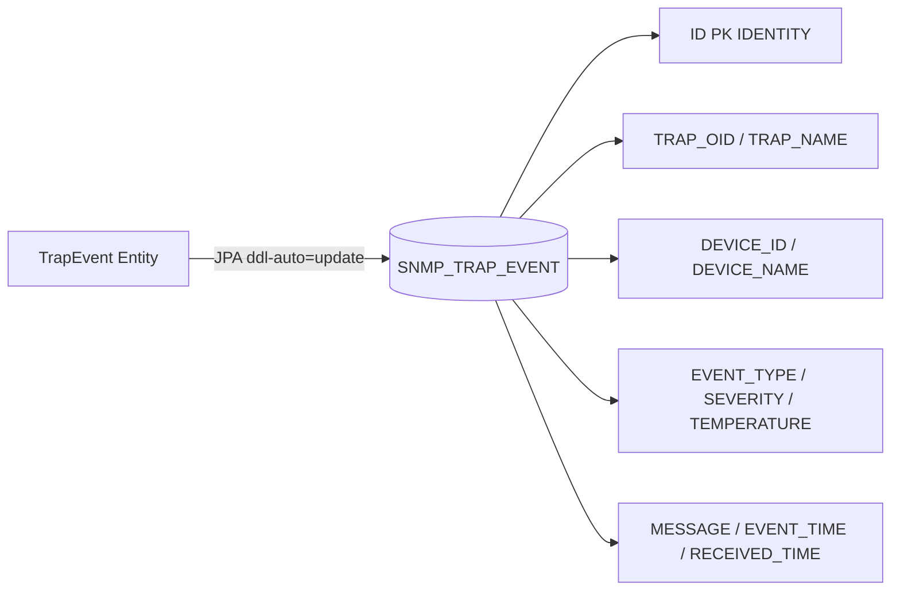

# 数据库表结构：SNMP_TRAP_EVENT

数据最终落地的地方长什么样？这一章看这张表是怎么设计的。

## 核心要点

* 表由 JPA 的 ddl-auto=update 自动创建，主键 ID 是 Long 类型，采用 IDENTITY 自增策略。
* TRAP_OID 和 TRAP_NAME 都限制为 128 字符，且都是 NOT NULL，确保每条记录都能追溯到原始通知。
* DEVICE_ID 限制 64 字符，DEVICE_NAME 限制 128 字符，都是必填。
* EVENT_TIME 记录的是事件发生的时间（来自 Trap 报文），RECEIVED_TIME 记录的是系统收到并保存的时间，两者是不同的时间点。
* MESSAGE 字段限制 512 字符，用来保存事件的描述性文本。

---

## 本章测验

本章共 5 道单项选择题。

### 第 1 题

SNMP_TRAP_EVENT 表是通过什么方式创建的？

- A. 通过 Flyway 迁移脚本
- B. JPA 的 ddl-auto=update 自动创建
- C. 由 snmptrapd 直接建表
- D. 手写 SQL 建表语句执行

选择答案后查看结果

正确答案：B

答案解析：详细设计书说明该表由 JPA `ddl-auto=update` 机制自动创建，无需手写建表 SQL。

### 第 2 题

主键 ID 的类型和生成策略是什么？

- A. Long，IDENTITY 自增
- B. 复合主键，两个字段组合
- C. Integer，手动指定
- D. String，UUID 生成

选择答案后查看结果

正确答案：A

答案解析：表结构中 ID 列类型为 Long，约束为 PK、IDENTITY，即由数据库自增生成主键值。

### 第 3 题

EVENT_TIME 和 RECEIVED_TIME 这两个字段分别代表什么？

- A. 完全相同的时间，只是字段名不同
- B. EVENT_TIME 是事件发生时间，RECEIVED_TIME 是系统接收保存的时间
- C. 这两个字段中只有一个会被实际使用
- D. EVENT_TIME 是系统时间，RECEIVED_TIME 是设备时间

选择答案后查看结果

正确答案：B

答案解析：EVENT_TIME 来自 Trap 报文本身记录的事件发生时间，RECEIVED_TIME 是系统实际接收并落库的时间，两者用途不同，都有实际意义。

### 第 4 题

TRAP_OID 和 TRAP_NAME 字段都设置为 NOT NULL，这样设计的意义是什么？

- A. 这两个字段实际上并不重要
- B. 为了加快查询速度
- C. 纯粹是为了节省存储空间
- D. 确保每条记录都能追溯到明确的原始通知类型，避免出现来源不明的数据

选择答案后查看结果

正确答案：D

答案解析：结合前面章节的一致性校验设计，只有通过校验的、来源明确的 Trap 才会被转发和保存，NOT NULL 约束在数据库层面进一步保证了这种可追溯性。

### 第 5 题

如果需要查询某个设备最近一次接收到的 Trap 记录，最合理的排序依据是哪个字段？

- A. MESSAGE 字母排序
- B. RECEIVED_TIME 降序
- C. TRAP_OID 数值排序
- D. ID 升序

选择答案后查看结果

正确答案：B

答案解析：第 14 章提到 Repository 提供按接收日期时间降序查询的方法，RECEIVED_TIME 降序正是获取"最近记录"的合理排序依据。

<!-- QUIZ_DATA_START
{
  "chapter": "15",
  "questions": [
    {
      "id": 1,
      "question": "SNMP_TRAP_EVENT 表是通过什么方式创建的？",
      "options": {
        "B": "JPA 的 ddl-auto=update 自动创建",
        "A": "通过 Flyway 迁移脚本",
        "C": "由 snmptrapd 直接建表",
        "D": "手写 SQL 建表语句执行"
      },
      "answer": "B",
      "explanation": "详细设计书说明该表由 JPA `ddl-auto=update` 机制自动创建，无需手写建表 SQL。"
    },
    {
      "id": 2,
      "question": "主键 ID 的类型和生成策略是什么？",
      "options": {
        "A": "Long，IDENTITY 自增",
        "B": "复合主键，两个字段组合",
        "C": "Integer，手动指定",
        "D": "String，UUID 生成"
      },
      "answer": "A",
      "explanation": "表结构中 ID 列类型为 Long，约束为 PK、IDENTITY，即由数据库自增生成主键值。"
    },
    {
      "id": 3,
      "question": "EVENT_TIME 和 RECEIVED_TIME 这两个字段分别代表什么？",
      "options": {
        "B": "EVENT_TIME 是事件发生时间，RECEIVED_TIME 是系统接收保存的时间",
        "A": "完全相同的时间，只是字段名不同",
        "C": "这两个字段中只有一个会被实际使用",
        "D": "EVENT_TIME 是系统时间，RECEIVED_TIME 是设备时间"
      },
      "answer": "B",
      "explanation": "EVENT_TIME 来自 Trap 报文本身记录的事件发生时间，RECEIVED_TIME 是系统实际接收并落库的时间，两者用途不同，都有实际意义。"
    },
    {
      "id": 4,
      "question": "TRAP_OID 和 TRAP_NAME 字段都设置为 NOT NULL，这样设计的意义是什么？",
      "options": {
        "D": "确保每条记录都能追溯到明确的原始通知类型，避免出现来源不明的数据",
        "A": "这两个字段实际上并不重要",
        "B": "为了加快查询速度",
        "C": "纯粹是为了节省存储空间"
      },
      "answer": "D",
      "explanation": "结合前面章节的一致性校验设计，只有通过校验的、来源明确的 Trap 才会被转发和保存，NOT NULL 约束在数据库层面进一步保证了这种可追溯性。"
    },
    {
      "id": 5,
      "question": "如果需要查询某个设备最近一次接收到的 Trap 记录，最合理的排序依据是哪个字段？",
      "options": {
        "B": "RECEIVED_TIME 降序",
        "A": "MESSAGE 字母排序",
        "C": "TRAP_OID 数值排序",
        "D": "ID 升序"
      },
      "answer": "B",
      "explanation": "第 14 章提到 Repository 提供按接收日期时间降序查询的方法，RECEIVED_TIME 降序正是获取\"最近记录\"的合理排序依据。"
    }
  ]
}
QUIZ_DATA_END -->
