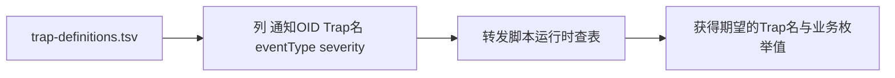

# 15 Trap定义辞书 trap-definitions.tsv

本章聚焦第一份运行时辞书：它把通知 OID 和业务含义连接起来。

## 核心要点

* trap-definitions.tsv 使用竖线 | 作为分隔符，UTF-8 编码，以 # 开头的行和空行都当作注释被忽略。
* 列顺序固定为：notificationOid、trapName、eventType、severity，缺一不可。
* notificationOid 必须是数字加点号组成，且在文件中唯一，还必须与 MIB 中同一个 Trap 的 OID 完全一致。
* trapName 使用小驼峰命名且唯一，必须真实存在于 MIB 中；eventType 使用大写加下划线且唯一；severity 只能是 INFO、WARNING、CRITICAL 三者之一。
* 查找逻辑上，通知 OID 是唯一的检索键，不会反过来用 eventType 或 severity 去推算 Trap 名，这样即使字段被篡改也不会导致误分类。

---

## 本章测验

本章共 5 道单项选择题。

### 第 1 题

trap-definitions.tsv 文件使用什么字符作为列分隔符？

- A. 逗号
- B. 竖线
- C. 制表符
- D. 分号

选择答案后查看结果

正确答案：B

答案解析：Net-SNMP 辞书・変換设计书中明确说明区切り文字（分隔符）是竖线 |。

### 第 2 题

trap-definitions.tsv 中固定的列顺序是什么？

- A. severity、eventType、notificationOid、trapName
- B. eventType、severity、trapName、notificationOid
- C. notificationOid、trapName、eventType、severity
- D. trapName、notificationOid、severity、eventType

选择答案后查看结果

正确答案：C

答案解析：文档中给出的示例行 1.3.6.1.4.1.99999.0.2|temperatureHighTrap|TEMPERATURE_HIGH|WARNING 显示了固定列顺序：notificationOid、trapName、eventType、severity。

### 第 3 题

severity 列的取值被限定为哪几种？

- A. INFO、WARNING、CRITICAL
- B. NORMAL、ABNORMAL、FATAL
- C. LOW、MEDIUM、HIGH
- D. DEBUG、INFO、ERROR

选择答案后查看结果

正确答案：A

答案解析：验证规则表明确 severity 只能取 INFO、WARNING、CRITICAL 三个值之一。

### 第 4 题

为什么设计上强调“以通知 OID 作为唯一检索键，不从 eventType 反推 Trap 名”？

- A. 因为 OID 比字符串更节省存储空间
- B. 因为 eventType 字段在协议中根本不存在
- C. 因为 eventType 字段无法用 UTF-8 编码
- D. 为了防止发送端 eventType 被篡改或实现不一致导致误分类

选择答案后查看结果

正确答案：D

答案解析：设计文档指出以通知 OID 作为唯一检索键，可以避免因发送端字段被篡改或程序实现不一致，而导致的事件误分类问题。

### 第 5 题

trap-definitions.tsv 中，以 # 开头的行会被如何处理？

- A. 自动转换成空行并保留在文件中
- B. 触发解析错误，构建失败
- C. 被当作注释忽略
- D. 被当作新增的 Trap 定义处理

选择答案后查看结果

正确答案：C

答案解析：文档说明以 # 开头的行以及空行都被视为注释，不会被解析为有效的辞书条目。

<!-- QUIZ_DATA_START
{
  "chapter": "15",
  "questions": [
    {
      "id": 1,
      "question": "trap-definitions.tsv 文件使用什么字符作为列分隔符？",
      "options": {
        "A": "逗号",
        "B": "竖线",
        "C": "制表符",
        "D": "分号"
      },
      "answer": "B",
      "explanation": "Net-SNMP 辞书・変換设计书中明确说明区切り文字（分隔符）是竖线 |。"
    },
    {
      "id": 2,
      "question": "trap-definitions.tsv 中固定的列顺序是什么？",
      "options": {
        "A": "severity、eventType、notificationOid、trapName",
        "B": "eventType、severity、trapName、notificationOid",
        "C": "notificationOid、trapName、eventType、severity",
        "D": "trapName、notificationOid、severity、eventType"
      },
      "answer": "C",
      "explanation": "文档中给出的示例行 1.3.6.1.4.1.99999.0.2|temperatureHighTrap|TEMPERATURE_HIGH|WARNING 显示了固定列顺序：notificationOid、trapName、eventType、severity。"
    },
    {
      "id": 3,
      "question": "severity 列的取值被限定为哪几种？",
      "options": {
        "A": "INFO、WARNING、CRITICAL",
        "B": "NORMAL、ABNORMAL、FATAL",
        "C": "LOW、MEDIUM、HIGH",
        "D": "DEBUG、INFO、ERROR"
      },
      "answer": "A",
      "explanation": "验证规则表明确 severity 只能取 INFO、WARNING、CRITICAL 三个值之一。"
    },
    {
      "id": 4,
      "question": "为什么设计上强调“以通知 OID 作为唯一检索键，不从 eventType 反推 Trap 名”？",
      "options": {
        "A": "因为 OID 比字符串更节省存储空间",
        "B": "因为 eventType 字段在协议中根本不存在",
        "C": "因为 eventType 字段无法用 UTF-8 编码",
        "D": "为了防止发送端 eventType 被篡改或实现不一致导致误分类"
      },
      "answer": "D",
      "explanation": "设计文档指出以通知 OID 作为唯一检索键，可以避免因发送端字段被篡改或程序实现不一致，而导致的事件误分类问题。"
    },
    {
      "id": 5,
      "question": "trap-definitions.tsv 中，以 # 开头的行会被如何处理？",
      "options": {
        "A": "自动转换成空行并保留在文件中",
        "B": "触发解析错误，构建失败",
        "C": "被当作注释忽略",
        "D": "被当作新增的 Trap 定义处理"
      },
      "answer": "C",
      "explanation": "文档说明以 # 开头的行以及空行都被视为注释，不会被解析为有效的辞书条目。"
    }
  ]
}
QUIZ_DATA_END -->
