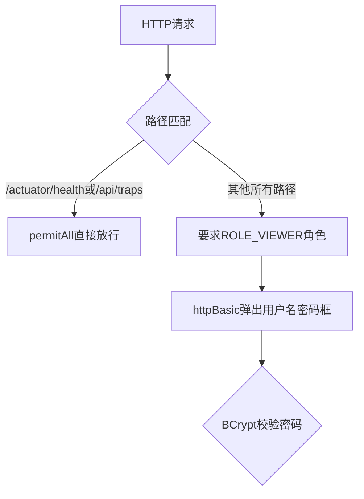

# 16. Web画面认证：Spring Security与Basic Auth

Trap API和Web展示页面是两套完全不同的认证边界，SecurityConfig负责配置Web侧的Basic Auth和权限控制。

## 核心要点

* securityFilterChain中对/actuator/health、/api/traps做了permitAll放行，其余所有请求都要求具备VIEWER角色
* 用户信息通过InMemoryUserDetailsManager配置，用户名和密码均来自外部配置(最终来自Secret)，密码长度同样要求大于等于16位
* 密码用BCryptPasswordEncoder(12)加密存储，12是加密强度(cost factor)，数字越大计算越慢但抗暴力破解能力越强
* sessionCreationPolicy设置为STATELESS，即不使用HTTP Session，每次请求都要重新携带Basic Auth凭据
* 对/api/traps这个路径单独关闭了csrf防护，因为这个接口本来就不使用Session/Cookie认证，而是用之前讲的Bearer Token机制

---

## 本章测验

本章共 5 道单项选择题。

### 第 1 题

SecurityConfig中，哪些路径被明确设置为permitAll，不需要认证？

- A. 所有路径都需要认证，没有例外
- B. 仅登录页面
- C. 仅Web首页
- D. /actuator/health相关路径和/api/traps

选择答案后查看结果

正确答案：D

答案解析：代码里authorizeHttpRequests配置了.requestMatchers(\"/actuator/health\", \"/actuator/health/**\", \"/api/traps\").permitAll()，这两类路径分别对应健康检查和已经用Bearer Token单独认证的Trap API。

### 第 2 题

Web画面登录用户的密码是用什么方式加密存储的？

- A. 用BCryptPasswordEncoder，加密强度为12
- B. 用MD5单向哈希
- C. 用对称加密算法AES
- D. 明文存储，不加密

选择答案后查看结果

正确答案：A

答案解析：passwordEncoder这个Bean返回了new BCryptPasswordEncoder(12)，12代表BCrypt的cost factor，数值越大计算耗时越长，抵御暴力破解的能力也越强。

### 第 3 题

sessionCreationPolicy设置为STATELESS意味着什么？

- A. 每次登录后会保留一个长期有效的Session，不需要重复输入密码
- B. 不使用HTTP Session保存登录状态，每次请求都要重新携带Basic Auth凭据
- C. 用户永远不需要认证
- D. 这个配置只影响Trap API，不影响Web页面

选择答案后查看结果

正确答案：B

答案解析：STATELESS策略下Spring Security不会创建或使用HttpSession来记住登录状态，浏览器每次发起请求时都要带上Basic Auth的用户名密码，这也符合Basic Auth协议本身的工作方式。

### 第 4 题

为什么/api/traps这个路径要单独在csrf配置里被忽略(ignoringRequestMatchers)？

- A. 因为Trap API不允许任何跨域请求
- B. 因为这个接口不重要，可以忽略安全风险
- C. 因为CSRF防护主要针对基于Cookie/Session的浏览器请求，而/api/traps使用的是Bearer Token认证，不依赖Cookie，天然不受CSRF攻击影响，强制要求CSRF Token反而会让内部服务调用失败
- D. 因为CSRF只对GET请求有效，POST请求不需要考虑

选择答案后查看结果

正确答案：C

答案解析：CSRF攻击的前提是浏览器会自动携带Cookie/Session凭据，而/api/traps走的是显式携带Bearer Token的认证方式，不存在CSRF攻击的前提条件，所以对这个路径关闭CSRF校验是合理且必要的，否则来自内部脚本的调用会因为缺少CSRF Token而被拒绝。

### 第 5 题

如果配置的viewer密码长度小于16位，会发生什么？

- A. 密码会被自动截断到16位
- B. 系统会随机生成一个新密码替代
- C. 应用正常启动，只是安全性较弱
- D. userDetailsService这个Bean的构造过程会抛出IllegalArgumentException，导致应用启动失败

选择答案后查看结果

正确答案：D

答案解析：代码里在userDetailsService方法中有if (password == null || password.length() < 16) throw new IllegalArgumentException(...)，同样是fail-fast的设计，确保生产环境不会使用弱密码启动。

<!-- QUIZ_DATA_START
{
  "chapter": "16",
  "questions": [
    {
      "id": 1,
      "question": "SecurityConfig中，哪些路径被明确设置为permitAll，不需要认证？",
      "options": {
        "A": "所有路径都需要认证，没有例外",
        "B": "仅登录页面",
        "C": "仅Web首页",
        "D": "/actuator/health相关路径和/api/traps"
      },
      "answer": "D",
      "explanation": "代码里authorizeHttpRequests配置了.requestMatchers(\\\"/actuator/health\\\", \\\"/actuator/health/**\\\", \\\"/api/traps\\\").permitAll()，这两类路径分别对应健康检查和已经用Bearer Token单独认证的Trap API。"
    },
    {
      "id": 2,
      "question": "Web画面登录用户的密码是用什么方式加密存储的？",
      "options": {
        "A": "用BCryptPasswordEncoder，加密强度为12",
        "B": "用MD5单向哈希",
        "C": "用对称加密算法AES",
        "D": "明文存储，不加密"
      },
      "answer": "A",
      "explanation": "passwordEncoder这个Bean返回了new BCryptPasswordEncoder(12)，12代表BCrypt的cost factor，数值越大计算耗时越长，抵御暴力破解的能力也越强。"
    },
    {
      "id": 3,
      "question": "sessionCreationPolicy设置为STATELESS意味着什么？",
      "options": {
        "A": "每次登录后会保留一个长期有效的Session，不需要重复输入密码",
        "B": "不使用HTTP Session保存登录状态，每次请求都要重新携带Basic Auth凭据",
        "C": "用户永远不需要认证",
        "D": "这个配置只影响Trap API，不影响Web页面"
      },
      "answer": "B",
      "explanation": "STATELESS策略下Spring Security不会创建或使用HttpSession来记住登录状态，浏览器每次发起请求时都要带上Basic Auth的用户名密码，这也符合Basic Auth协议本身的工作方式。"
    },
    {
      "id": 4,
      "question": "为什么/api/traps这个路径要单独在csrf配置里被忽略(ignoringRequestMatchers)？",
      "options": {
        "A": "因为Trap API不允许任何跨域请求",
        "B": "因为这个接口不重要，可以忽略安全风险",
        "C": "因为CSRF防护主要针对基于Cookie/Session的浏览器请求，而/api/traps使用的是Bearer Token认证，不依赖Cookie，天然不受CSRF攻击影响，强制要求CSRF Token反而会让内部服务调用失败",
        "D": "因为CSRF只对GET请求有效，POST请求不需要考虑"
      },
      "answer": "C",
      "explanation": "CSRF攻击的前提是浏览器会自动携带Cookie/Session凭据，而/api/traps走的是显式携带Bearer Token的认证方式，不存在CSRF攻击的前提条件，所以对这个路径关闭CSRF校验是合理且必要的，否则来自内部脚本的调用会因为缺少CSRF Token而被拒绝。"
    },
    {
      "id": 5,
      "question": "如果配置的viewer密码长度小于16位，会发生什么？",
      "options": {
        "A": "密码会被自动截断到16位",
        "B": "系统会随机生成一个新密码替代",
        "C": "应用正常启动，只是安全性较弱",
        "D": "userDetailsService这个Bean的构造过程会抛出IllegalArgumentException，导致应用启动失败"
      },
      "answer": "D",
      "explanation": "代码里在userDetailsService方法中有if (password == null || password.length() < 16) throw new IllegalArgumentException(...)，同样是fail-fast的设计，确保生产环境不会使用弱密码启动。"
    }
  ]
}
QUIZ_DATA_END -->
