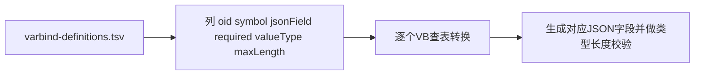

# 16 VB定义辞书 varbind-definitions.tsv

第二份运行时辞书负责把每个 Variable Binding 翻译成 JSON 字段，并规定它的类型和长度限制。

## 核心要点

* varbind-definitions.tsv 的列顺序是：oid、symbol、jsonField、required、valueType、maxLength。
* oid 必须是数字加点号、唯一，并且要与 MIB 中的同一个符号 OID 一致；symbol 是 MIB 里的对象名，同样要求唯一且真实存在。
* jsonField 是最终传给 API 的 JSON 字段名，要求小驼峰、唯一，且必须有对应的转换逻辑支持；required 目前全部为 true，即 7 个字段都是必填。
* valueType 只能是 string、number、datetime 三种之一，number 允许带符号的整数或小数，datetime 要求 ISO-8601 本地日期时间的前缀格式；maxLength 是去掉引号之后的最大字符数限制。
* 未知的 VB OID 会被直接忽略，不影响处理，这是为了不阻碍 SNMP 协议本身的可扩展性；但已知的必须字段如果最终为空，则整条 Trap 会被拒绝。

---

## 本章测验

本章共 5 道单项选择题。

### 第 1 题

varbind-definitions.tsv 中，valueType 列允许的取值有哪几种？

- A. int、float、text
- B. string、number、datetime
- C. text、date、integer
- D. boolean、string、array

选择答案后查看结果

正确答案：B

答案解析：文档中列明 valueType 值仅限 string、number、datetime 三种。

### 第 2 题

如果 snmptrapd 转发脚本收到一个 VB 定义辞书中未登记的 OID，会如何处理？

- A. 立即终止整个转发流程
- B. 直接忽略该 OID，不影响其他字段处理
- C. 自动把它当作 message 字段处理
- D. 写入数据库的额外扩展列

选择答案后查看结果

正确答案：B

答案解析：设计文档说明未知的 VB OID 会被忽略，以保留 SNMP 协议本身的可扩展性，不会中断处理流程。

### 第 3 题

如果某个已知的必须 VB 字段最终解析为空值，脚本会怎么做？

- A. 拒绝这条 Trap，不再转发
- B. 用空字符串占位并继续转发
- C. 跳过该字段但保留其余字段并转发
- D. 自动从 MIB 中查找默认值填充

选择答案后查看结果

正确答案：A

答案解析：文档明确：已知的必须 VB 最终为空时，整条 Trap 会被拒绝，不会转发不完整的数据。

### 第 4 题

varbind-definitions.tsv 中当前 7 个字段的 required 列取值情况是什么？

- A. 全部为 true，均为必填字段
- B. 该列不存在于当前版本
- C. 部分为 true，部分为 false
- D. 全部为 false，均为可选字段

选择答案后查看结果

正确答案：A

答案解析：文档说明现行 7 个字段的 required 列均为 true，即全部为必填字段。

### 第 5 题

maxLength 列的具体含义是什么？

- A. 去除外侧引号之后允许的最大字符数
- B. 该字段在 MIB 中定义的位数
- C. 该字段允许的最大发送次数
- D. 字段在数据库中的原始字节长度

选择答案后查看结果

正确答案：A

答案解析：文档中说明 maxLength 表示引用符除去后的最大文字数，即去掉引号后的字符长度限制。

<!-- QUIZ_DATA_START
{
  "chapter": "16",
  "questions": [
    {
      "id": 1,
      "question": "varbind-definitions.tsv 中，valueType 列允许的取值有哪几种？",
      "options": {
        "A": "int、float、text",
        "B": "string、number、datetime",
        "C": "text、date、integer",
        "D": "boolean、string、array"
      },
      "answer": "B",
      "explanation": "文档中列明 valueType 值仅限 string、number、datetime 三种。"
    },
    {
      "id": 2,
      "question": "如果 snmptrapd 转发脚本收到一个 VB 定义辞书中未登记的 OID，会如何处理？",
      "options": {
        "A": "立即终止整个转发流程",
        "B": "直接忽略该 OID，不影响其他字段处理",
        "C": "自动把它当作 message 字段处理",
        "D": "写入数据库的额外扩展列"
      },
      "answer": "B",
      "explanation": "设计文档说明未知的 VB OID 会被忽略，以保留 SNMP 协议本身的可扩展性，不会中断处理流程。"
    },
    {
      "id": 3,
      "question": "如果某个已知的必须 VB 字段最终解析为空值，脚本会怎么做？",
      "options": {
        "A": "拒绝这条 Trap，不再转发",
        "B": "用空字符串占位并继续转发",
        "C": "跳过该字段但保留其余字段并转发",
        "D": "自动从 MIB 中查找默认值填充"
      },
      "answer": "A",
      "explanation": "文档明确：已知的必须 VB 最终为空时，整条 Trap 会被拒绝，不会转发不完整的数据。"
    },
    {
      "id": 4,
      "question": "varbind-definitions.tsv 中当前 7 个字段的 required 列取值情况是什么？",
      "options": {
        "A": "全部为 true，均为必填字段",
        "B": "该列不存在于当前版本",
        "C": "部分为 true，部分为 false",
        "D": "全部为 false，均为可选字段"
      },
      "answer": "A",
      "explanation": "文档说明现行 7 个字段的 required 列均为 true，即全部为必填字段。"
    },
    {
      "id": 5,
      "question": "maxLength 列的具体含义是什么？",
      "options": {
        "A": "去除外侧引号之后允许的最大字符数",
        "B": "该字段在 MIB 中定义的位数",
        "C": "该字段允许的最大发送次数",
        "D": "字段在数据库中的原始字节长度"
      },
      "answer": "A",
      "explanation": "文档中说明 maxLength 表示引用符除去后的最大文字数，即去掉引号后的字符长度限制。"
    }
  ]
}
QUIZ_DATA_END -->
