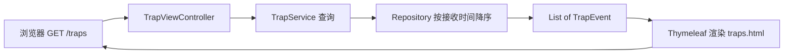

# 展示层：traps.html 与 Thymeleaf

数据存进数据库之后，运维人员打开浏览器看到的那张表，究竟是怎么渲染出来的？

## 核心要点

* traps.html 是服务端渲染的 HTML 表格，不依赖任何 JavaScript，页面加载即完整展示，兼容性和可预测性都很好。
* TrapViewController 处理 / 和 /traps 两个路径的浏览器请求，调用 TrapService 获取数据后交给模板渲染。
* 展示的数据来自 Repository 按接收时间降序的查询结果，所以最新收到的 Trap 记录会排在最前面。
* 由于不依赖 JavaScript，这个页面天然适合被简单的自动化测试或截图工具捕获，也是 README 中截图展示的来源。

---

## 本章测验

本章共 5 道单项选择题。

### 第 1 题

traps.html 页面不依赖 JavaScript，这样设计带来的直接好处是什么？

- A. 无法进行任何交互
- B. 页面无法显示任何数据
- C. 浏览器必须安装插件才能访问
- D. 页面加载即可看到完整内容，兼容性和可预测性更好

选择答案后查看结果

正确答案：D

答案解析：纯服务端渲染的 HTML 表格在页面加载完成时就已经包含全部内容，不需要额外的 JS 执行步骤，行为更简单可预测。

### 第 2 题

浏览器访问 /traps 时，是哪个组件负责处理这个请求？

- A. TrapApiController
- B. TrapViewController
- C. ApiExceptionHandler
- D. TrapEventRepository

选择答案后查看结果

正确答案：B

答案解析：详细设计书明确 TrapViewController 负责处理 / 和 /traps 两个页面路径的请求。

### 第 3 题

页面上展示的 Trap 记录排序依据是什么？

- A. 按 deviceId 字母顺序
- B. 按 severity 严重程度排序
- C. 随机排序
- D. 按接收时间（RECEIVED_TIME）降序

选择答案后查看结果

正确答案：D

答案解析：结合 Repository 的设计，查询是按接收日期时间降序进行的，因此页面上最新收到的记录会排在最前面。

### 第 4 题

为什么 README 中的功能截图可以直接展示这个页面的效果？

- A. 因为页面是纯服务端渲染的静态 HTML，加载完成即为最终效果，便于截图
- B. 因为页面使用了专门的截图 API
- C. 因为页面内容完全是预先写死的
- D. 因为页面每隔几秒会自动刷新一次

选择答案后查看结果

正确答案：A

答案解析：由于不依赖 JavaScript 异步渲染，页面加载完成的那一刻就是最终展示效果，适合用普通截图工具直接捕获，无需等待额外的脚本执行。

### 第 5 题

如果浏览器请求 /traps 时数据库查询失败，从架构上看合理的处理方式是什么？

- A. 浏览器会自动切换到离线模式显示缓存数据
- B. 这种情况在设计上完全不可能发生
- C. 页面应当直接崩溃白屏且不给任何提示
- D. 由类似 ApiExceptionHandler 的机制统一处理异常，避免堆栈直接暴露给用户

选择答案后查看结果

正确答案：D

答案解析：虽然 ApiExceptionHandler 主要面向 API 层，但统一、优雅地处理异常、避免把技术细节直接暴露给终端用户，是良好 Web 应用设计的通用原则。

<!-- QUIZ_DATA_START
{
  "chapter": "16",
  "questions": [
    {
      "id": 1,
      "question": "traps.html 页面不依赖 JavaScript，这样设计带来的直接好处是什么？",
      "options": {
        "D": "页面加载即可看到完整内容，兼容性和可预测性更好",
        "A": "无法进行任何交互",
        "B": "页面无法显示任何数据",
        "C": "浏览器必须安装插件才能访问"
      },
      "answer": "D",
      "explanation": "纯服务端渲染的 HTML 表格在页面加载完成时就已经包含全部内容，不需要额外的 JS 执行步骤，行为更简单可预测。"
    },
    {
      "id": 2,
      "question": "浏览器访问 /traps 时，是哪个组件负责处理这个请求？",
      "options": {
        "B": "TrapViewController",
        "A": "TrapApiController",
        "C": "ApiExceptionHandler",
        "D": "TrapEventRepository"
      },
      "answer": "B",
      "explanation": "详细设计书明确 TrapViewController 负责处理 / 和 /traps 两个页面路径的请求。"
    },
    {
      "id": 3,
      "question": "页面上展示的 Trap 记录排序依据是什么？",
      "options": {
        "D": "按接收时间（RECEIVED_TIME）降序",
        "A": "按 deviceId 字母顺序",
        "B": "按 severity 严重程度排序",
        "C": "随机排序"
      },
      "answer": "D",
      "explanation": "结合 Repository 的设计，查询是按接收日期时间降序进行的，因此页面上最新收到的记录会排在最前面。"
    },
    {
      "id": 4,
      "question": "为什么 README 中的功能截图可以直接展示这个页面的效果？",
      "options": {
        "A": "因为页面是纯服务端渲染的静态 HTML，加载完成即为最终效果，便于截图",
        "B": "因为页面使用了专门的截图 API",
        "C": "因为页面内容完全是预先写死的",
        "D": "因为页面每隔几秒会自动刷新一次"
      },
      "answer": "A",
      "explanation": "由于不依赖 JavaScript 异步渲染，页面加载完成的那一刻就是最终展示效果，适合用普通截图工具直接捕获，无需等待额外的脚本执行。"
    },
    {
      "id": 5,
      "question": "如果浏览器请求 /traps 时数据库查询失败，从架构上看合理的处理方式是什么？",
      "options": {
        "D": "由类似 ApiExceptionHandler 的机制统一处理异常，避免堆栈直接暴露给用户",
        "A": "浏览器会自动切换到离线模式显示缓存数据",
        "B": "这种情况在设计上完全不可能发生",
        "C": "页面应当直接崩溃白屏且不给任何提示"
      },
      "answer": "D",
      "explanation": "虽然 ApiExceptionHandler 主要面向 API 层，但统一、优雅地处理异常、避免把技术细节直接暴露给终端用户，是良好 Web 应用设计的通用原则。"
    }
  ]
}
QUIZ_DATA_END -->
