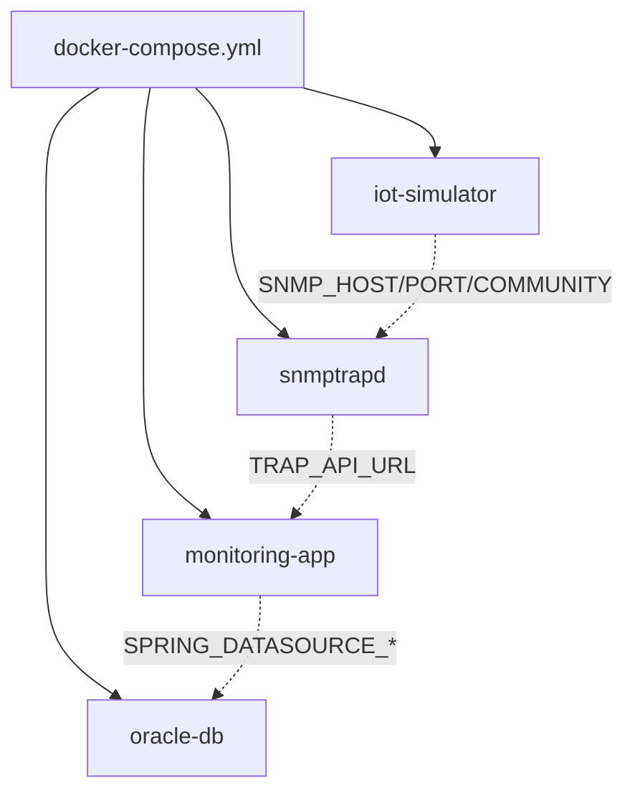

# 环境变量与 Docker Compose 编排

四个组件是怎么被拼装、配置到一起，用一条命令就能跑起来的？

## 核心要点

* docker compose up -d --build 一条命令即可构建并启动 snmptrapd、monitoring-app、oracle-db 等常驻服务。
* iot-simulator 是一次性任务容器，通过 docker compose run --rm iot-simulator <场景名> 按需触发发送。
* 关键环境变量包括：SNMP_HOST/PORT/COMMUNITY（决定 Simulator 发送目标）、TRAP_API_URL（决定 forward-trap.sh 投递地址）、TRAP_DICTIONARY/VARBIND_DICTIONARY（字典文件路径）、SPRING_DATASOURCE_*（数据库连接信息）。
* 宿主机需要预留 UDP 162、TCP 8080、TCP 1521 三个端口不被占用，这是启动前的前置条件之一。
* Oracle Database Free 首次启动通常需要几分钟完成初始化，这段等待时间是正常现象。

---

## 本章测验

本章共 5 道单项选择题。

### 第 1 题

启动整套系统的核心命令是什么？

- A. snmptrapd --start-all
- B. docker run oracle-free
- C. docker compose up -d --build
- D. java -jar monitoring-app.jar

选择答案后查看结果

正确答案：C

答案解析：README 给出的最短启动步骤是在项目根目录执行 docker compose up -d --build，一次性构建并启动常驻服务。

### 第 2 题

iot-simulator 这个容器和其他三个服务（snmptrapd、monitoring-app、oracle-db）在运行方式上有什么本质区别？

- A. iot-simulator 需要单独的 Kubernetes 集群才能运行
- B. iot-simulator 是一次性任务容器，通过 run --rm 按需触发，其他是常驻服务
- C. iot-simulator 不需要 Docker 就能运行
- D. 没有区别，都是常驻服务

选择答案后查看结果

正确答案：B

答案解析：其他三个服务是持续运行的后台服务，而 iot-simulator 通过 docker compose run --rm 按需执行一次发送任务后即退出销毁。

### 第 3 题

TRAP_API_URL 这个环境变量的作用是什么？

- A. 指定 Simulator 发送 Trap 的目标地址
- B. 指定浏览器访问页面的地址
- C. 指定 Oracle 数据库的连接地址
- D. 指定 forward-trap.sh 把 JSON 投递到 Spring Boot 的哪个地址

选择答案后查看结果

正确答案：D

答案解析：环境变量表中 TRAP_API_URL 默认值为 http://monitoring-app:8080/api/traps，用于转发脚本知道要把 JSON POST 到哪里。

### 第 4 题

启动前需要确保宿主机哪些端口未被占用？

- A. UDP 162、TCP 8080、TCP 1521
- B. TCP 22、TCP 3306、UDP 123
- C. TCP 9000、TCP 9090、UDP 514
- D. UDP 53、TCP 80、TCP 443

选择答案后查看结果

正确答案：A

答案解析：前提条件中列出宿主机的 UDP 162（Trap 接收）、TCP 8080（Spring Boot）、TCP 1521（Oracle）需要保持未被占用。

### 第 5 题

如果想把 Simulator 发送 Trap 的目标 Community 从 public 改成其他值，应该怎么做，会影响哪些其他组件？

- A. 只需要修改 monitoring-app 的配置，其他组件不受影响
- B. Community 值是硬编码的，无法修改
- C. 修改后 Oracle 数据库需要重新建表
- D. 只需修改 SNMP_COMMUNITY 环境变量；同时 snmptrapd 的 authCommunity 配置也要相应调整才能保持一致，否则报文会被拒绝

选择答案后查看结果

正确答案：D

答案解析：SNMP_COMMUNITY 决定 Simulator 发送时使用的 Community 值，而 snmptrapd 的 authCommunity 配置决定它接受哪个 Community 的报文，两边必须保持一致，否则报文会在 snmptrapd 端被拒绝。

<!-- QUIZ_DATA_START
{
  "chapter": "17",
  "questions": [
    {
      "id": 1,
      "question": "启动整套系统的核心命令是什么？",
      "options": {
        "C": "docker compose up -d --build",
        "A": "snmptrapd --start-all",
        "B": "docker run oracle-free",
        "D": "java -jar monitoring-app.jar"
      },
      "answer": "C",
      "explanation": "README 给出的最短启动步骤是在项目根目录执行 docker compose up -d --build，一次性构建并启动常驻服务。"
    },
    {
      "id": 2,
      "question": "iot-simulator 这个容器和其他三个服务（snmptrapd、monitoring-app、oracle-db）在运行方式上有什么本质区别？",
      "options": {
        "B": "iot-simulator 是一次性任务容器，通过 run --rm 按需触发，其他是常驻服务",
        "A": "iot-simulator 需要单独的 Kubernetes 集群才能运行",
        "C": "iot-simulator 不需要 Docker 就能运行",
        "D": "没有区别，都是常驻服务"
      },
      "answer": "B",
      "explanation": "其他三个服务是持续运行的后台服务，而 iot-simulator 通过 docker compose run --rm 按需执行一次发送任务后即退出销毁。"
    },
    {
      "id": 3,
      "question": "TRAP_API_URL 这个环境变量的作用是什么？",
      "options": {
        "D": "指定 forward-trap.sh 把 JSON 投递到 Spring Boot 的哪个地址",
        "A": "指定 Simulator 发送 Trap 的目标地址",
        "B": "指定浏览器访问页面的地址",
        "C": "指定 Oracle 数据库的连接地址"
      },
      "answer": "D",
      "explanation": "环境变量表中 TRAP_API_URL 默认值为 http://monitoring-app:8080/api/traps，用于转发脚本知道要把 JSON POST 到哪里。"
    },
    {
      "id": 4,
      "question": "启动前需要确保宿主机哪些端口未被占用？",
      "options": {
        "A": "UDP 162、TCP 8080、TCP 1521",
        "B": "TCP 22、TCP 3306、UDP 123",
        "C": "TCP 9000、TCP 9090、UDP 514",
        "D": "UDP 53、TCP 80、TCP 443"
      },
      "answer": "A",
      "explanation": "前提条件中列出宿主机的 UDP 162（Trap 接收）、TCP 8080（Spring Boot）、TCP 1521（Oracle）需要保持未被占用。"
    },
    {
      "id": 5,
      "question": "如果想把 Simulator 发送 Trap 的目标 Community 从 public 改成其他值，应该怎么做，会影响哪些其他组件？",
      "options": {
        "D": "只需修改 SNMP_COMMUNITY 环境变量；同时 snmptrapd 的 authCommunity 配置也要相应调整才能保持一致，否则报文会被拒绝",
        "A": "只需要修改 monitoring-app 的配置，其他组件不受影响",
        "B": "Community 值是硬编码的，无法修改",
        "C": "修改后 Oracle 数据库需要重新建表"
      },
      "answer": "D",
      "explanation": "SNMP_COMMUNITY 决定 Simulator 发送时使用的 Community 值，而 snmptrapd 的 authCommunity 配置决定它接受哪个 Community 的报文，两边必须保持一致，否则报文会在 snmptrapd 端被拒绝。"
    }
  ]
}
QUIZ_DATA_END -->
