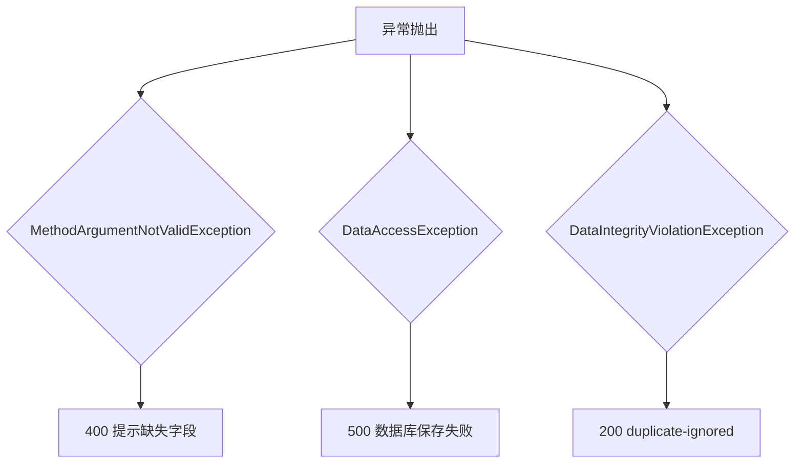

# 17. 异常处理机制：ApiExceptionHandler

这一章聚焦Spring Boot如何用统一的异常处理，把不同类型的错误转换成恰当的HTTP响应，而不泄露内部细节。

## 核心要点

* 三种异常分别对应输入校验失败、通用数据库访问异常、以及数据完整性冲突(如唯一约束冲突)
* MethodArgumentNotValidException对应字段格式错误，返回400和具体是哪个字段出了问题，但不暴露详细的校验规则实现
* DataIntegrityViolationException特意返回200和duplicate-ignored，而不是报错，因为这种情况通常就是并发场景下的重复eventId被数据库唯一约束拦下，属于预期内的正常情况
* 所有异常处理方法都用@RestControllerAdvice统一收敛，避免在每个Controller里写重复的try-catch逻辑

---

## 本章测验

本章共 5 道单项选择题。

### 第 1 题

MethodArgumentNotValidException被捕获后，返回的HTTP状态码是多少？

- A. 400
- B. 500
- C. 401
- D. 200

选择答案后查看结果

正确答案：A

答案解析：这个方法上标注了@ResponseStatus(HttpStatus.BAD_REQUEST)，对应输入数据格式或必填项不满足Bean Validation规则的场景，属于客户端错误。

### 第 2 题

为什么DataIntegrityViolationException(唯一约束冲突)被处理成返回200而不是错误状态码？

- A. 这是代码疏漏，本应返回409
- B. 因为这种冲突通常就是重试或并发场景下重复投递的正常表现，属于预期内情况，不应该让上游把它当成失败重试
- C. 因为Oracle数据库不支持返回409状态码
- D. 因为Spring框架强制要求所有异常都返回200

选择答案后查看结果

正确答案：B

答案解析：结合前面讲过的重试队列和幂等机制，重复的eventId命中唯一约束是完全正常且预期的行为，把它当作成功(200和duplicate-ignored)处理，可以让上游(比如retry-queue.sh)认为投递已经完成，不再重复尝试。

### 第 3 题

DataAccessException被捕获时返回的状态码和内容是什么？

- A. 直接不响应，让请求超时
- B. 200和空内容
- C. 500和一段通用的\"数据库保存失败\"提示，同时记录详细异常到日志
- D. 400和详细的SQL错误堆栈

选择答案后查看结果

正确答案：C

答案解析：代码用@ResponseStatus(HttpStatus.INTERNAL_SERVER_ERROR)标注，返回给客户端的只是一句通用提示，详细的异常堆栈用log.error记录在服务端日志里，避免把数据库内部细节暴露给外部调用方。

### 第 4 题

为什么校验失败的响应体里只返回字段名，而不是把Bean Validation具体的正则表达式或详细规则返回给调用方？

- A. 因为返回详细规则会导致响应体过大
- B. 这是历史遗留代码，没有特别设计考量
- C. 因为技术上无法获取到正则表达式内容
- D. 避免把内部实现细节暴露给外部，只需要告诉调用方哪个字段有问题即可，具体规则属于内部实现

选择答案后查看结果

正确答案：D

答案解析：这是一种最小信息暴露原则的体现，返回具体的正则或规则细节对调用方排查问题帮助有限，反而可能暴露内部实现供攻击者针对性构造绕过或试探数据。

### 第 5 题

@RestControllerAdvice这个注解的作用是什么？

- A. 提供一个全局的异常处理入口，让所有Controller共享同一套统一的异常处理规则
- B. 用于配置数据库连接池
- C. 标记这个类是一个可以被外部调用的REST接口
- D. 给单个Controller添加异常处理逻辑，只对该Controller生效

选择答案后查看结果

正确答案：A

答案解析：@RestControllerAdvice是Spring提供的全局异常处理机制，被标注的类里的@ExceptionHandler方法会应用到所有Controller抛出的对应异常上，避免在每个Controller里重复编写相同的异常处理代码。

<!-- QUIZ_DATA_START
{
  "chapter": "17",
  "questions": [
    {
      "id": 1,
      "question": "MethodArgumentNotValidException被捕获后，返回的HTTP状态码是多少？",
      "options": {
        "A": "400",
        "B": "500",
        "C": "401",
        "D": "200"
      },
      "answer": "A",
      "explanation": "这个方法上标注了@ResponseStatus(HttpStatus.BAD_REQUEST)，对应输入数据格式或必填项不满足Bean Validation规则的场景，属于客户端错误。"
    },
    {
      "id": 2,
      "question": "为什么DataIntegrityViolationException(唯一约束冲突)被处理成返回200而不是错误状态码？",
      "options": {
        "A": "这是代码疏漏，本应返回409",
        "B": "因为这种冲突通常就是重试或并发场景下重复投递的正常表现，属于预期内情况，不应该让上游把它当成失败重试",
        "C": "因为Oracle数据库不支持返回409状态码",
        "D": "因为Spring框架强制要求所有异常都返回200"
      },
      "answer": "B",
      "explanation": "结合前面讲过的重试队列和幂等机制，重复的eventId命中唯一约束是完全正常且预期的行为，把它当作成功(200和duplicate-ignored)处理，可以让上游(比如retry-queue.sh)认为投递已经完成，不再重复尝试。"
    },
    {
      "id": 3,
      "question": "DataAccessException被捕获时返回的状态码和内容是什么？",
      "options": {
        "A": "直接不响应，让请求超时",
        "B": "200和空内容",
        "C": "500和一段通用的\\\"数据库保存失败\\\"提示，同时记录详细异常到日志",
        "D": "400和详细的SQL错误堆栈"
      },
      "answer": "C",
      "explanation": "代码用@ResponseStatus(HttpStatus.INTERNAL_SERVER_ERROR)标注，返回给客户端的只是一句通用提示，详细的异常堆栈用log.error记录在服务端日志里，避免把数据库内部细节暴露给外部调用方。"
    },
    {
      "id": 4,
      "question": "为什么校验失败的响应体里只返回字段名，而不是把Bean Validation具体的正则表达式或详细规则返回给调用方？",
      "options": {
        "A": "因为返回详细规则会导致响应体过大",
        "B": "这是历史遗留代码，没有特别设计考量",
        "C": "因为技术上无法获取到正则表达式内容",
        "D": "避免把内部实现细节暴露给外部，只需要告诉调用方哪个字段有问题即可，具体规则属于内部实现"
      },
      "answer": "D",
      "explanation": "这是一种最小信息暴露原则的体现，返回具体的正则或规则细节对调用方排查问题帮助有限，反而可能暴露内部实现供攻击者针对性构造绕过或试探数据。"
    },
    {
      "id": 5,
      "question": "@RestControllerAdvice这个注解的作用是什么？",
      "options": {
        "A": "提供一个全局的异常处理入口，让所有Controller共享同一套统一的异常处理规则",
        "B": "用于配置数据库连接池",
        "C": "标记这个类是一个可以被外部调用的REST接口",
        "D": "给单个Controller添加异常处理逻辑，只对该Controller生效"
      },
      "answer": "A",
      "explanation": "@RestControllerAdvice是Spring提供的全局异常处理机制，被标注的类里的@ExceptionHandler方法会应用到所有Controller抛出的对应异常上，避免在每个Controller里重复编写相同的异常处理代码。"
    }
  ]
}
QUIZ_DATA_END -->
