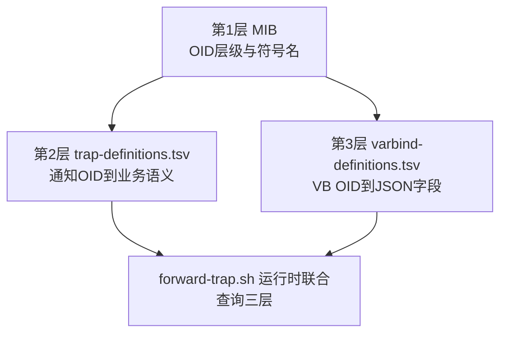

# 17 辞书三层分离架构

把 MIB、Trap 定义辞书、VB 定义辞书放在一起看，理解为什么要分成三层，而不是合并成一个文件。

## 核心要点

* 整个辞书体系被划分为三层：MIB 负责“OID 层级与符号名”，Trap 定义辞书负责“通知 OID 到 Trap 名、业务类型、严重程度”，VB 定义辞书负责“VB OID 到 JSON 字段、类型、必须性、最大长度”。
* 运行时的规则正本是两份 TSV 辞书，而不是把规则重复写死在脚本代码里，这样修改业务规则时只需要改辞书文件，不需要改脚本逻辑。
* 脚本、辞书、MIB 打包进同一个容器镜像，Git 的改动单位和发布单位保持一致，避免出现“代码更新了但辞书没更新”的错位。
* 辞书路径可以通过 TRAP_DICTIONARY 和 VARBIND_DICTIONARY 两个环境变量切换，但这仅用于测试场景，不支持运行时热切换。

---

## 本章测验

本章共 5 道单项选择题。

### 第 1 题

辞书三层分离架构中，MIB 主要承担的角色是什么？

- A. 生成 Web 页面模板
- B. 决定数据库表结构
- C. 存储运行时的业务枚举值
- D. 定义 OID 层级和符号名

选择答案后查看结果

正确答案：D

答案解析：三层分离中，MIB 负责通知和 VB 的 OID 层级结构与符号名，是结构层面的正本。

### 第 2 题

为什么运行时规则的正本被放在两份 TSV 辞书里，而不是硬编码进转发脚本？

- A. TSV 文件运行速度比代码更快
- B. 因为 MIB 文件不支持嵌入业务规则
- C. 这样修改业务规则时只需改辞书文件，无需改动脚本逻辑，降低改动范围
- D. 因为 shell 脚本无法处理 JSON

选择答案后查看结果

正确答案：C

答案解析：将规则集中在 TSV 辞书中，使得业务规则调整只需修改辞书文件，脚本逻辑保持不变，减少了改动范围和引入错误的风险。

### 第 3 题

MIB、辞书、转发脚本为什么被打包进同一个容器镜像，而不是分开管理？

- A. 为了减少镜像总大小
- B. 为了方便浏览器直接访问这些文件
- C. 为了让 Git 的改动单位与发布单位保持一致，避免代码和辞书更新不同步
- D. 因为 Docker 不支持跨镜像文件引用

选择答案后查看结果

正确答案：C

答案解析：将三者打包进同一镜像，是为了让代码改动与发布版本严格对应，避免出现代码更新了但辞书未同步更新的错位问题。

### 第 4 题

环境变量 TRAP_DICTIONARY 和 VARBIND_DICTIONARY 的设计用途是什么？

- A. 用于配置 Oracle 数据库连接字符串
- B. 用于控制浏览器页面的语言版本
- C. 仅用于测试场景下指定辞书文件路径
- D. 支持生产环境运行时热切换辞书内容

选择答案后查看结果

正确答案：C

答案解析：文档说明这两个环境变量的作用是让辞书路径“在测试时切换”，并非支持生产环境的动态热切换。

### 第 5 题

在这套三层架构中，validate-dictionary.sh 主要在什么阶段发挥作用？

- A. 在镜像构建阶段，对辞书与 MIB 的一致性进行交叉验证
- B. 仅在 Oracle 数据库启动时触发
- C. 仅在浏览器请求页面时触发
- D. 在每次 Trap 到达时实时触发

选择答案后查看结果

正确答案：A

答案解析：validate-dictionary.sh 是构建时验证脚本，在镜像构建阶段检查辞书格式、重复项以及与 MIB 的 OID 一致性，而非运行时逐条触发。

<!-- QUIZ_DATA_START
{
  "chapter": "17",
  "questions": [
    {
      "id": 1,
      "question": "辞书三层分离架构中，MIB 主要承担的角色是什么？",
      "options": {
        "A": "生成 Web 页面模板",
        "B": "决定数据库表结构",
        "C": "存储运行时的业务枚举值",
        "D": "定义 OID 层级和符号名"
      },
      "answer": "D",
      "explanation": "三层分离中，MIB 负责通知和 VB 的 OID 层级结构与符号名，是结构层面的正本。"
    },
    {
      "id": 2,
      "question": "为什么运行时规则的正本被放在两份 TSV 辞书里，而不是硬编码进转发脚本？",
      "options": {
        "A": "TSV 文件运行速度比代码更快",
        "B": "因为 MIB 文件不支持嵌入业务规则",
        "C": "这样修改业务规则时只需改辞书文件，无需改动脚本逻辑，降低改动范围",
        "D": "因为 shell 脚本无法处理 JSON"
      },
      "answer": "C",
      "explanation": "将规则集中在 TSV 辞书中，使得业务规则调整只需修改辞书文件，脚本逻辑保持不变，减少了改动范围和引入错误的风险。"
    },
    {
      "id": 3,
      "question": "MIB、辞书、转发脚本为什么被打包进同一个容器镜像，而不是分开管理？",
      "options": {
        "A": "为了减少镜像总大小",
        "B": "为了方便浏览器直接访问这些文件",
        "C": "为了让 Git 的改动单位与发布单位保持一致，避免代码和辞书更新不同步",
        "D": "因为 Docker 不支持跨镜像文件引用"
      },
      "answer": "C",
      "explanation": "将三者打包进同一镜像，是为了让代码改动与发布版本严格对应，避免出现代码更新了但辞书未同步更新的错位问题。"
    },
    {
      "id": 4,
      "question": "环境变量 TRAP_DICTIONARY 和 VARBIND_DICTIONARY 的设计用途是什么？",
      "options": {
        "A": "用于配置 Oracle 数据库连接字符串",
        "B": "用于控制浏览器页面的语言版本",
        "C": "仅用于测试场景下指定辞书文件路径",
        "D": "支持生产环境运行时热切换辞书内容"
      },
      "answer": "C",
      "explanation": "文档说明这两个环境变量的作用是让辞书路径“在测试时切换”，并非支持生产环境的动态热切换。"
    },
    {
      "id": 5,
      "question": "在这套三层架构中，validate-dictionary.sh 主要在什么阶段发挥作用？",
      "options": {
        "A": "在镜像构建阶段，对辞书与 MIB 的一致性进行交叉验证",
        "B": "仅在 Oracle 数据库启动时触发",
        "C": "仅在浏览器请求页面时触发",
        "D": "在每次 Trap 到达时实时触发"
      },
      "answer": "A",
      "explanation": "validate-dictionary.sh 是构建时验证脚本，在镜像构建阶段检查辞书格式、重复项以及与 MIB 的 OID 一致性，而非运行时逐条触发。"
    }
  ]
}
QUIZ_DATA_END -->
