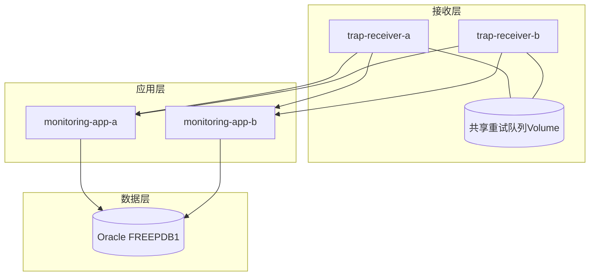

# 18. 多实例架构与高可用设计

整套系统在多个层面都做了冗余：两个接收节点、两个应用节点、一个共享数据库，这一章串起来看高可用是怎么实现的。

## 核心要点

* 接收层的两个节点(receiver-a/b)通过一致性哈希分流，各自拥有独立的USM Volume，但共享同一个重试队列Volume
* 应用层的两个Spring Boot实例(monitoring-app-a/b)是无状态的，任意请求都可以被负载均衡到任意一个实例
* 两层节点最终都收敛到同一个Oracle数据库，这是整套系统里唯一的单点，也是README里特别强调需要HA/backup/PITR的部分
* 健康检查(healthcheck)配置在每个服务上，配合depends_on的condition确保依赖顺序正确，比如gateway要等monitoring-app健康后才启动

---

## 本章测验

本章共 5 道单项选择题。

### 第 1 题

trap-receiver-a和trap-receiver-b这两个接收节点，哪些资源是共享的，哪些是各自独立的？

- A. USM状态和重试队列都是共享的
- B. 重试队列(trap-retry-queue)是共享Volume，但USM状态(receiver-a-usm/receiver-b-usm)是各自独立的Volume
- C. 两者完全没有任何共享资源
- D. 两者共用同一个USM Volume

选择答案后查看结果

正确答案：B

答案解析：docker-compose.yml里receiver-a和receiver-b各自挂载了独立的receiver-a-usm/receiver-b-usm卷用于保存USM安全状态，但都挂载了同一个trap-retry-queue卷，这样即使一个节点的重试任务处理不完，也可能被同一个队列上的retry-queue.sh后台进程处理。

### 第 2 题

monitoring-app-a和monitoring-app-b这两个应用实例，在架构设计上是什么关系？

- A. 两者存储各自独立的数据，互不相通
- B. 主备关系，只有一个在实际工作
- C. 完全对等的无状态实例，可以被nginx任意负载均衡调度
- D. 必须先启动a才能启动b

选择答案后查看结果

正确答案：C

答案解析：两个monitoring-app实例配置几乎完全相同(通过YAML锚点&monitoring-app复用)，都连接同一个Oracle数据库，不保存任何本地状态，因此可以被nginx的least_conn策略随意调度到任意一个。

### 第 3 题

整套架构中，唯一的单点（Single Point of Failure）是什么？

- A. nginx网关
- B. trap-receiver节点
- C. monitoring-app节点
- D. Oracle数据库

选择答案后查看结果

正确答案：D

答案解析：接收层和应用层都做了双节点冗余，但两层最终都写入同一个Oracle数据库实例，这也是README里特别强调生产环境需要为Oracle设计HA、backup和PITR(时间点恢复)方案的原因。

### 第 4 题

docker-compose.yml中gateway服务的depends_on为什么要设置condition: service_healthy？

- A. 确保monitoring-app实例真正通过健康检查、能够正常服务之后，gateway才会启动，避免网关启动后转发请求到还没准备好的后端
- B. 这个配置只是为了让启动日志更好看
- C. 这样可以加快容器启动速度
- D. 这个配置项没有实际作用，可以随意省略

选择答案后查看结果

正确答案：A

答案解析：如果没有健康检查依赖，gateway可能在monitoring-app还在初始化(比如正在做Flyway迁移)时就开始接收流量并转发过去，导致请求失败；service_healthy确保了依赖服务真正就绪后才继续下一步。

### 第 5 题

下列哪一种情况最能体现这套架构的高可用设计发挥了作用？

- A. 两个接收节点同时下线，系统依然正常
- B. trap-receiver-a节点故障时，新到达的Trap仍可以被一致性哈希路由到trap-receiver-b，之前receiver-a遗留在共享队列里的重试任务也还能被后台进程继续处理
- C. Oracle数据库故障时，系统依然可以正常写入数据
- D. nginx网关故障时，两个应用节点可以直接互相通信绕过网关

选择答案后查看结果

正确答案：B

答案解析：这正是接收层双节点+共享重试队列设计的价值所在：单个接收节点故障不会导致新数据丢失，也不会导致队列里遗留的重试任务无法完成，但Oracle作为唯一数据存储仍是单点，网关故障也没有绕过机制。

<!-- QUIZ_DATA_START
{
  "chapter": "18",
  "questions": [
    {
      "id": 1,
      "question": "trap-receiver-a和trap-receiver-b这两个接收节点，哪些资源是共享的，哪些是各自独立的？",
      "options": {
        "A": "USM状态和重试队列都是共享的",
        "B": "重试队列(trap-retry-queue)是共享Volume，但USM状态(receiver-a-usm/receiver-b-usm)是各自独立的Volume",
        "C": "两者完全没有任何共享资源",
        "D": "两者共用同一个USM Volume"
      },
      "answer": "B",
      "explanation": "docker-compose.yml里receiver-a和receiver-b各自挂载了独立的receiver-a-usm/receiver-b-usm卷用于保存USM安全状态，但都挂载了同一个trap-retry-queue卷，这样即使一个节点的重试任务处理不完，也可能被同一个队列上的retry-queue.sh后台进程处理。"
    },
    {
      "id": 2,
      "question": "monitoring-app-a和monitoring-app-b这两个应用实例，在架构设计上是什么关系？",
      "options": {
        "A": "两者存储各自独立的数据，互不相通",
        "B": "主备关系，只有一个在实际工作",
        "C": "完全对等的无状态实例，可以被nginx任意负载均衡调度",
        "D": "必须先启动a才能启动b"
      },
      "answer": "C",
      "explanation": "两个monitoring-app实例配置几乎完全相同(通过YAML锚点&monitoring-app复用)，都连接同一个Oracle数据库，不保存任何本地状态，因此可以被nginx的least_conn策略随意调度到任意一个。"
    },
    {
      "id": 3,
      "question": "整套架构中，唯一的单点（Single Point of Failure）是什么？",
      "options": {
        "A": "nginx网关",
        "B": "trap-receiver节点",
        "C": "monitoring-app节点",
        "D": "Oracle数据库"
      },
      "answer": "D",
      "explanation": "接收层和应用层都做了双节点冗余，但两层最终都写入同一个Oracle数据库实例，这也是README里特别强调生产环境需要为Oracle设计HA、backup和PITR(时间点恢复)方案的原因。"
    },
    {
      "id": 4,
      "question": "docker-compose.yml中gateway服务的depends_on为什么要设置condition: service_healthy？",
      "options": {
        "A": "确保monitoring-app实例真正通过健康检查、能够正常服务之后，gateway才会启动，避免网关启动后转发请求到还没准备好的后端",
        "B": "这个配置只是为了让启动日志更好看",
        "C": "这样可以加快容器启动速度",
        "D": "这个配置项没有实际作用，可以随意省略"
      },
      "answer": "A",
      "explanation": "如果没有健康检查依赖，gateway可能在monitoring-app还在初始化(比如正在做Flyway迁移)时就开始接收流量并转发过去，导致请求失败；service_healthy确保了依赖服务真正就绪后才继续下一步。"
    },
    {
      "id": 5,
      "question": "下列哪一种情况最能体现这套架构的高可用设计发挥了作用？",
      "options": {
        "A": "两个接收节点同时下线，系统依然正常",
        "B": "trap-receiver-a节点故障时，新到达的Trap仍可以被一致性哈希路由到trap-receiver-b，之前receiver-a遗留在共享队列里的重试任务也还能被后台进程继续处理",
        "C": "Oracle数据库故障时，系统依然可以正常写入数据",
        "D": "nginx网关故障时，两个应用节点可以直接互相通信绕过网关"
      },
      "answer": "B",
      "explanation": "这正是接收层双节点+共享重试队列设计的价值所在：单个接收节点故障不会导致新数据丢失，也不会导致队列里遗留的重试任务无法完成，但Oracle作为唯一数据存储仍是单点，网关故障也没有绕过机制。"
    }
  ]
}
QUIZ_DATA_END -->
