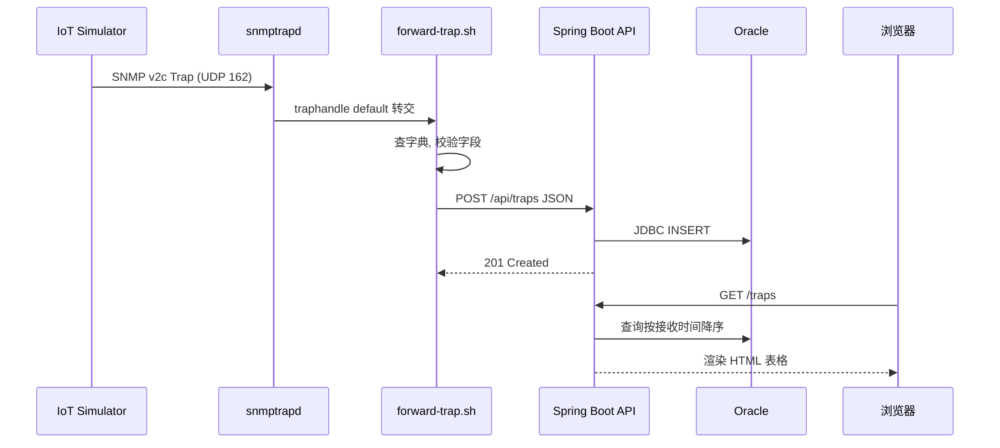

# 完整数据流演练：从 Trap 发送到页面展示

把前面十七章拆开讲的知识点，串成一条完整的时序图，走一遍全流程。

## 核心要点

* 整条链路可以概括为八步：发送、认证转交、查字典转换、字段校验、HTTP 投递、数据库写入、浏览器查询、页面渲染。
* 这条链路中有两次"翻译"：一次是 forward-trap.sh 把 SNMP 报文翻译成 JSON，一次是 TrapService/JPA 把 JSON 翻译成数据库记录。
* 整个流程是单向、同步的：Simulator 发送后不等待最终结果，snmptrapd 转交后由脚本同步完成剩余步骤，脚本用 curl --fail 同步等待 API 响应。
* 浏览器端的查询路径和写入路径完全独立，写入走 SNMP→脚本→API→DB，查询走浏览器→API→DB，两条路径只在 Oracle 这一点交汇。

---

## 本章测验

本章共 5 道单项选择题。

### 第 1 题

从 Trap 发出到最终被浏览器看到，整条链路大致经过几个主要步骤？

- A. 8 步左右：发送、转交、转换、校验、投递、写库、查询、渲染
- B. 5 步
- C. 3 步
- D. 只有 1 步，全部自动完成

选择答案后查看结果

正确答案：A

答案解析：把各章内容串起来，完整链路包含发送、snmptrapd 认证转交、字典转换、字段校验、HTTP 投递、数据库写入、浏览器查询、页面渲染这几个主要环节。

### 第 2 题

这条链路中发生了几次"格式翻译"？

- A. 1 次，只在页面渲染时
- B. 3 次，包括浏览器端的额外转换
- C. 0 次，数据格式全程不变
- D. 2 次：SNMP 报文到 JSON，JSON 到数据库记录

选择答案后查看结果

正确答案：D

答案解析：第一次翻译发生在 forward-trap.sh，把 SNMP Varbind 转成 JSON；第二次发生在 Spring Boot 层，把 JSON/DTO 转成数据库 Entity 记录。

### 第 3 题

forward-trap.sh 使用 curl --fail 发送请求，这体现了它和 Spring Boot API 之间是什么样的调用关系？

- A. 脚本完全不发起网络请求
- B. 同步调用，脚本会等待并感知 API 的响应结果
- C. 由 Oracle 数据库直接调用脚本
- D. 异步调用，脚本发完就不管结果

选择答案后查看结果

正确答案：B

答案解析：curl --fail 会等待 HTTP 响应，并根据状态码判断成功与否，说明这是一次同步调用，脚本能感知投递是否成功。

### 第 4 题

浏览器的查询路径和 Trap 的写入路径，在架构上是什么关系？

- A. 查询路径依赖写入路径实时同步数据
- B. 完全相同的一条路径
- C. 查询路径绕过 Spring Boot 直接连数据库
- D. 两条相互独立的路径，只在 Oracle 数据库这一点交汇

选择答案后查看结果

正确答案：D

答案解析：写入走 Simulator→snmptrapd→脚本→API→数据库，查询走浏览器→API→数据库，两者除了都经过 Spring Boot 和 Oracle 之外互不依赖，是独立的路径。

### 第 5 题

如果 forward-trap.sh 在投递 JSON 时收到了非 2xx 响应，按照本章串联的整体流程，最合理的后续状态是什么？

- A. 浏览器会显示一条错误提示
- B. curl --fail 判定失败，本条记录不会出现在数据库和页面上，脚本可据此记录错误
- C. 数据会被自动重试直到成功
- D. Oracle 会自动生成一条占位记录

选择答案后查看结果

正确答案：B

答案解析：结合前面章节，本 Demo 没有内建自动重试机制，curl --fail 只是让脚本能够感知失败并记录错误，这条数据不会出现在数据库和页面上；第 22 章会具体讨论这一限制。

<!-- QUIZ_DATA_START
{
  "chapter": "18",
  "questions": [
    {
      "id": 1,
      "question": "从 Trap 发出到最终被浏览器看到，整条链路大致经过几个主要步骤？",
      "options": {
        "A": "8 步左右：发送、转交、转换、校验、投递、写库、查询、渲染",
        "B": "5 步",
        "C": "3 步",
        "D": "只有 1 步，全部自动完成"
      },
      "answer": "A",
      "explanation": "把各章内容串起来，完整链路包含发送、snmptrapd 认证转交、字典转换、字段校验、HTTP 投递、数据库写入、浏览器查询、页面渲染这几个主要环节。"
    },
    {
      "id": 2,
      "question": "这条链路中发生了几次\"格式翻译\"？",
      "options": {
        "D": "2 次：SNMP 报文到 JSON，JSON 到数据库记录",
        "A": "1 次，只在页面渲染时",
        "B": "3 次，包括浏览器端的额外转换",
        "C": "0 次，数据格式全程不变"
      },
      "answer": "D",
      "explanation": "第一次翻译发生在 forward-trap.sh，把 SNMP Varbind 转成 JSON；第二次发生在 Spring Boot 层，把 JSON/DTO 转成数据库 Entity 记录。"
    },
    {
      "id": 3,
      "question": "forward-trap.sh 使用 curl --fail 发送请求，这体现了它和 Spring Boot API 之间是什么样的调用关系？",
      "options": {
        "B": "同步调用，脚本会等待并感知 API 的响应结果",
        "A": "脚本完全不发起网络请求",
        "C": "由 Oracle 数据库直接调用脚本",
        "D": "异步调用，脚本发完就不管结果"
      },
      "answer": "B",
      "explanation": "curl --fail 会等待 HTTP 响应，并根据状态码判断成功与否，说明这是一次同步调用，脚本能感知投递是否成功。"
    },
    {
      "id": 4,
      "question": "浏览器的查询路径和 Trap 的写入路径，在架构上是什么关系？",
      "options": {
        "D": "两条相互独立的路径，只在 Oracle 数据库这一点交汇",
        "A": "查询路径依赖写入路径实时同步数据",
        "B": "完全相同的一条路径",
        "C": "查询路径绕过 Spring Boot 直接连数据库"
      },
      "answer": "D",
      "explanation": "写入走 Simulator→snmptrapd→脚本→API→数据库，查询走浏览器→API→数据库，两者除了都经过 Spring Boot 和 Oracle 之外互不依赖，是独立的路径。"
    },
    {
      "id": 5,
      "question": "如果 forward-trap.sh 在投递 JSON 时收到了非 2xx 响应，按照本章串联的整体流程，最合理的后续状态是什么？",
      "options": {
        "B": "curl --fail 判定失败，本条记录不会出现在数据库和页面上，脚本可据此记录错误",
        "A": "浏览器会显示一条错误提示",
        "C": "数据会被自动重试直到成功",
        "D": "Oracle 会自动生成一条占位记录"
      },
      "answer": "B",
      "explanation": "结合前面章节，本 Demo 没有内建自动重试机制，curl --fail 只是让脚本能够感知失败并记录错误，这条数据不会出现在数据库和页面上；第 22 章会具体讨论这一限制。"
    }
  ]
}
QUIZ_DATA_END -->
