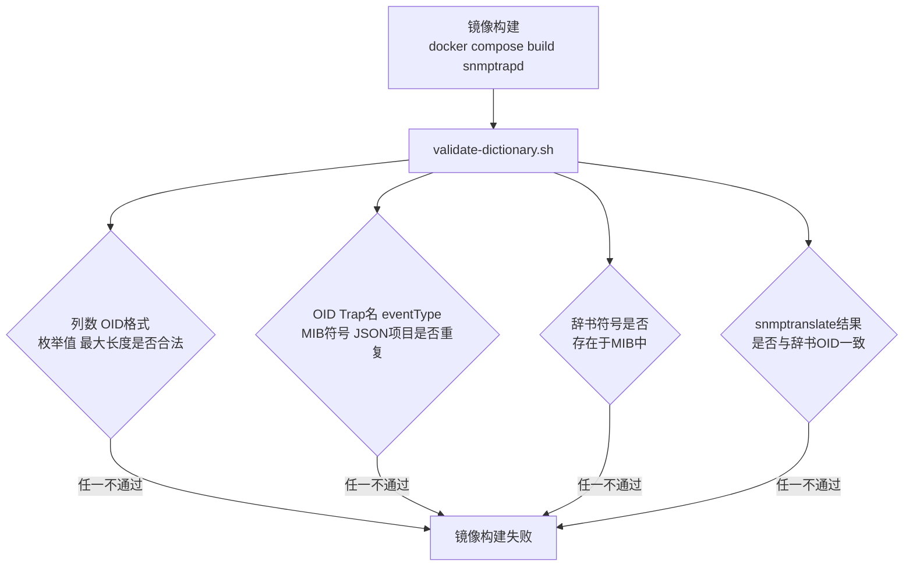

# 18 构建时辞书校验 validate-dictionary.sh

本章讲清楚镜像构建阶段是如何提前拦截辞书错误的，避免问题一直拖到运行时才暴露。

## 核心要点

* validate-dictionary.sh 在镜像构建阶段运行，一旦发现问题就会让整个镜像构建失败，而不是让错误的辞书被打包进可运行的镜像。
* 校验内容包括：列数、OID 格式、枚举值、最大长度这些格式层面的规则是否合法。
* 校验还包括：OID、Trap 名、eventType、MIB 符号、JSON 项目这几类标识符在辞书内部是否有重复。
* 最关键的一步是用 snmptranslate 命令实际解析每个 OID，确认解析结果与辞书里写的数值 OID 完全一致，从根本上防止“辞书和 MIB 各说各话”。
* 可以用 docker compose run --rm --no-deps --entrypoint validate-dictionary.sh snmptrapd 这样的命令单独触发一次校验，不需要重新构建整个镜像。

---

## 本章测验

本章共 5 道单项选择题。

### 第 1 题

validate-dictionary.sh 主要在系统的哪个阶段运行？

- A. Oracle 数据库启动之后
- B. 镜像构建阶段
- C. 运行时每次收到 Trap 时
- D. 浏览器渲染页面时

选择答案后查看结果

正确答案：B

答案解析：validate-dictionary.sh 是构建时校验脚本，在 docker compose build 阶段运行，提前拦截辞书问题，避免错误辞书进入可运行镜像。

### 第 2 题

validate-dictionary.sh 校验流程中最能防止“辞书与 MIB 定义不一致”的一步是什么？

- A. 检查文件编码是否为 UTF-8
- B. 检查文件名是否符合命名规范
- C. 用 snmptranslate 解析辞书中的符号并比对数值 OID
- D. 检查列数是否正确

选择答案后查看结果

正确答案：C

答案解析：文档强调最终会用 snmptranslate 的解析结果与辞书中的数值 OID 逐一比对，确保两者完全一致，这是防止“各说各话”最关键的一步。

### 第 3 题

如果 validate-dictionary.sh 发现问题，会产生什么后果？

- A. 自动修复辞书文件后继续构建
- B. 只记录警告日志，镜像仍然构建成功
- C. 跳过该辞书条目，继续构建其余部分
- D. 让整个镜像构建失败

选择答案后查看结果

正确答案：D

答案解析：文档明确说明校验发现任一类问题都会让镜像作成失败，不允许带着有问题的辞书继续构建出可运行镜像。

### 第 4 题

以下哪一项不属于 validate-dictionary.sh 检查的重复项范围？

- A. Trap 名
- B. eventType
- C. OID
- D. 浏览器 Cookie 名称

选择答案后查看结果

正确答案：D

答案解析：文档列出的重复检查范围包括 OID、Trap名、eventType、MIB符号、JSON项目，与浏览器 Cookie 无关。

### 第 5 题

想要单独执行一次辞书校验而不重新构建整个镜像，可以使用什么命令？

- A. docker compose restart snmptrapd
- B. docker compose logs validate-dictionary
- C. docker compose run --rm --no-deps --entrypoint validate-dictionary.sh snmptrapd
- D. docker compose up validate-dictionary

选择答案后查看结果

正确答案：C

答案解析：文档给出的示例命令是 docker compose run --rm --no-deps --entrypoint validate-dictionary.sh snmptrapd，用于单独触发一次辞书验证。

<!-- QUIZ_DATA_START
{
  "chapter": "18",
  "questions": [
    {
      "id": 1,
      "question": "validate-dictionary.sh 主要在系统的哪个阶段运行？",
      "options": {
        "A": "Oracle 数据库启动之后",
        "B": "镜像构建阶段",
        "C": "运行时每次收到 Trap 时",
        "D": "浏览器渲染页面时"
      },
      "answer": "B",
      "explanation": "validate-dictionary.sh 是构建时校验脚本，在 docker compose build 阶段运行，提前拦截辞书问题，避免错误辞书进入可运行镜像。"
    },
    {
      "id": 2,
      "question": "validate-dictionary.sh 校验流程中最能防止“辞书与 MIB 定义不一致”的一步是什么？",
      "options": {
        "A": "检查文件编码是否为 UTF-8",
        "B": "检查文件名是否符合命名规范",
        "C": "用 snmptranslate 解析辞书中的符号并比对数值 OID",
        "D": "检查列数是否正确"
      },
      "answer": "C",
      "explanation": "文档强调最终会用 snmptranslate 的解析结果与辞书中的数值 OID 逐一比对，确保两者完全一致，这是防止“各说各话”最关键的一步。"
    },
    {
      "id": 3,
      "question": "如果 validate-dictionary.sh 发现问题，会产生什么后果？",
      "options": {
        "A": "自动修复辞书文件后继续构建",
        "B": "只记录警告日志，镜像仍然构建成功",
        "C": "跳过该辞书条目，继续构建其余部分",
        "D": "让整个镜像构建失败"
      },
      "answer": "D",
      "explanation": "文档明确说明校验发现任一类问题都会让镜像作成失败，不允许带着有问题的辞书继续构建出可运行镜像。"
    },
    {
      "id": 4,
      "question": "以下哪一项不属于 validate-dictionary.sh 检查的重复项范围？",
      "options": {
        "A": "Trap 名",
        "B": "eventType",
        "C": "OID",
        "D": "浏览器 Cookie 名称"
      },
      "answer": "D",
      "explanation": "文档列出的重复检查范围包括 OID、Trap名、eventType、MIB符号、JSON项目，与浏览器 Cookie 无关。"
    },
    {
      "id": 5,
      "question": "想要单独执行一次辞书校验而不重新构建整个镜像，可以使用什么命令？",
      "options": {
        "A": "docker compose restart snmptrapd",
        "B": "docker compose logs validate-dictionary",
        "C": "docker compose run --rm --no-deps --entrypoint validate-dictionary.sh snmptrapd",
        "D": "docker compose up validate-dictionary"
      },
      "answer": "C",
      "explanation": "文档给出的示例命令是 docker compose run --rm --no-deps --entrypoint validate-dictionary.sh snmptrapd，用于单独触发一次辞书验证。"
    }
  ]
}
QUIZ_DATA_END -->
