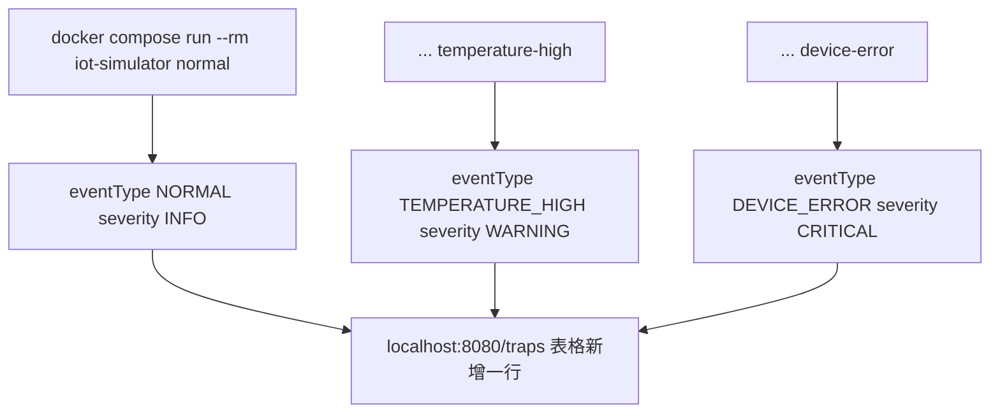

# 三种 Trap 事件实战演练

光说不练不够扎实，这一章用三个具体命令，对照数据在每个环节的样子。

## 核心要点

* 发送 NORMAL：docker compose run --rm iot-simulator normal，对应通知 OID .0.1，Trap 名 normalTrap，eventType=NORMAL，severity=INFO。
* 发送 TEMPERATURE_HIGH：docker compose run --rm iot-simulator temperature-high，对应 .0.2，Trap 名 temperatureHighTrap，eventType=TEMPERATURE_HIGH，severity=WARNING。
* 发送 DEVICE_ERROR：docker compose run --rm iot-simulator device-error，对应 .0.3，Trap 名 deviceErrorTrap，eventType=DEVICE_ERROR，severity=CRITICAL。
* 三次命令执行后，打开 http://localhost:8080/traps 应该能依次看到三行新记录，且 TRAP_NAME 和 SEVERITY 与上面的对照表完全一致。
* 字典中定义的 snmptranslate 校验命令可以单独验证名字解析是否正确，例如查询 deviceErrorTrap 应该解析回 .1.3.6.1.4.1.99999.0.3。

---

## 本章测验

本章共 5 道单项选择题。

### 第 1 题

要发送一条 TEMPERATURE_HIGH 事件的 Trap，应该执行的命令是什么？

- A. docker compose exec iot-simulator send-temp
- B. docker compose run --rm iot-simulator normal
- C. docker compose up temperature-high
- D. docker compose run --rm iot-simulator temperature-high

选择答案后查看结果

正确答案：D

答案解析：README 的示例命令中，发送温度过高事件对应的参数是 temperature-high。

### 第 2 题

发送 device-error 事件后，按照字典映射，页面上应该看到的 SEVERITY 值是什么？

- A. WARNING
- B. INFO
- C. CRITICAL
- D. DEBUG

选择答案后查看结果

正确答案：C

答案解析：trap-definitions.tsv 中 .0.3（deviceErrorTrap/DEVICE_ERROR）对应的期望 severity 是 CRITICAL。

### 第 3 题

在浏览器的哪个地址可以看到发送成功后的 Trap 记录？

- A. http://localhost:1521/traps
- B. http://localhost:162/traps
- C. http://localhost:9090/dashboard
- D. http://localhost:8080/traps

选择答案后查看结果

正确答案：D

答案解析：README 的最短起动手順明确指出打开 http://localhost:8080/traps 查看结果，8080 是 Spring Boot 的端口。

### 第 4 题

使用 snmptranslate 校验 deviceErrorTrap 这个符号，期望解析回的数值 OID 是什么？

- A. .1.3.6.1.4.1.99999.0.2
- B. .1.3.6.1.4.1.99999.0.1
- C. .1.3.6.1.4.1.99999.0.3
- D. .1.3.6.1.4.1.99999.1.3

选择答案后查看结果

正确答案：C

答案解析：README 提供的辞书名前解決示例中，deviceErrorTrap 对应的正确 OID 应为 .1.3.6.1.4.1.99999.0.3，与设计文档中的映射表一致。

### 第 5 题

如果依次执行 normal、temperature-high、device-error 三个命令后刷新页面，最合理的预期结果是什么？

- A. 会看到三条新记录，按接收时间降序排列，device-error 通常排在最上面
- B. 只会看到最后一次 device-error 的记录，前两条会被覆盖
- C. 三条记录会被合并成一条汇总记录
- D. 页面不会有任何变化

选择答案后查看结果

正确答案：A

答案解析：结合第 15、16 章的设计，每次成功投递都会新增一条独立记录，页面按接收时间降序展示，因此最后发送的 device-error 通常会出现在列表最上方。

<!-- QUIZ_DATA_START
{
  "chapter": "19",
  "questions": [
    {
      "id": 1,
      "question": "要发送一条 TEMPERATURE_HIGH 事件的 Trap，应该执行的命令是什么？",
      "options": {
        "D": "docker compose run --rm iot-simulator temperature-high",
        "A": "docker compose exec iot-simulator send-temp",
        "B": "docker compose run --rm iot-simulator normal",
        "C": "docker compose up temperature-high"
      },
      "answer": "D",
      "explanation": "README 的示例命令中，发送温度过高事件对应的参数是 temperature-high。"
    },
    {
      "id": 2,
      "question": "发送 device-error 事件后，按照字典映射，页面上应该看到的 SEVERITY 值是什么？",
      "options": {
        "C": "CRITICAL",
        "A": "WARNING",
        "B": "INFO",
        "D": "DEBUG"
      },
      "answer": "C",
      "explanation": "trap-definitions.tsv 中 .0.3（deviceErrorTrap/DEVICE_ERROR）对应的期望 severity 是 CRITICAL。"
    },
    {
      "id": 3,
      "question": "在浏览器的哪个地址可以看到发送成功后的 Trap 记录？",
      "options": {
        "D": "http://localhost:8080/traps",
        "A": "http://localhost:1521/traps",
        "B": "http://localhost:162/traps",
        "C": "http://localhost:9090/dashboard"
      },
      "answer": "D",
      "explanation": "README 的最短起动手順明确指出打开 http://localhost:8080/traps 查看结果，8080 是 Spring Boot 的端口。"
    },
    {
      "id": 4,
      "question": "使用 snmptranslate 校验 deviceErrorTrap 这个符号，期望解析回的数值 OID 是什么？",
      "options": {
        "C": ".1.3.6.1.4.1.99999.0.3",
        "A": ".1.3.6.1.4.1.99999.0.2",
        "B": ".1.3.6.1.4.1.99999.0.1",
        "D": ".1.3.6.1.4.1.99999.1.3"
      },
      "answer": "C",
      "explanation": "README 提供的辞书名前解決示例中，deviceErrorTrap 对应的正确 OID 应为 .1.3.6.1.4.1.99999.0.3，与设计文档中的映射表一致。"
    },
    {
      "id": 5,
      "question": "如果依次执行 normal、temperature-high、device-error 三个命令后刷新页面，最合理的预期结果是什么？",
      "options": {
        "A": "会看到三条新记录，按接收时间降序排列，device-error 通常排在最上面",
        "B": "只会看到最后一次 device-error 的记录，前两条会被覆盖",
        "C": "三条记录会被合并成一条汇总记录",
        "D": "页面不会有任何变化"
      },
      "answer": "A",
      "explanation": "结合第 15、16 章的设计，每次成功投递都会新增一条独立记录，页面按接收时间降序展示，因此最后发送的 device-error 通常会出现在列表最上方。"
    }
  ]
}
QUIZ_DATA_END -->
