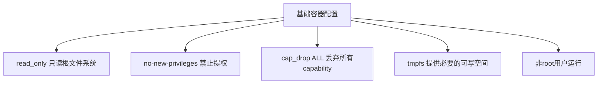

# 19. 容器安全加固

每个容器都遵循了最小权限原则，这一章梳理docker-compose.yml和Dockerfile里体现的具体安全加固手段。

## 核心要点

* 所有自定义构建的服务(monitoring-app、trap-receiver、gateway)都设置了read_only: true，容器运行时无法修改镜像文件系统
* security_opt设置了no-new-privileges:true，即使容器内的进程尝试通过setuid等方式提权也会被内核拒绝
* cap_drop: ALL丢弃了全部Linux capability，只有gateway额外用cap_add加回了NET_BIND_SERVICE，用于绑定162和8080等端口
* 只读文件系统下仍然需要写入的目录(如/tmp、日志、USM状态)都通过tmpfs或专用Volume显式声明，而不是放开整个文件系统的写权限
* Oracle数据库端口没有对外映射到宿主机，只在容器网络内部可见，减少了攻击面

---

## 本章测验

本章共 5 道单项选择题。

### 第 1 题

docker-compose.yml中read_only: true这个配置的含义是什么？

- A. 这个配置只影响日志文件，不影响其他文件
- B. 容器只能读取环境变量，不能读取文件
- C. 容器的根文件系统在运行时是只读的，任何写入尝试都会失败，除非显式挂载了可写卷
- D. 容器只能被其他容器读取，不能主动发起网络请求

选择答案后查看结果

正确答案：C

答案解析：read_only限制了容器运行时对自身文件系统的写权限，即使容器内的进程被攻破，攻击者也很难篡改镜像内容或写入恶意文件，这是常见的容器安全加固手段。

### 第 2 题

no-new-privileges:true这个安全选项防止的是什么？

- A. 防止容器读取环境变量
- B. 防止容器访问数据库
- C. 防止容器使用网络
- D. 防止容器内进程通过setuid等机制在运行时获得比启动时更高的权限

选择答案后查看结果

正确答案：D

答案解析：这个内核级别的安全选项确保容器内的进程无法通过exec setuid程序等方式提升权限，即使镜像里存在配置不当的setuid二进制文件，也无法被利用来提权。

### 第 3 题

cap_drop: ALL之后，为什么gateway服务又单独用cap_add加回了NET_BIND_SERVICE？

- A. 因为nginx需要监听162和8080这类特权端口(1024以下)，普通非root进程默认没有权限绑定这些端口，需要单独授予NET_BIND_SERVICE能力
- B. NET_BIND_SERVICE是为了允许容器访问外部网络
- C. 这个capability是Oracle数据库连接必需的
- D. 这是配置错误，不应该加回任何capability

选择答案后查看结果

正确答案：A

答案解析：Linux上默认只有root或者拥有CAP_NET_BIND_SERVICE能力的进程才能绑定1024以下的端口，gateway服务虽然以非root用户101运行，但监听162端口需要这个特定能力，所以在丢弃全部capability后又精确地加回了这一个。

### 第 4 题

如果容器整体是只读文件系统，nginx运行时又必须写入pid文件和缓存目录，这个矛盾是怎么解决的？

- A. 取消read_only限制，改成可读写
- B. 用tmpfs单独挂载/var/cache/nginx、/var/run、/tmp这些目录，在内存中提供必要的可写空间，不影响整体只读边界
- C. 把pid文件和缓存都存到Oracle数据库里
- D. 完全禁止nginx写入任何文件，接受服务异常

选择答案后查看结果

正确答案：B

答案解析：tmpfs提供的是基于内存的临时文件系统，声明后这些特定目录变成可写，而容器镜像本身的其他部分依然保持只读，这样既满足了运行时需求，又不放弃整体的安全加固。

### 第 5 题

Oracle数据库端口在docker-compose.yml里的网络暴露策略是什么？

- A. 使用UDP协议对外广播
- B. 映射到宿主机的1521端口，方便本地工具直接连接
- C. 不映射到宿主机端口，只能在Docker Compose内部网络中被其他容器访问
- D. 通过公网IP直接暴露

选择答案后查看结果

正确答案：C

答案解析：oracle-db服务没有配置ports映射，只有其他服务通过内部服务名oracle-db在同一个Compose网络中访问它，减少了数据库被外部直接扫描或攻击的风险面。

<!-- QUIZ_DATA_START
{
  "chapter": "19",
  "questions": [
    {
      "id": 1,
      "question": "docker-compose.yml中read_only: true这个配置的含义是什么？",
      "options": {
        "A": "这个配置只影响日志文件，不影响其他文件",
        "B": "容器只能读取环境变量，不能读取文件",
        "C": "容器的根文件系统在运行时是只读的，任何写入尝试都会失败，除非显式挂载了可写卷",
        "D": "容器只能被其他容器读取，不能主动发起网络请求"
      },
      "answer": "C",
      "explanation": "read_only限制了容器运行时对自身文件系统的写权限，即使容器内的进程被攻破，攻击者也很难篡改镜像内容或写入恶意文件，这是常见的容器安全加固手段。"
    },
    {
      "id": 2,
      "question": "no-new-privileges:true这个安全选项防止的是什么？",
      "options": {
        "A": "防止容器读取环境变量",
        "B": "防止容器访问数据库",
        "C": "防止容器使用网络",
        "D": "防止容器内进程通过setuid等机制在运行时获得比启动时更高的权限"
      },
      "answer": "D",
      "explanation": "这个内核级别的安全选项确保容器内的进程无法通过exec setuid程序等方式提升权限，即使镜像里存在配置不当的setuid二进制文件，也无法被利用来提权。"
    },
    {
      "id": 3,
      "question": "cap_drop: ALL之后，为什么gateway服务又单独用cap_add加回了NET_BIND_SERVICE？",
      "options": {
        "A": "因为nginx需要监听162和8080这类特权端口(1024以下)，普通非root进程默认没有权限绑定这些端口，需要单独授予NET_BIND_SERVICE能力",
        "B": "NET_BIND_SERVICE是为了允许容器访问外部网络",
        "C": "这个capability是Oracle数据库连接必需的",
        "D": "这是配置错误，不应该加回任何capability"
      },
      "answer": "A",
      "explanation": "Linux上默认只有root或者拥有CAP_NET_BIND_SERVICE能力的进程才能绑定1024以下的端口，gateway服务虽然以非root用户101运行，但监听162端口需要这个特定能力，所以在丢弃全部capability后又精确地加回了这一个。"
    },
    {
      "id": 4,
      "question": "如果容器整体是只读文件系统，nginx运行时又必须写入pid文件和缓存目录，这个矛盾是怎么解决的？",
      "options": {
        "A": "取消read_only限制，改成可读写",
        "B": "用tmpfs单独挂载/var/cache/nginx、/var/run、/tmp这些目录，在内存中提供必要的可写空间，不影响整体只读边界",
        "C": "把pid文件和缓存都存到Oracle数据库里",
        "D": "完全禁止nginx写入任何文件，接受服务异常"
      },
      "answer": "B",
      "explanation": "tmpfs提供的是基于内存的临时文件系统，声明后这些特定目录变成可写，而容器镜像本身的其他部分依然保持只读，这样既满足了运行时需求，又不放弃整体的安全加固。"
    },
    {
      "id": 5,
      "question": "Oracle数据库端口在docker-compose.yml里的网络暴露策略是什么？",
      "options": {
        "A": "使用UDP协议对外广播",
        "B": "映射到宿主机的1521端口，方便本地工具直接连接",
        "C": "不映射到宿主机端口，只能在Docker Compose内部网络中被其他容器访问",
        "D": "通过公网IP直接暴露"
      },
      "answer": "C",
      "explanation": "oracle-db服务没有配置ports映射，只有其他服务通过内部服务名oracle-db在同一个Compose网络中访问它，减少了数据库被外部直接扫描或攻击的风险面。"
    }
  ]
}
QUIZ_DATA_END -->
