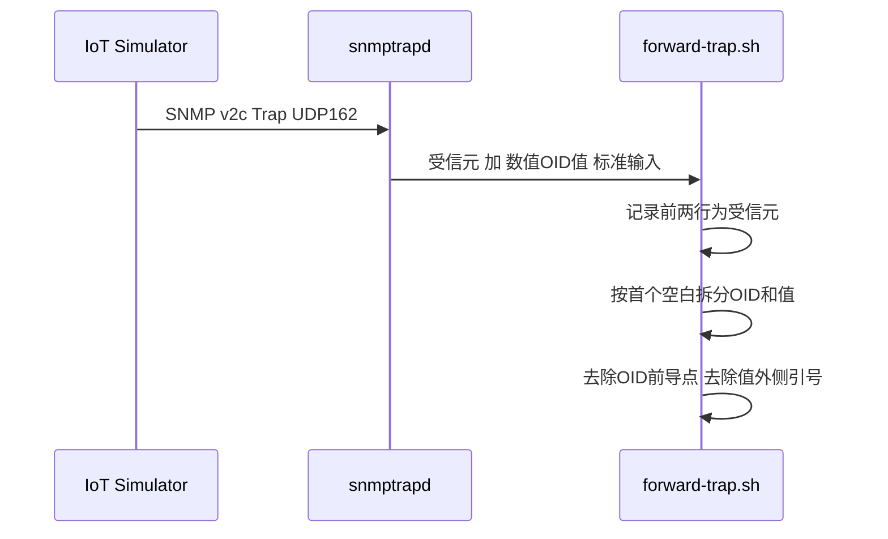

# 19 Trap接收与OID/VB提取流程

把 forward-trap.sh 的处理过程拆解到更细的粒度，逐行看它是怎么把标准输入变成结构化数据的。

## 核心要点

* 标准输入的具体格式是：第一行受信元主机，第二行受信元地址，第三行起是“数值 OID 空格 值”的形式，例如 .1.3.6.1.4.1.99999.1.1 "iot-001"。
* 脚本处理顺序：先记录前两行日志，再对第三行起的每一行，按第一个空白字符拆分成 OID 和值两部分。
* 拆分之后要做两次清理：去掉 OID 开头的那个点号，去掉值两侧的双引号，这样得到的才是干净可比较的数据。
* snmpTrapOID.0 这一行会被单独提取出来，作为整条 Trap 的通知 OID，后续所有的字典查找都以它为起点。
* 这个提取过程完全不依赖 MIB 的显示名称设置，因为 snmptrapd 一开始就用 -On 参数输出了数值形式的 OID。

---

## 本章测验

本章共 5 道单项选择题。

### 第 1 题

forward-trap.sh 标准输入的前两行分别代表什么？

- A. 第一行是受信元主机，第二行是受信元地址
- B. 第一行是通知 OID，第二行是事件时间
- C. 第一行和第二行都是 VB 数据
- D. 第一行是 JSON 头部，第二行是 JSON 主体

选择答案后查看结果

正确答案：A

答案解析：受信入力形式说明中，标准输入第一行为受信元的主机，第二行为受信元地址。

### 第 2 题

脚本拆分“数值 OID 值”这一行时，是按什么规则拆分的？

- A. 按固定字符位置截断
- B. 按第一个空白字符拆分成 OID 和值
- C. 按最后一个逗号拆分
- D. 按双引号数量拆分

选择答案后查看结果

正确答案：B

答案解析：处理顺序说明中提到：以最初的空白将 OID 与值分割，即按第一个空白字符进行拆分。

### 第 3 题

拆分出的 OID 和值分别需要做哪些清理？

- A. 把 OID 和值都转换成 Base64 编码
- B. 不需要任何清理，直接使用
- C. 去掉 OID 开头的点号，去掉值外侧的双引号
- D. OID 转成大写，值转成小写

选择答案后查看结果

正确答案：C

答案解析：文档说明脚本会去除 OID 前导的点号，并只去除字符串值外侧的双引号，得到干净的数据。

### 第 4 题

整条 Trap 的通知 OID 是通过哪个专门的字段提取出来的？

- A. snmpTrapOID.0
- B. eventTime
- C. trapName
- D. deviceId

选择答案后查看结果

正确答案：A

答案解析：snmpTrapOID.0 是 SNMP Trap 中携带通知 OID 的标准字段，脚本会将其单独提取作为后续辞书查找的起点。

### 第 5 题

为什么这个提取流程不受 MIB 显示名称设置的影响？

- A. 因为 snmptrapd 启动时使用了 -On 参数，始终输出数值形式的 OID
- B. 因为提取过程发生在 MIB 加载之前
- C. 因为 Oracle 数据库屏蔽了 MIB 的影响
- D. 因为脚本完全不使用任何 MIB 相关配置

选择答案后查看结果

正确答案：A

答案解析：snmptrapd 启动参数中的 -On 让输出始终为数值 OID，不依赖符号名解析或本地化设置，因此提取过程稳定且不受显示配置影响。

<!-- QUIZ_DATA_START
{
  "chapter": "19",
  "questions": [
    {
      "id": 1,
      "question": "forward-trap.sh 标准输入的前两行分别代表什么？",
      "options": {
        "A": "第一行是受信元主机，第二行是受信元地址",
        "B": "第一行是通知 OID，第二行是事件时间",
        "C": "第一行和第二行都是 VB 数据",
        "D": "第一行是 JSON 头部，第二行是 JSON 主体"
      },
      "answer": "A",
      "explanation": "受信入力形式说明中，标准输入第一行为受信元的主机，第二行为受信元地址。"
    },
    {
      "id": 2,
      "question": "脚本拆分“数值 OID 值”这一行时，是按什么规则拆分的？",
      "options": {
        "A": "按固定字符位置截断",
        "B": "按第一个空白字符拆分成 OID 和值",
        "C": "按最后一个逗号拆分",
        "D": "按双引号数量拆分"
      },
      "answer": "B",
      "explanation": "处理顺序说明中提到：以最初的空白将 OID 与值分割，即按第一个空白字符进行拆分。"
    },
    {
      "id": 3,
      "question": "拆分出的 OID 和值分别需要做哪些清理？",
      "options": {
        "A": "把 OID 和值都转换成 Base64 编码",
        "B": "不需要任何清理，直接使用",
        "C": "去掉 OID 开头的点号，去掉值外侧的双引号",
        "D": "OID 转成大写，值转成小写"
      },
      "answer": "C",
      "explanation": "文档说明脚本会去除 OID 前导的点号，并只去除字符串值外侧的双引号，得到干净的数据。"
    },
    {
      "id": 4,
      "question": "整条 Trap 的通知 OID 是通过哪个专门的字段提取出来的？",
      "options": {
        "A": "snmpTrapOID.0",
        "B": "eventTime",
        "C": "trapName",
        "D": "deviceId"
      },
      "answer": "A",
      "explanation": "snmpTrapOID.0 是 SNMP Trap 中携带通知 OID 的标准字段，脚本会将其单独提取作为后续辞书查找的起点。"
    },
    {
      "id": 5,
      "question": "为什么这个提取流程不受 MIB 显示名称设置的影响？",
      "options": {
        "A": "因为 snmptrapd 启动时使用了 -On 参数，始终输出数值形式的 OID",
        "B": "因为提取过程发生在 MIB 加载之前",
        "C": "因为 Oracle 数据库屏蔽了 MIB 的影响",
        "D": "因为脚本完全不使用任何 MIB 相关配置"
      },
      "answer": "A",
      "explanation": "snmptrapd 启动参数中的 -On 让输出始终为数值 OID，不依赖符号名解析或本地化设置，因此提取过程稳定且不受显示配置影响。"
    }
  ]
}
QUIZ_DATA_END -->
