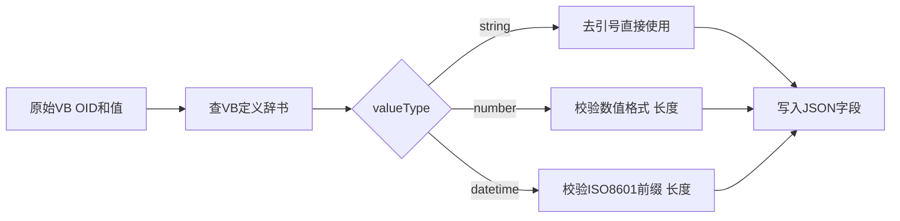

# 20 VB到JSON的转换规则与类型校验

拿到清理干净的 OID 和值之后，怎么把它们变成一份符合规范的 JSON？本章讲清楚每个字段各自的转换和校验规则。

## 核心要点

* deviceId、deviceName、eventType、severity、message 这几个字段都是字符串类型，转换规则是去掉外侧引号后直接作为字符串使用，若为空则中止转发。
* temperature 字段的处理更严格：去掉引号后要校验是否符合数值格式，并且不能超过 32 个字符，格式不对或为空都会中止转发。
* eventTime 字段要求去掉引号后校验是否符合 ISO-8601 本地日期时间的前缀格式，并且不能超过 64 个字符。
* 最终生成的 JSON 里，number 类型字段以数值字面量的形式写入（不带引号），string 类型字段以字符串形式写入。
* 文档特别说明，这套转换规则只针对本演示 Simulator 生成的固定格式字符串，完整的 JSON 转义、字符编码转换、枚举值外部化配置属于生产环境需要补充的能力。

---

## 本章测验

本章共 5 道单项选择题。

### 第 1 题

deviceId、deviceName 等字符串类字段的转换规则是什么？

- A. 去掉外侧引号后直接使用，为空则中止转发
- B. 转换为数值类型后使用
- C. 自动截断为固定 10 个字符
- D. 转换为 Base64 编码后使用

选择答案后查看结果

正确答案：A

答案解析：VB 到 JSON 转换表中，字符串字段的处理是去除外侧引号，若为空则中止转发。

### 第 2 题

temperature 字段除了去除引号，还需要满足哪些额外条件？

- A. 必须以摄氏度符号结尾
- B. 必须四舍五入到小数点后一位
- C. 必须是整数，且长度不超过 8 个字符
- D. 必须符合数值格式，且长度不超过 32 个字符

选择答案后查看结果

正确答案：D

答案解析：转换规则表明确 temperature 需要校验数值格式并且长度不超过 32 个字符，不满足条件则中止转发。

### 第 3 题

eventTime 字段的格式校验要求是什么？

- A. 不需要任何格式校验
- B. 必须是 Unix 时间戳整数
- C. 必须是中文日期格式，如“2026年8月6日”
- D. 必须符合 ISO-8601 本地日期时间的前缀格式，且不超过 64 个字符

选择答案后查看结果

正确答案：D

答案解析：文档明确 eventTime 需要校验日期时间先头形式（即 ISO-8601 前缀格式），并且长度不超过 64 个字符。

### 第 4 题

最终生成的 JSON 中，number 类型字段的写入方式是什么？

- A. 以 Base64 编码字符串写入
- B. 以带引号的字符串形式写入
- C. 以数组形式写入
- D. 以数值字面量形式写入，不带引号

选择答案后查看结果

正确答案：D

答案解析：文档说明 number 类型在 JSON 中是以“number literal”（数值字面量）形式写入，即不加引号的原始数字。

### 第 5 题

文档为什么强调这套转换规则“只针对本项目 Simulator 生成的固定格式字符串”？

- A. 因为这套规则本身存在明显 bug，尚未修复
- B. 因为 Simulator 生成的数据无法转换为 JSON
- C. 因为完整的 JSON 转义、编码转换、枚举外部化配置是生产环境需要另外补充的能力，本演示未覆盖
- D. 因为该规则只适用于中文字符集

选择答案后查看结果

正确答案：C

答案解析：文档明确说明本演示的转换规则针对固定格式数据设计，完整的通用转义、编码处理和枚举值可配置化属于生产环境需要额外实现的部分。

<!-- QUIZ_DATA_START
{
  "chapter": "20",
  "questions": [
    {
      "id": 1,
      "question": "deviceId、deviceName 等字符串类字段的转换规则是什么？",
      "options": {
        "A": "去掉外侧引号后直接使用，为空则中止转发",
        "B": "转换为数值类型后使用",
        "C": "自动截断为固定 10 个字符",
        "D": "转换为 Base64 编码后使用"
      },
      "answer": "A",
      "explanation": "VB 到 JSON 转换表中，字符串字段的处理是去除外侧引号，若为空则中止转发。"
    },
    {
      "id": 2,
      "question": "temperature 字段除了去除引号，还需要满足哪些额外条件？",
      "options": {
        "A": "必须以摄氏度符号结尾",
        "B": "必须四舍五入到小数点后一位",
        "C": "必须是整数，且长度不超过 8 个字符",
        "D": "必须符合数值格式，且长度不超过 32 个字符"
      },
      "answer": "D",
      "explanation": "转换规则表明确 temperature 需要校验数值格式并且长度不超过 32 个字符，不满足条件则中止转发。"
    },
    {
      "id": 3,
      "question": "eventTime 字段的格式校验要求是什么？",
      "options": {
        "A": "不需要任何格式校验",
        "B": "必须是 Unix 时间戳整数",
        "C": "必须是中文日期格式，如“2026年8月6日”",
        "D": "必须符合 ISO-8601 本地日期时间的前缀格式，且不超过 64 个字符"
      },
      "answer": "D",
      "explanation": "文档明确 eventTime 需要校验日期时间先头形式（即 ISO-8601 前缀格式），并且长度不超过 64 个字符。"
    },
    {
      "id": 4,
      "question": "最终生成的 JSON 中，number 类型字段的写入方式是什么？",
      "options": {
        "A": "以 Base64 编码字符串写入",
        "B": "以带引号的字符串形式写入",
        "C": "以数组形式写入",
        "D": "以数值字面量形式写入，不带引号"
      },
      "answer": "D",
      "explanation": "文档说明 number 类型在 JSON 中是以“number literal”（数值字面量）形式写入，即不加引号的原始数字。"
    },
    {
      "id": 5,
      "question": "文档为什么强调这套转换规则“只针对本项目 Simulator 生成的固定格式字符串”？",
      "options": {
        "A": "因为这套规则本身存在明显 bug，尚未修复",
        "B": "因为 Simulator 生成的数据无法转换为 JSON",
        "C": "因为完整的 JSON 转义、编码转换、枚举外部化配置是生产环境需要另外补充的能力，本演示未覆盖",
        "D": "因为该规则只适用于中文字符集"
      },
      "answer": "C",
      "explanation": "文档明确说明本演示的转换规则针对固定格式数据设计，完整的通用转义、编码处理和枚举值可配置化属于生产环境需要额外实现的部分。"
    }
  ]
}
QUIZ_DATA_END -->
