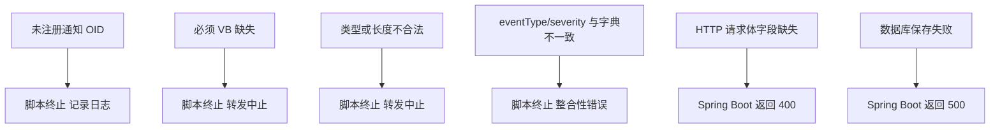

# 错误处理与异常场景

如果数据不对、类型不合法，系统在哪个环节把它拦下来？拦截的结果又是什么？

## 核心要点

* 四类会在 snmptrapd/脚本这一侧被拦截的异常：未注册的通知 OID、必须 VB 为空、类型或长度不合法、eventType/severity 与字典不一致。
* 这四类异常都会导致本条数据完全不会到达 Spring Boot，只在标准错误里留下日志，不会污染数据库。
* 如果数据侥幸通过了脚本这一层的校验，但 HTTP 请求体本身在 Spring Boot 一侧仍缺少必填字段，会被 Bean Validation 拦截，返回 400。
* 如果请求本身完全合法但数据库层面出现问题（如连接异常），Spring Boot 返回 500，这与前面几种"数据问题"性质不同，是"基础设施问题"。
* 这种分层拦截意味着：越靠近数据源头的校验越严格，能挡住的问题类型也越具体（比如 OID 未注册这种 SNMP 特有问题）。

---

## 本章测验

本章共 5 道单项选择题。

### 第 1 题

如果通知 OID 完全没有在字典中登记，异常会在哪个环节被拦截？

- A. 浏览器渲染层面
- B. Spring Boot 的 Bean Validation
- C. forward-trap.sh 脚本层面，转发被终止
- D. Oracle 数据库层面

选择答案后查看结果

正确答案：C

答案解析：结合第 12 章的内容，未注册的通知 OID 会导致脚本在转发前就终止处理，属于脚本层面的拦截，根本不会到达 Spring Boot。

### 第 2 题

如果 forward-trap.sh 生成的 JSON 完整合法，但恰好此时数据库连接异常，Spring Boot 会返回什么状态码？

- A. 400 Bad Request
- B. 201 Created
- C. 404 Not Found
- D. 500 Internal Server Error

选择答案后查看结果

正确答案：D

答案解析：这属于请求本身没问题，但服务端基础设施（数据库）出现故障，按照第 13 章的设计应返回 500。

### 第 3 题

以下哪一种异常不属于脚本层面（forward-trap.sh）能够拦截的范畴？

- A. 字段值超过最大长度
- B. eventType 与字典期望值不一致
- C. Spring Boot 请求体缺少必填字段（脚本已生成合法 JSON 的情况下不会发生，但 API 一侧仍会独立校验）
- D. 必须 VB 字段为空

选择答案后查看结果

正确答案：C

答案解析：脚本层面的校验主要针对 SNMP 报文本身的完整性和字典一致性；API 层的 Bean Validation 是独立的一层校验，两者职责不同，即使脚本层通过，API 层仍会各自校验。

### 第 4 题

被脚本层拦截的异常（如未注册 OID）和被 Spring Boot 拦截的异常（如 400/500），在数据可见性上有什么本质区别？

- A. 脚本层拦截的数据完全不会到达数据库，只留脚本日志；API 层拦截的请求虽然失败但仍然发生了一次 HTTP 交互
- B. API 层拦截的请求会被自动转成脚本日志
- C. 没有区别，两者都会留下一条数据库记录
- D. 脚本层拦截的数据会自动重试直到成功写入

选择答案后查看结果

正确答案：A

答案解析：脚本层的校验在 HTTP 请求发出之前就终止了流程，因此数据完全不会进入 Spring Boot 或数据库；而 API 层的校验发生在请求已经到达 Spring Boot 之后，只是最终没能成功创建资源。

### 第 5 题

从整体设计上看，为什么系统要在脚本层和 API 层做两道独立的校验，而不是只在其中一层做？

- A. 纯粹是历史遗留代码，没有实际意义
- B. 两层校验的规则完全相同，属于不必要的重复
- C. 两层各自面向不同的输入来源（SNMP 报文与 HTTP 请求），独立校验能保证各自的边界安全，即使某一层被绕过另一层依然有效
- D. 只是为了增加系统的复杂度

选择答案后查看结果

正确答案：C

答案解析：脚本层面对的是原始 SNMP 数据的可信度问题，API 层面对的是 HTTP 请求本身的合法性问题；即便未来有其他调用方绕过脚本直接调用 API，Bean Validation 依然能独立把关，这是纵深防御的设计思路。

<!-- QUIZ_DATA_START
{
  "chapter": "20",
  "questions": [
    {
      "id": 1,
      "question": "如果通知 OID 完全没有在字典中登记，异常会在哪个环节被拦截？",
      "options": {
        "C": "forward-trap.sh 脚本层面，转发被终止",
        "A": "浏览器渲染层面",
        "B": "Spring Boot 的 Bean Validation",
        "D": "Oracle 数据库层面"
      },
      "answer": "C",
      "explanation": "结合第 12 章的内容，未注册的通知 OID 会导致脚本在转发前就终止处理，属于脚本层面的拦截，根本不会到达 Spring Boot。"
    },
    {
      "id": 2,
      "question": "如果 forward-trap.sh 生成的 JSON 完整合法，但恰好此时数据库连接异常，Spring Boot 会返回什么状态码？",
      "options": {
        "D": "500 Internal Server Error",
        "A": "400 Bad Request",
        "B": "201 Created",
        "C": "404 Not Found"
      },
      "answer": "D",
      "explanation": "这属于请求本身没问题，但服务端基础设施（数据库）出现故障，按照第 13 章的设计应返回 500。"
    },
    {
      "id": 3,
      "question": "以下哪一种异常不属于脚本层面（forward-trap.sh）能够拦截的范畴？",
      "options": {
        "C": "Spring Boot 请求体缺少必填字段（脚本已生成合法 JSON 的情况下不会发生，但 API 一侧仍会独立校验）",
        "A": "字段值超过最大长度",
        "B": "eventType 与字典期望值不一致",
        "D": "必须 VB 字段为空"
      },
      "answer": "C",
      "explanation": "脚本层面的校验主要针对 SNMP 报文本身的完整性和字典一致性；API 层的 Bean Validation 是独立的一层校验，两者职责不同，即使脚本层通过，API 层仍会各自校验。"
    },
    {
      "id": 4,
      "question": "被脚本层拦截的异常（如未注册 OID）和被 Spring Boot 拦截的异常（如 400/500），在数据可见性上有什么本质区别？",
      "options": {
        "A": "脚本层拦截的数据完全不会到达数据库，只留脚本日志；API 层拦截的请求虽然失败但仍然发生了一次 HTTP 交互",
        "B": "API 层拦截的请求会被自动转成脚本日志",
        "C": "没有区别，两者都会留下一条数据库记录",
        "D": "脚本层拦截的数据会自动重试直到成功写入"
      },
      "answer": "A",
      "explanation": "脚本层的校验在 HTTP 请求发出之前就终止了流程，因此数据完全不会进入 Spring Boot 或数据库；而 API 层的校验发生在请求已经到达 Spring Boot 之后，只是最终没能成功创建资源。"
    },
    {
      "id": 5,
      "question": "从整体设计上看，为什么系统要在脚本层和 API 层做两道独立的校验，而不是只在其中一层做？",
      "options": {
        "C": "两层各自面向不同的输入来源（SNMP 报文与 HTTP 请求），独立校验能保证各自的边界安全，即使某一层被绕过另一层依然有效",
        "A": "纯粹是历史遗留代码，没有实际意义",
        "B": "两层校验的规则完全相同，属于不必要的重复",
        "D": "只是为了增加系统的复杂度"
      },
      "answer": "C",
      "explanation": "脚本层面对的是原始 SNMP 数据的可信度问题，API 层面对的是 HTTP 请求本身的合法性问题；即便未来有其他调用方绕过脚本直接调用 API，Bean Validation 依然能独立把关，这是纵深防御的设计思路。"
    }
  ]
}
QUIZ_DATA_END -->
