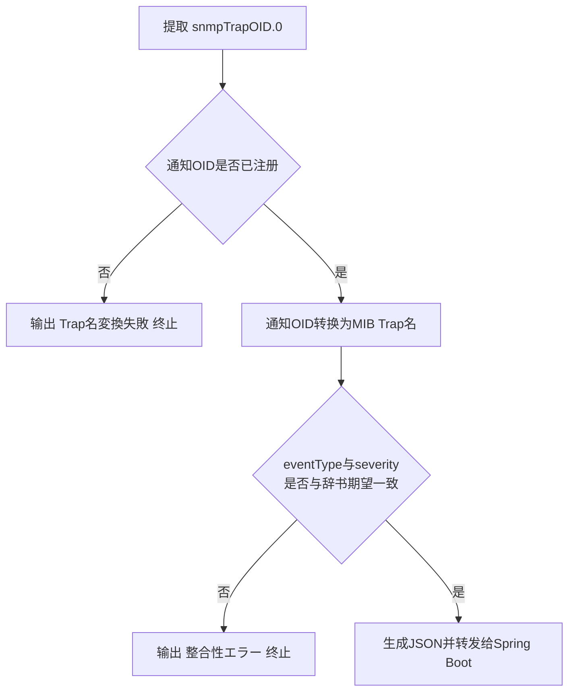

# 21 Trap名称转换与一致性校验流程

本章聚焦转发脚本里最核心的一步判断逻辑：如何确定 Trap 名称，以及如何拦截数据不一致的情况。

## 核心要点

* Trap 名称转换的优先顺序是：以收到的 snmpTrapOID.0 数值作为第一检索键，去 Trap 定义辞书里查表，用查到的 trapName 作为展示名。
* 如果通知 OID 没有在辞书中注册，脚本不会把它当成一个叫 unknownTrap 的通用类型继续转发，而是直接记录“Trap名变换失败”并以退出码 1 终止。
* 查到 Trap 名之后，还要做第二重校验：比较实际收到的 eventType、severity，是否与辞书里为这个 Trap 预先设定的期望值一致。
* 如果 eventType 或 severity 与期望值不一致，脚本会把这种情况当作数据被篡改或者发送端实现不一致来处理，同样拒绝转发，不会“将就着”把数据发过去。
* 只有通知 OID 已注册、且业务字段与期望值完全一致，才会走到最后一步：生成包含 trapOid 和 trapName 的 JSON 并转发给 Spring Boot。

---

## 本章测验

本章共 5 道单项选择题。

### 第 1 题

转发脚本确定 Trap 名称时，使用的第一检索键是什么？

- A. eventType
- B. snmpTrapOID.0 的数值
- C. deviceName
- D. severity

选择答案后查看结果

正确答案：B

答案解析：文档说明 Trap 名称转换以收到的 snmpTrapOID.0 数值作为第一检索键，去查询 Trap 定义辞书。

### 第 2 题

如果通知 OID 未在辞书中注册，脚本会怎样处理？

- A. 记录 Trap 名変換失敗 并以退出码 1 终止，不转发
- B. 跳过 Trap 名，只发送 VB 数据
- C. 自动命名为 unknownTrap 并继续转发
- D. 使用上一次成功的 Trap 名代替

选择答案后查看结果

正确答案：A

答案解析：文档明确说明未登录的通知 OID 不会被替代为 unknownTrap，而是记录失败原因并以退出码 1 终止。

### 第 3 题

第二重一致性校验比较的是哪两个字段？

- A. eventType 与 severity 是否与辞书期望值一致
- B. trapOid 与 trapName
- C. deviceId 与 deviceName
- D. temperature 与 message

选择答案后查看结果

正确答案：A

答案解析：一致性校验流程图显示，脚本会比较实际收到的 eventType 和 severity 是否与 Trap 定义辞书预设的期望值一致。

### 第 4 题

eventType 或 severity 与期望值不一致时，脚本会如何看待这种情况？

- A. 视为 MIB 版本过旧，自动更新 MIB
- B. 视为网络延迟导致的临时误差，自动重试
- C. 视为数据被篡改或发送端实现不一致，拒绝转发
- D. 视为正常的业务变化，照常转发

选择答案后查看结果

正确答案：C

答案解析：文档将 eventType/severity 不一致的情况定性为“改ざんまたは送信実装不整合”，即篡改或实现不一致，因此拒绝转发。

### 第 5 题

只有满足什么条件，脚本才会生成 JSON 并转发给 Spring Boot？

- A. 只要通知 OID 存在即可，无需其他校验
- B. 只要 temperature 字段格式正确即可
- C. 通知 OID 已注册，且 eventType、severity 与期望值一致
- D. 只要浏览器当前处于打开状态

选择答案后查看结果

正确答案：C

答案解析：流程图显示只有“通知OID是否已注册”和“eventType与severity是否一致”两关都通过，才会走到生成 JSON 并转发的最后一步。

<!-- QUIZ_DATA_START
{
  "chapter": "21",
  "questions": [
    {
      "id": 1,
      "question": "转发脚本确定 Trap 名称时，使用的第一检索键是什么？",
      "options": {
        "A": "eventType",
        "B": "snmpTrapOID.0 的数值",
        "C": "deviceName",
        "D": "severity"
      },
      "answer": "B",
      "explanation": "文档说明 Trap 名称转换以收到的 snmpTrapOID.0 数值作为第一检索键，去查询 Trap 定义辞书。"
    },
    {
      "id": 2,
      "question": "如果通知 OID 未在辞书中注册，脚本会怎样处理？",
      "options": {
        "A": "记录 Trap 名変換失敗 并以退出码 1 终止，不转发",
        "B": "跳过 Trap 名，只发送 VB 数据",
        "C": "自动命名为 unknownTrap 并继续转发",
        "D": "使用上一次成功的 Trap 名代替"
      },
      "answer": "A",
      "explanation": "文档明确说明未登录的通知 OID 不会被替代为 unknownTrap，而是记录失败原因并以退出码 1 终止。"
    },
    {
      "id": 3,
      "question": "第二重一致性校验比较的是哪两个字段？",
      "options": {
        "A": "eventType 与 severity 是否与辞书期望值一致",
        "B": "trapOid 与 trapName",
        "C": "deviceId 与 deviceName",
        "D": "temperature 与 message"
      },
      "answer": "A",
      "explanation": "一致性校验流程图显示，脚本会比较实际收到的 eventType 和 severity 是否与 Trap 定义辞书预设的期望值一致。"
    },
    {
      "id": 4,
      "question": "eventType 或 severity 与期望值不一致时，脚本会如何看待这种情况？",
      "options": {
        "A": "视为 MIB 版本过旧，自动更新 MIB",
        "B": "视为网络延迟导致的临时误差，自动重试",
        "C": "视为数据被篡改或发送端实现不一致，拒绝转发",
        "D": "视为正常的业务变化，照常转发"
      },
      "answer": "C",
      "explanation": "文档将 eventType/severity 不一致的情况定性为“改ざんまたは送信実装不整合”，即篡改或实现不一致，因此拒绝转发。"
    },
    {
      "id": 5,
      "question": "只有满足什么条件，脚本才会生成 JSON 并转发给 Spring Boot？",
      "options": {
        "A": "只要通知 OID 存在即可，无需其他校验",
        "B": "只要 temperature 字段格式正确即可",
        "C": "通知 OID 已注册，且 eventType、severity 与期望值一致",
        "D": "只要浏览器当前处于打开状态"
      },
      "answer": "C",
      "explanation": "流程图显示只有“通知OID是否已注册”和“eventType与severity是否一致”两关都通过，才会走到生成 JSON 并转发的最后一步。"
    }
  ]
}
QUIZ_DATA_END -->
