# 21. Kubernetes生产部署架构

从本地Docker Compose迈向生产环境，production.yaml用Deployment和StatefulSet的组合体现了不同组件的状态特性。

```mermaid
flowchart TB
  NS[Namespace snmp-trap-platform] --> D[Deployment monitoring-app 2副本]
  D --> HPA[HorizontalPodAutoscaler]
  NS --> SS[StatefulSet trap-receiver 2副本]
  SS --> PVC1[Pod专属USM PVC]
  NS --> PVC2[共享RWX重试队列/vendor MIB PVC]
  NS --> SVC1[Service monitoring-app]
  NS --> SVC2[Service trap-receiver 含headless]
```

## 核心要点

* monitoring-app用Deployment管理，因为它是无状态的，配合HorizontalPodAutoscaler可以根据负载自动扩缩容
* trap-receiver用StatefulSet管理，因为每个Pod需要有专属且稳定的USM Volume(存储SNMPv3安全状态)，这跟Deployment里Pod可随意替换的特性冲突
* trap-retry-queue和vendor-mibs用RWX(ReadWriteMany)模式的PersistentVolumeClaim，因为需要被多个Pod同时挂载读写
* trap-receiver还配置了headless Service，用于StatefulSet内部Pod间的稳定网络标识，配合普通Service对外提供UDP LoadBalancer入口
* 生产部署前必须替换镜像仓库地址、DNS、TLS Secret、外部Oracle连接信息、StorageClass、允许的来源CIDR等环境相关配置，这些在manifest里是占位符

---

## 本章测验

本章共 5 道单项选择题。

### 第 1 题

monitoring-app为什么用Deployment而不是StatefulSet来管理？

- A. 因为monitoring-app是无状态服务，Pod可以随意创建、替换或扩缩容，不需要稳定的网络标识或专属存储
- B. 因为Kubernetes不支持StatefulSet部署Java应用
- C. 这只是随意的选择，没有技术原因
- D. 因为Deployment性能更好

选择答案后查看结果

正确答案：A

答案解析：Deployment适合无状态应用，Pod实例之间完全对等、可随意替换；monitoring-app不持有任何需要保持关联的本地状态，所有数据都在Oracle里，因此是Deployment的典型使用场景。

### 第 2 题

trap-receiver为什么要用StatefulSet而不是Deployment？

- A. 因为StatefulSet启动速度更快
- B. 因为每个trap-receiver Pod需要一个专属且在重建后依然保留的USM Volume，与该Pod的身份绑定，Deployment无法提供这种稳定的一对一存储关联
- C. 因为trap-receiver需要比monitoring-app更多的CPU资源
- D. 因为UDP协议只能被StatefulSet处理

选择答案后查看结果

正确答案：B

答案解析：StatefulSet为每个副本提供稳定的、按序号命名的Pod身份和对应的PVC，这正好匹配trap-receiver中\"Pod固有USM PVC\"的需求——USM里保存的SNMPv3安全上下文需要和特定Pod绑定，而不能像Deployment那样被随意打散重建。

### 第 3 题

trap-retry-queue和vendor-mibs这两个PVC为什么要用RWX(ReadWriteMany)访问模式？

- A. RWX是唯一支持StatefulSet的访问模式
- B. RWX性能比RWO更好，所以优先选择
- C. 因为这两类数据需要同时被多个Pod挂载读写，比如多个trap-receiver Pod共享同一个重试队列
- D. 这是Kubernetes的默认设置，无法更改

选择答案后查看结果

正确答案：C

答案解析：重试队列需要被所有trap-receiver Pod共同访问和处理，vendor MIB也需要被多个Pod读取，这类多写者/多读者场景必须使用支持ReadWriteMany的StorageClass，这与Docker Compose里用单一Volume在多个容器间共享的思路是一致的，只是Kubernetes环境下需要RWX能力的存储后端支持。

### 第 4 题

headless Service在trap-receiver的StatefulSet场景中主要用途是什么？

- A. 完全替代普通Service，不再需要对外暴露的入口
- B. 用于加密Pod之间的通信
- C. 对外提供负载均衡的UDP入口
- D. 为StatefulSet中的每个Pod提供稳定、可直接寻址的DNS记录，通常用于Pod间需要感知彼此身份的场景

选择答案后查看结果

正确答案：D

答案解析：headless Service（不分配ClusterIP）会给StatefulSet的每个Pod生成独立的DNS记录，方便进行有身份的直接寻址，这跟另一个普通trap-receiver Service（对外提供UDP LoadBalancer入口）是两个不同用途的Service，配合使用。

### 第 5 题

应用production.yaml manifest之前，必须替换哪些环境固有的占位符？

- A. 镜像仓库地址、DNS主机名、TLS证书Secret、外部Oracle连接信息、StorageClass、允许的来源CIDR、LoadBalancer的annotation等
- B. 只需要替换镜像仓库地址即可，其他都是通用配置
- C. 只需要修改Namespace名称
- D. 不需要替换任何内容，可以直接apply到任意集群

选择答案后查看结果

正确答案：A

答案解析：部署文档明确说明manifest内的registry.example.invalid、主机名、StorageClass、LoadBalancer annotation等都是需要替换成环境实际值的占位符，这是一份不含环境特定值的部署模板，不能未经修改就直接用于真实集群。

<!-- QUIZ_DATA_START
{
  "chapter": "21",
  "questions": [
    {
      "id": 1,
      "question": "monitoring-app为什么用Deployment而不是StatefulSet来管理？",
      "options": {
        "A": "因为monitoring-app是无状态服务，Pod可以随意创建、替换或扩缩容，不需要稳定的网络标识或专属存储",
        "B": "因为Kubernetes不支持StatefulSet部署Java应用",
        "C": "这只是随意的选择，没有技术原因",
        "D": "因为Deployment性能更好"
      },
      "answer": "A",
      "explanation": "Deployment适合无状态应用，Pod实例之间完全对等、可随意替换；monitoring-app不持有任何需要保持关联的本地状态，所有数据都在Oracle里，因此是Deployment的典型使用场景。"
    },
    {
      "id": 2,
      "question": "trap-receiver为什么要用StatefulSet而不是Deployment？",
      "options": {
        "A": "因为StatefulSet启动速度更快",
        "B": "因为每个trap-receiver Pod需要一个专属且在重建后依然保留的USM Volume，与该Pod的身份绑定，Deployment无法提供这种稳定的一对一存储关联",
        "C": "因为trap-receiver需要比monitoring-app更多的CPU资源",
        "D": "因为UDP协议只能被StatefulSet处理"
      },
      "answer": "B",
      "explanation": "StatefulSet为每个副本提供稳定的、按序号命名的Pod身份和对应的PVC，这正好匹配trap-receiver中\\\"Pod固有USM PVC\\\"的需求——USM里保存的SNMPv3安全上下文需要和特定Pod绑定，而不能像Deployment那样被随意打散重建。"
    },
    {
      "id": 3,
      "question": "trap-retry-queue和vendor-mibs这两个PVC为什么要用RWX(ReadWriteMany)访问模式？",
      "options": {
        "A": "RWX是唯一支持StatefulSet的访问模式",
        "B": "RWX性能比RWO更好，所以优先选择",
        "C": "因为这两类数据需要同时被多个Pod挂载读写，比如多个trap-receiver Pod共享同一个重试队列",
        "D": "这是Kubernetes的默认设置，无法更改"
      },
      "answer": "C",
      "explanation": "重试队列需要被所有trap-receiver Pod共同访问和处理，vendor MIB也需要被多个Pod读取，这类多写者/多读者场景必须使用支持ReadWriteMany的StorageClass，这与Docker Compose里用单一Volume在多个容器间共享的思路是一致的，只是Kubernetes环境下需要RWX能力的存储后端支持。"
    },
    {
      "id": 4,
      "question": "headless Service在trap-receiver的StatefulSet场景中主要用途是什么？",
      "options": {
        "A": "完全替代普通Service，不再需要对外暴露的入口",
        "B": "用于加密Pod之间的通信",
        "C": "对外提供负载均衡的UDP入口",
        "D": "为StatefulSet中的每个Pod提供稳定、可直接寻址的DNS记录，通常用于Pod间需要感知彼此身份的场景"
      },
      "answer": "D",
      "explanation": "headless Service（不分配ClusterIP）会给StatefulSet的每个Pod生成独立的DNS记录，方便进行有身份的直接寻址，这跟另一个普通trap-receiver Service（对外提供UDP LoadBalancer入口）是两个不同用途的Service，配合使用。"
    },
    {
      "id": 5,
      "question": "应用production.yaml manifest之前，必须替换哪些环境固有的占位符？",
      "options": {
        "A": "镜像仓库地址、DNS主机名、TLS证书Secret、外部Oracle连接信息、StorageClass、允许的来源CIDR、LoadBalancer的annotation等",
        "B": "只需要替换镜像仓库地址即可，其他都是通用配置",
        "C": "只需要修改Namespace名称",
        "D": "不需要替换任何内容，可以直接apply到任意集群"
      },
      "answer": "A",
      "explanation": "部署文档明确说明manifest内的registry.example.invalid、主机名、StorageClass、LoadBalancer annotation等都是需要替换成环境实际值的占位符，这是一份不含环境特定值的部署模板，不能未经修改就直接用于真实集群。"
    }
  ]
}
QUIZ_DATA_END -->
