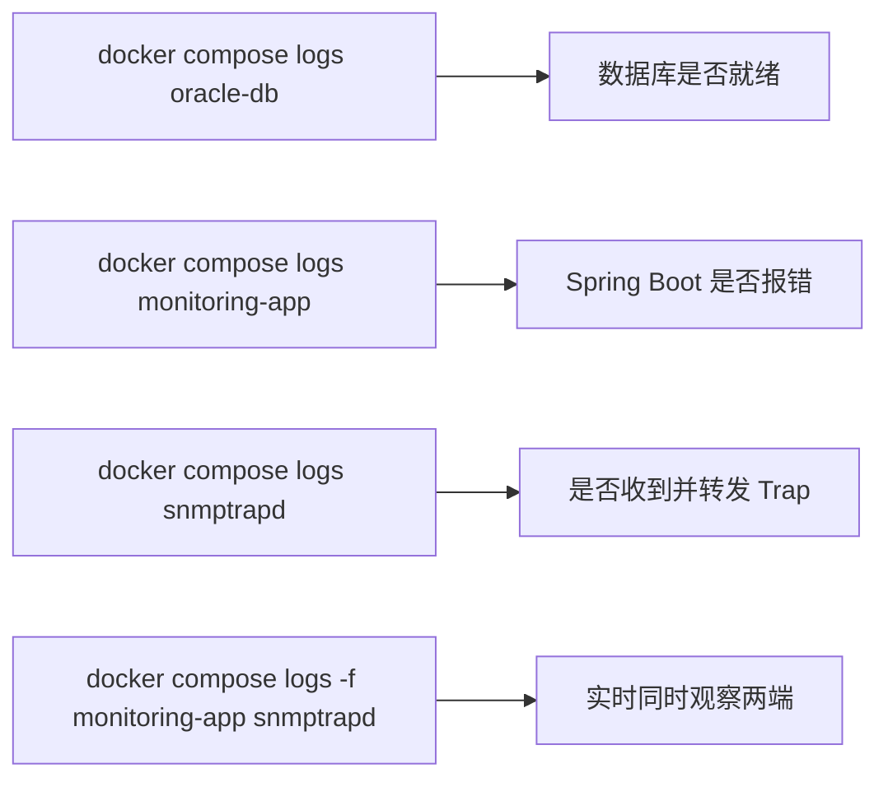

# 日志排查与运维命令

如果某次发送之后页面上没看到新记录，该去哪里查、看什么？

## 核心要点

* docker compose logs oracle-db：查看数据库是否已经完成初始化、是否有连接相关的错误。
* docker compose logs monitoring-app：查看 Spring Boot 是否收到请求、是否有校验失败或保存异常的堆栈信息。
* docker compose logs snmptrapd：查看是否收到了 Trap、转发脚本是否执行、有没有"未注册 OID"或"整合性错误"这类日志。
* docker compose logs -f monitoring-app snmptrapd：加 -f 可以同时跟踪两个服务的实时日志，方便在发送 Trap 的同时观察两端的反应。
* 停止服务用 docker compose down；如果还想清空数据库里的历史数据，需要额外加 -v 参数删除挂载的数据卷。

---

## 本章测验

本章共 5 道单项选择题。

### 第 1 题

如果怀疑 Trap 没有被正确接收或转发，应该优先查看哪个服务的日志？

- A. snmptrapd
- B. oracle-db
- C. 浏览器控制台
- D. iot-simulator 的镜像构建日志

选择答案后查看结果

正确答案：A

答案解析：snmptrapd 的日志能反映 Trap 是否被接收、转发脚本是否执行、以及是否出现未注册 OID 或一致性错误等信息，是排查接收转发问题的首选。

### 第 2 题

docker compose logs -f monitoring-app snmptrapd 中的 -f 参数作用是什么？

- A. 只显示错误级别的日志
- B. 把日志导出到文件
- C. 强制重启这两个服务
- D. 持续实时跟踪日志输出，而不是只看历史快照

选择答案后查看结果

正确答案：D

答案解析：-f 是 follow 的缩写，让日志输出保持实时滚动，方便在触发一次 Trap 发送的同时同步观察两端服务的反应。

### 第 3 题

停止所有服务但保留 Oracle 中已保存的历史数据，应该执行什么命令？

- A. docker compose down
- B. docker compose rm -v
- C. docker compose down -v
- D. docker compose stop -v

选择答案后查看结果

正确答案：A

答案解析：docker compose down（不带 -v）只停止并移除容器，保留数据卷中的持久化数据；加上 -v 才会连同数据卷一起删除。

### 第 4 题

如果要彻底清空 Oracle 中的历史 Trap 数据重新开始，应该执行什么命令？

- A. docker compose logs oracle-db --clean
- B. docker compose restart oracle-db
- C. docker compose down
- D. docker compose down -v

选择答案后查看结果

正确答案：D

答案解析：README 明确说明只有执行 docker compose down -v 才会连同 Oracle 保存的数据一起删除，这是彻底重置环境的方式。

### 第 5 题

发送一条 Trap 之后页面没有出现新记录，按照本章思路，比较系统化的排查顺序是什么？

- A. 直接执行 docker compose down -v 重来
- B. 先看 snmptrapd 日志确认是否收到并成功转发，再看 monitoring-app 日志确认 API 是否收到请求并成功保存，最后确认 oracle-db 是否正常
- C. 只需要刷新浏览器几次就能解决
- D. 重新编译 Simulator 源码

选择答案后查看结果

正确答案：B

答案解析：结合第 20 章的分层校验设计，排查应当顺着数据流方向逐段确认：先确认 Trap 是否被接收转发成功，再确认 API 是否收到并保存成功，最后确认数据库本身状态，逐段定位问题所在环节，而不是直接清空数据重来。

<!-- QUIZ_DATA_START
{
  "chapter": "21",
  "questions": [
    {
      "id": 1,
      "question": "如果怀疑 Trap 没有被正确接收或转发，应该优先查看哪个服务的日志？",
      "options": {
        "A": "snmptrapd",
        "B": "oracle-db",
        "C": "浏览器控制台",
        "D": "iot-simulator 的镜像构建日志"
      },
      "answer": "A",
      "explanation": "snmptrapd 的日志能反映 Trap 是否被接收、转发脚本是否执行、以及是否出现未注册 OID 或一致性错误等信息，是排查接收转发问题的首选。"
    },
    {
      "id": 2,
      "question": "docker compose logs -f monitoring-app snmptrapd 中的 -f 参数作用是什么？",
      "options": {
        "D": "持续实时跟踪日志输出，而不是只看历史快照",
        "A": "只显示错误级别的日志",
        "B": "把日志导出到文件",
        "C": "强制重启这两个服务"
      },
      "answer": "D",
      "explanation": "-f 是 follow 的缩写，让日志输出保持实时滚动，方便在触发一次 Trap 发送的同时同步观察两端服务的反应。"
    },
    {
      "id": 3,
      "question": "停止所有服务但保留 Oracle 中已保存的历史数据，应该执行什么命令？",
      "options": {
        "A": "docker compose down",
        "B": "docker compose rm -v",
        "C": "docker compose down -v",
        "D": "docker compose stop -v"
      },
      "answer": "A",
      "explanation": "docker compose down（不带 -v）只停止并移除容器，保留数据卷中的持久化数据；加上 -v 才会连同数据卷一起删除。"
    },
    {
      "id": 4,
      "question": "如果要彻底清空 Oracle 中的历史 Trap 数据重新开始，应该执行什么命令？",
      "options": {
        "D": "docker compose down -v",
        "A": "docker compose logs oracle-db --clean",
        "B": "docker compose restart oracle-db",
        "C": "docker compose down"
      },
      "answer": "D",
      "explanation": "README 明确说明只有执行 docker compose down -v 才会连同 Oracle 保存的数据一起删除，这是彻底重置环境的方式。"
    },
    {
      "id": 5,
      "question": "发送一条 Trap 之后页面没有出现新记录，按照本章思路，比较系统化的排查顺序是什么？",
      "options": {
        "B": "先看 snmptrapd 日志确认是否收到并成功转发，再看 monitoring-app 日志确认 API 是否收到请求并成功保存，最后确认 oracle-db 是否正常",
        "A": "直接执行 docker compose down -v 重来",
        "C": "只需要刷新浏览器几次就能解决",
        "D": "重新编译 Simulator 源码"
      },
      "answer": "B",
      "explanation": "结合第 20 章的分层校验设计，排查应当顺着数据流方向逐段确认：先确认 Trap 是否被接收转发成功，再确认 API 是否收到并保存成功，最后确认数据库本身状态，逐段定位问题所在环节，而不是直接清空数据重来。"
    }
  ]
}
QUIZ_DATA_END -->
