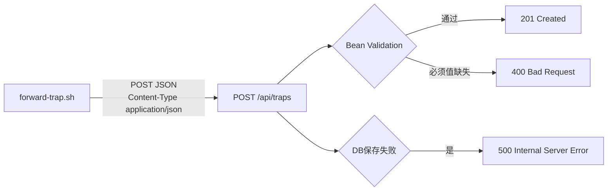

# 22 REST API设计：POST /api/traps

这是转发脚本和 Spring Boot 之间的唯一接口，本章把它的字段、类型、状态码梳理清楚。

## 核心要点

* 接口地址固定为 POST /api/traps，请求头要求 Content-Type: application/json。
* 成功保存返回 201 Created；必须字段缺失返回 400 Bad Request；数据库保存失败返回 500 Internal Server Error。
* 请求体包含 9 个字段：trapOid、trapName、deviceId、deviceName、eventType、severity、temperature、message、eventTime，全部为必填。
* 字符串字段各自有数据库层面的最大长度限制：trapOid 和 trapName 都是 128 字符，deviceId 是 64 字符，deviceName 是 128 字符，eventType 是 64 字符，severity 是 32 字符，message 是 512 字符。
* temperature 字段类型是 number（对应 Java 的 Double），eventTime 要求是 ISO-8601 格式的本地日期时间字符串。

## 关键信息

| JSON 字段 | 类型 | 必须 | 长度/格式 |
| --- | --- | --- | --- |
| trapOid | string | 是 | 数据库128字符，数值OID |
| trapName | string | 是 | 数据库128字符，需为辞书登记名 |
| deviceId | string | 是 | 数据库64字符 |
| deviceName | string | 是 | 数据库128字符 |
| eventType | string | 是 | 数据库64字符 |
| severity | string | 是 | 数据库32字符 |
| temperature | number | 是 | Double |
| message | string | 是 | 数据库512字符 |
| eventTime | string | 是 | ISO-8601本地日期时间 |

---

## 本章测验

本章共 5 道单项选择题。

### 第 1 题

REST API 的完整路径和请求方式是什么？

- A. POST /api/traps
- B. PUT /api/trap-events
- C. GET /traps
- D. POST /snmp/traps

选择答案后查看结果

正确答案：A

答案解析：详细设计文档明确接口为 POST /api/traps，Content-Type 为 application/json。

### 第 2 题

数据库保存失败时，API 会返回什么状态码？

- A. 200 OK
- B. 400 Bad Request
- C. 500 Internal Server Error
- D. 404 Not Found

选择答案后查看结果

正确答案：C

答案解析：文档明确规定 DB 保存失败返回 500 Internal Server Error。

### 第 3 题

以下哪个字段在数据库层面的最大长度限制是 512 字符？

- A. message
- B. severity
- C. deviceId
- D. trapOid

选择答案后查看结果

正确答案：A

答案解析：字段长度表显示 message 字段的数据库最大长度为 512 字符，是所有字符串字段中限制最宽松的。

### 第 4 题

temperature 字段在 JSON 请求体中对应的类型和 Java 类型分别是什么？

- A. JSON 中为 string，Java 中为 String
- B. JSON 中为 number，Java 中为 Double
- C. JSON 中为 boolean，Java 中为 Boolean
- D. JSON 中为 number，Java 中为 Integer

选择答案后查看结果

正确答案：B

答案解析：字段表中 temperature 类型标注为 number，详细设计文档说明 Spring Boot 最终将其转换为 Java 的 Double 类型。

### 第 5 题

如果请求体中缺少某个必须字段，API 会返回什么状态码？

- A. 400 Bad Request
- B. 500 Internal Server Error
- C. 201 Created
- D. 204 No Content

选择答案后查看结果

正确答案：A

答案解析：文档明确规定必须値不足（必须字段缺失）时返回 400 Bad Request，由 Bean Validation 在入口处拦截。

<!-- QUIZ_DATA_START
{
  "chapter": "22",
  "questions": [
    {
      "id": 1,
      "question": "REST API 的完整路径和请求方式是什么？",
      "options": {
        "A": "POST /api/traps",
        "B": "PUT /api/trap-events",
        "C": "GET /traps",
        "D": "POST /snmp/traps"
      },
      "answer": "A",
      "explanation": "详细设计文档明确接口为 POST /api/traps，Content-Type 为 application/json。"
    },
    {
      "id": 2,
      "question": "数据库保存失败时，API 会返回什么状态码？",
      "options": {
        "A": "200 OK",
        "B": "400 Bad Request",
        "C": "500 Internal Server Error",
        "D": "404 Not Found"
      },
      "answer": "C",
      "explanation": "文档明确规定 DB 保存失败返回 500 Internal Server Error。"
    },
    {
      "id": 3,
      "question": "以下哪个字段在数据库层面的最大长度限制是 512 字符？",
      "options": {
        "A": "message",
        "B": "severity",
        "C": "deviceId",
        "D": "trapOid"
      },
      "answer": "A",
      "explanation": "字段长度表显示 message 字段的数据库最大长度为 512 字符，是所有字符串字段中限制最宽松的。"
    },
    {
      "id": 4,
      "question": "temperature 字段在 JSON 请求体中对应的类型和 Java 类型分别是什么？",
      "options": {
        "A": "JSON 中为 string，Java 中为 String",
        "B": "JSON 中为 number，Java 中为 Double",
        "C": "JSON 中为 boolean，Java 中为 Boolean",
        "D": "JSON 中为 number，Java 中为 Integer"
      },
      "answer": "B",
      "explanation": "字段表中 temperature 类型标注为 number，详细设计文档说明 Spring Boot 最终将其转换为 Java 的 Double 类型。"
    },
    {
      "id": 5,
      "question": "如果请求体中缺少某个必须字段，API 会返回什么状态码？",
      "options": {
        "A": "400 Bad Request",
        "B": "500 Internal Server Error",
        "C": "201 Created",
        "D": "204 No Content"
      },
      "answer": "A",
      "explanation": "文档明确规定必须値不足（必须字段缺失）时返回 400 Bad Request，由 Bean Validation 在入口处拦截。"
    }
  ]
}
QUIZ_DATA_END -->
