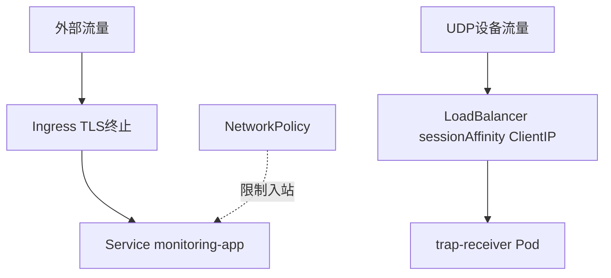

# 22. Kubernetes网络与安全策略

生产环境下，网络层面的会话保持和访问控制同样关键，这一章讲Ingress TLS、ClientIP亲和性和NetworkPolicy。

## 核心要点

* Ingress负责TLS终止，把HTTPS流量解密后转发给monitoring-app Service，对外只暴露443端口
* trap-receiver的Service必须保留sessionAffinity: ClientIP，这是Kubernetes环境下实现和Docker Compose里nginx一致性哈希同样效果的方式——保证同一来源IP的SNMPv3会话固定到同一个Pod
* NetworkPolicy限制了能够访问monitoring-app的入站流量来源，实现最小权限的网络访问控制，即使某个Pod被攻破，也难以直接横向访问其他服务
* 文档特别提醒：如果部署在NAT网关之后、来源IP被统一替换成NAT的IP，ClientIP亲和性可能失效，需要针对性验证LoadBalancer是否支持保留原始来源IP(source-IP preservation)

---

## 本章测验

本章共 5 道单项选择题。

### 第 1 题

Ingress在这套架构里主要承担什么职责？

- A. 处理UDP层的SNMPv3流量
- B. 作为HTTP(S)入口做TLS终止，把外部HTTPS流量解密后转发给monitoring-app Service
- C. 直接连接Oracle数据库
- D. 负责Pod的自动扩缩容

选择答案后查看结果

正确答案：B

答案解析：Ingress资源通常处理HTTP/HTTPS层的路由和TLS终止，配合monitoring-app-tls这个TLS Secret，让外部只需要通过标准的443端口访问，证书由Ingress统一管理。

### 第 2 题

为什么trap-receiver对应的Service必须配置sessionAffinity: ClientIP，并且文档特别强调不能删除？

- A. 这跟SNMPv3认证完全无关，只是性能优化
- B. 这只是为了提升网络吞吐量
- C. 这是Kubernetes环境下实现\"同一来源固定路由到同一Pod\"的关键机制，功能上对应Docker Compose里nginx的一致性哈希，用于保证SNMPv3的discovery和后续Inform落在同一个Pod上
- D. 这是Kubernetes的强制默认配置，无法关闭

选择答案后查看结果

正确答案：C

答案解析：这正是第5章讲过的一致性哈希在Kubernetes环境下的等价实现，如果去掉这个配置，同一设备的请求可能被分发到不同的trap-receiver Pod，导致SNMPv3认证因为Engine ID/USM状态不一致而失败。

### 第 3 题

NetworkPolicy在这套架构里的作用是什么？

- A. 自动给Pod分配IP地址
- B. 管理Ingress的TLS证书
- C. 加速Pod之间的网络通信
- D. 限制哪些来源可以访问monitoring-app，实现最小权限的网络访问控制

选择答案后查看结果

正确答案：D

答案解析：NetworkPolicy是Kubernetes原生的网络访问控制机制，通过定义允许的入站/出站规则，限制哪些Pod或命名空间可以与目标Pod通信，即使某个组件被攻破，也能限制攻击者进一步横向移动的范围。

### 第 4 题

文档提到\"NAT配下的session affinity验证\"，这里的核心风险是什么？

- A. 如果多个终端设备的流量在经过NAT后被统一替换成同一个来源IP，基于ClientIP的会话保持机制可能无法正确区分不同来源，进而影响一致性路由的效果
- B. NAT会自动加密所有流量
- C. 这个风险只存在于IPv6网络中
- D. NAT会导致数据包丢失

选择答案后查看结果

正确答案：A

答案解析：ClientIP亲和性依赖能看到真实的来源IP，如果NAT网关把多台设备的流量统一转换成同一个来源IP，基于IP的会话保持就失去了区分不同设备的能力，因此文档特别提醒要针对具体的NLB和NAT环境单独验证source-IP preservation的行为。

### 第 5 题

整体上，Ingress、Service sessionAffinity和NetworkPolicy三者分别解决了什么层面的问题？

- A. 三者做的是同一件事，互相替代
- B. Ingress解决HTTP(S)入口和TLS终止，sessionAffinity解决SNMPv3会话的一致路由，NetworkPolicy解决网络访问的最小权限控制，三者是互补关系
- C. 三者都只与UDP流量有关
- D. 这三个机制都是Kubernetes里已经废弃的功能

选择答案后查看结果

正确答案：B

答案解析：这三个机制分别对应网络层面的三个不同关注点：入口与加密、会话路由一致性、访问权限最小化，共同构成了这套架构在Kubernetes网络层的完整安全设计。

<!-- QUIZ_DATA_START
{
  "chapter": "22",
  "questions": [
    {
      "id": 1,
      "question": "Ingress在这套架构里主要承担什么职责？",
      "options": {
        "A": "处理UDP层的SNMPv3流量",
        "B": "作为HTTP(S)入口做TLS终止，把外部HTTPS流量解密后转发给monitoring-app Service",
        "C": "直接连接Oracle数据库",
        "D": "负责Pod的自动扩缩容"
      },
      "answer": "B",
      "explanation": "Ingress资源通常处理HTTP/HTTPS层的路由和TLS终止，配合monitoring-app-tls这个TLS Secret，让外部只需要通过标准的443端口访问，证书由Ingress统一管理。"
    },
    {
      "id": 2,
      "question": "为什么trap-receiver对应的Service必须配置sessionAffinity: ClientIP，并且文档特别强调不能删除？",
      "options": {
        "A": "这跟SNMPv3认证完全无关，只是性能优化",
        "B": "这只是为了提升网络吞吐量",
        "C": "这是Kubernetes环境下实现\\\"同一来源固定路由到同一Pod\\\"的关键机制，功能上对应Docker Compose里nginx的一致性哈希，用于保证SNMPv3的discovery和后续Inform落在同一个Pod上",
        "D": "这是Kubernetes的强制默认配置，无法关闭"
      },
      "answer": "C",
      "explanation": "这正是第5章讲过的一致性哈希在Kubernetes环境下的等价实现，如果去掉这个配置，同一设备的请求可能被分发到不同的trap-receiver Pod，导致SNMPv3认证因为Engine ID/USM状态不一致而失败。"
    },
    {
      "id": 3,
      "question": "NetworkPolicy在这套架构里的作用是什么？",
      "options": {
        "A": "自动给Pod分配IP地址",
        "B": "管理Ingress的TLS证书",
        "C": "加速Pod之间的网络通信",
        "D": "限制哪些来源可以访问monitoring-app，实现最小权限的网络访问控制"
      },
      "answer": "D",
      "explanation": "NetworkPolicy是Kubernetes原生的网络访问控制机制，通过定义允许的入站/出站规则，限制哪些Pod或命名空间可以与目标Pod通信，即使某个组件被攻破，也能限制攻击者进一步横向移动的范围。"
    },
    {
      "id": 4,
      "question": "文档提到\\\"NAT配下的session affinity验证\\\"，这里的核心风险是什么？",
      "options": {
        "A": "如果多个终端设备的流量在经过NAT后被统一替换成同一个来源IP，基于ClientIP的会话保持机制可能无法正确区分不同来源，进而影响一致性路由的效果",
        "B": "NAT会自动加密所有流量",
        "C": "这个风险只存在于IPv6网络中",
        "D": "NAT会导致数据包丢失"
      },
      "answer": "A",
      "explanation": "ClientIP亲和性依赖能看到真实的来源IP，如果NAT网关把多台设备的流量统一转换成同一个来源IP，基于IP的会话保持就失去了区分不同设备的能力，因此文档特别提醒要针对具体的NLB和NAT环境单独验证source-IP preservation的行为。"
    },
    {
      "id": 5,
      "question": "整体上，Ingress、Service sessionAffinity和NetworkPolicy三者分别解决了什么层面的问题？",
      "options": {
        "A": "三者做的是同一件事，互相替代",
        "B": "Ingress解决HTTP(S)入口和TLS终止，sessionAffinity解决SNMPv3会话的一致路由，NetworkPolicy解决网络访问的最小权限控制，三者是互补关系",
        "C": "三者都只与UDP流量有关",
        "D": "这三个机制都是Kubernetes里已经废弃的功能"
      },
      "answer": "B",
      "explanation": "这三个机制分别对应网络层面的三个不同关注点：入口与加密、会话路由一致性、访问权限最小化，共同构成了这套架构在Kubernetes网络层的完整安全设计。"
    }
  ]
}
QUIZ_DATA_END -->
