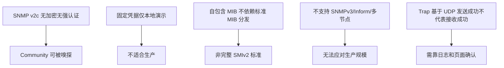

# 本 Demo 的限制与安全边界

这个项目定位是演示，README 里专门列出了一份"不做什么"的清单，这一章逐条理解它们的含义。

## 核心要点

* SNMP v2c 的 Community public 不提供加密也不提供强认证，理论上可以被网络嗅探获取，这也是它被限定为演示用途的核心原因。
* 所有凭据（数据库账号密码等）都是本地演示专用的固定值，生产环境应该替换为 Docker Secrets 或其他密钥管理机制。
* 项目自带的 MIB 是自包含的、不依赖标准 SMIv2 MIB 分发体系，也不支持外部 MIB 动态替换、多厂商 MIB 依赖解析。
* SNMPv3、Inform、认证授权、失败重试队列、多节点部署均不在本 Demo 范围内，这意味着单点故障和消息丢失在设计上是被接受的风险。
* Trap 基于 UDP 传输，Simulator 显示"发送成功"只代表报文已经送出，并不保证被接收和保存，必须通过日志和页面确认最终结果，这一点在第 21 章也有体现。

---

## 本章测验

本章共 5 道单项选择题。

### 第 1 题

本 Demo 使用的 SNMP v2c Community public 存在的核心安全限制是什么？

- A. 无法处理超过 3 种事件类型
- B. 只能在 Windows 系统运行
- C. 不提供加密和强认证，理论上可能被网络嗅探获取
- D. 不支持任何设备接入

选择答案后查看结果

正确答案：C

答案解析：README 明确说明 Community public 不提供加密和强认证，这是 v2c 协议本身的限制，也是该 Demo 被限定为演示用途的核心原因。

### 第 2 题

关于本项目的凭据管理，README 中的建议是什么？

- A. 生产环境应替换为 Docker Secrets 等方式，而非固定值
- B. 凭据完全不需要保护
- C. 凭据应该硬编码进 Java 源码
- D. 生产环境可以继续使用相同的固定值

选择答案后查看结果

正确答案：A

答案解析：README 的制约事项中说明资格情报是本地演示专用的固定值，生产环境需要替换为 Docker Secrets 等方案。

### 第 3 题

以下哪一项属于 README 中明确列出的、本 Demo 不包含的特性？

- A. 字典驱动的 OID 转换
- B. Thymeleaf 页面渲染
- C. SNMPv3、Inform、失败重试队列、多节点部署
- D. REST API 的 Bean Validation 校验

选择答案后查看结果

正确答案：C

答案解析：README 制约事项明确将 SNMPv3、Inform、认证授权、重试队列、多节点配置列为本 Demo 范围之外。

### 第 4 题

为什么"Simulator 显示发送成功"不能等同于"数据已经被正确保存"？

- A. 因为浏览器缓存了旧数据
- B. 因为 Spring Boot 会随机丢弃部分请求
- C. 因为 Simulator 存在软件缺陷
- D. 因为 Trap 基于 UDP 传输，发送成功只表示报文已发出，不保证被接收和处理

选择答案后查看结果

正确答案：D

答案解析：UDP 是无连接、不保证送达的协议，README 特别提醒发送成功不代表接收和保存的保证，必须靠日志和页面加以确认，这与第 21 章的排查方法相呼应。

### 第 5 题

综合本章内容，如果有人想把这个 Demo 直接部署为公司内部的生产监控系统，最不合适的原因组合是什么？

- A. 只是因为界面不够美观
- B. 只是因为不支持中文界面
- C. 缺乏加密认证、使用固定演示凭据、无失败重试与多节点冗余，任一节点故障或消息丢失都无法自动恢复
- D. 只是因为使用了 Oracle 而不是 MySQL

选择答案后查看结果

正确答案：C

答案解析：生产环境的可靠性和安全性需要认证加密、凭据管理、故障冗余和消息可靠投递等机制的共同支撑，而这些正是本 Demo 明确排除在范围之外的部分，直接照搬会带来数据丢失和安全风险。

<!-- QUIZ_DATA_START
{
  "chapter": "22",
  "questions": [
    {
      "id": 1,
      "question": "本 Demo 使用的 SNMP v2c Community public 存在的核心安全限制是什么？",
      "options": {
        "C": "不提供加密和强认证，理论上可能被网络嗅探获取",
        "A": "无法处理超过 3 种事件类型",
        "B": "只能在 Windows 系统运行",
        "D": "不支持任何设备接入"
      },
      "answer": "C",
      "explanation": "README 明确说明 Community public 不提供加密和强认证，这是 v2c 协议本身的限制，也是该 Demo 被限定为演示用途的核心原因。"
    },
    {
      "id": 2,
      "question": "关于本项目的凭据管理，README 中的建议是什么？",
      "options": {
        "A": "生产环境应替换为 Docker Secrets 等方式，而非固定值",
        "B": "凭据完全不需要保护",
        "C": "凭据应该硬编码进 Java 源码",
        "D": "生产环境可以继续使用相同的固定值"
      },
      "answer": "A",
      "explanation": "README 的制约事项中说明资格情报是本地演示专用的固定值，生产环境需要替换为 Docker Secrets 等方案。"
    },
    {
      "id": 3,
      "question": "以下哪一项属于 README 中明确列出的、本 Demo 不包含的特性？",
      "options": {
        "C": "SNMPv3、Inform、失败重试队列、多节点部署",
        "A": "字典驱动的 OID 转换",
        "B": "Thymeleaf 页面渲染",
        "D": "REST API 的 Bean Validation 校验"
      },
      "answer": "C",
      "explanation": "README 制约事项明确将 SNMPv3、Inform、认证授权、重试队列、多节点配置列为本 Demo 范围之外。"
    },
    {
      "id": 4,
      "question": "为什么\"Simulator 显示发送成功\"不能等同于\"数据已经被正确保存\"？",
      "options": {
        "D": "因为 Trap 基于 UDP 传输，发送成功只表示报文已发出，不保证被接收和处理",
        "A": "因为浏览器缓存了旧数据",
        "B": "因为 Spring Boot 会随机丢弃部分请求",
        "C": "因为 Simulator 存在软件缺陷"
      },
      "answer": "D",
      "explanation": "UDP 是无连接、不保证送达的协议，README 特别提醒发送成功不代表接收和保存的保证，必须靠日志和页面加以确认，这与第 21 章的排查方法相呼应。"
    },
    {
      "id": 5,
      "question": "综合本章内容，如果有人想把这个 Demo 直接部署为公司内部的生产监控系统，最不合适的原因组合是什么？",
      "options": {
        "C": "缺乏加密认证、使用固定演示凭据、无失败重试与多节点冗余，任一节点故障或消息丢失都无法自动恢复",
        "A": "只是因为界面不够美观",
        "B": "只是因为不支持中文界面",
        "D": "只是因为使用了 Oracle 而不是 MySQL"
      },
      "answer": "C",
      "explanation": "生产环境的可靠性和安全性需要认证加密、凭据管理、故障冗余和消息可靠投递等机制的共同支撑，而这些正是本 Demo 明确排除在范围之外的部分，直接照搬会带来数据丢失和安全风险。"
    }
  ]
}
QUIZ_DATA_END -->
