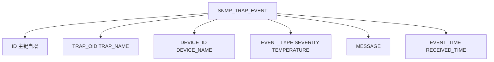

# 23 数据库表结构设计

最终数据落地在 SNMP_TRAP_EVENT 表里，本章把每一列的类型和约束讲清楚。

## 核心要点

* 表名固定为 SNMP_TRAP_EVENT，由 JPA 的 ddl-auto=update 自动创建，不需要手写建表 SQL。
* ID 列是 Long 类型的自增主键（IDENTITY 策略），是每条记录的唯一标识。
* TRAP_OID 和 TRAP_NAME 都保存下来，前者是协议层的原始追踪依据，后者是给运维人员看的可读名称，两者都不能省略。
* EVENT_TIME 记录的是事件本身发生的时间，RECEIVED_TIME 记录的是系统接收到这条数据的时间，二者是两个独立的字段，不能混为一谈。
* 所有列都标记为 NOT NULL，这与前面讲到的“7 个 VB 字段全部必填”以及“API 请求体全部字段必填”是一脉相承的设计。

## 关键信息

| 列名 | Java 类型 | 约束 |
| --- | --- | --- |
| ID | Long | 主键，自增 |
| TRAP_OID | String(128) | 非空 |
| TRAP_NAME | String(128) | 非空 |
| DEVICE_ID | String(64) | 非空 |
| DEVICE_NAME | String(128) | 非空 |
| EVENT_TYPE | String(64) | 非空 |
| SEVERITY | String(32) | 非空 |
| TEMPERATURE | Double | 非空 |
| MESSAGE | String(512) | 非空 |
| EVENT_TIME | LocalDateTime | 非空 |
| RECEIVED_TIME | LocalDateTime | 非空 |

---

## 本章测验

本章共 5 道单项选择题。

### 第 1 题

SNMP_TRAP_EVENT 表是通过什么方式创建的？

- A. JPA 的 ddl-auto=update 根据实体类自动创建
- B. 由 IoT Simulator 首次启动时创建
- C. 手工编写并执行 SQL 建表脚本
- D. 由转发脚本 forward-trap.sh 直接创建

选择答案后查看结果

正确答案：A

答案解析：文档说明数据库表结构由 JPA 的 ddl-auto=update 机制根据 TrapEvent 实体类自动创建和更新。

### 第 2 题

ID 列采用的主键生成策略是什么？

- A. 复合主键
- B. IDENTITY 自增
- C. UUID
- D. 手动指定

选择答案后查看结果

正确答案：B

答案解析：表结构说明中 ID 列为 Long 类型，主键策略为 IDENTITY（自增）。

### 第 3 题

TRAP_OID 和 TRAP_NAME 两列同时保留的主要原因是什么？

- A. 因为 Oracle 数据库要求必须有两个字符串列
- B. 为了兼容旧版本数据格式
- C. TRAP_OID 是协议层原始追踪依据，TRAP_NAME 是可读名称，两者用途不同都需要保留
- D. 为了让表结构看起来更复杂

选择答案后查看结果

正确答案：C

答案解析：Net-SNMP辞书・変換设计书中提到，trapOid 用于追踪接收事实，trapName 用于运维人员判读，两者都保存以避免丢失任何一方信息。

### 第 4 题

EVENT_TIME 和 RECEIVED_TIME 两个字段的区别是什么？

- A. RECEIVED_TIME 永远早于 EVENT_TIME
- B. EVENT_TIME 是事件发生时间，RECEIVED_TIME 是系统接收时间，两者独立记录
- C. 两者完全相同，只是命名不同
- D. EVENT_TIME 是数据库自动生成，RECEIVED_TIME 由前端传入

选择答案后查看结果

正确答案：B

答案解析：表结构中 EVENT_TIME 和 RECEIVED_TIME 是两个独立的 LocalDateTime 字段，分别记录事件发生时间和系统接收时间。

### 第 5 题

SNMP_TRAP_EVENT 表所有列的非空约束，与前面哪个环节的设计理念是一致的？

- A. 与浏览器缓存策略一致
- B. 与 VB 字段全部必填、API 请求体字段全部必填的设计理念一致
- C. 与 Docker 网络端口设计一致
- D. 与 MIB 模块命名规则一致

选择答案后查看结果

正确答案：B

答案解析：数据库表所有列 NOT NULL 的约束，延续了 VB 定义辞书中 7 个字段全部必填、以及 REST API 请求体全部字段必填的一致性设计思路。

<!-- QUIZ_DATA_START
{
  "chapter": "23",
  "questions": [
    {
      "id": 1,
      "question": "SNMP_TRAP_EVENT 表是通过什么方式创建的？",
      "options": {
        "A": "JPA 的 ddl-auto=update 根据实体类自动创建",
        "B": "由 IoT Simulator 首次启动时创建",
        "C": "手工编写并执行 SQL 建表脚本",
        "D": "由转发脚本 forward-trap.sh 直接创建"
      },
      "answer": "A",
      "explanation": "文档说明数据库表结构由 JPA 的 ddl-auto=update 机制根据 TrapEvent 实体类自动创建和更新。"
    },
    {
      "id": 2,
      "question": "ID 列采用的主键生成策略是什么？",
      "options": {
        "A": "复合主键",
        "B": "IDENTITY 自增",
        "C": "UUID",
        "D": "手动指定"
      },
      "answer": "B",
      "explanation": "表结构说明中 ID 列为 Long 类型，主键策略为 IDENTITY（自增）。"
    },
    {
      "id": 3,
      "question": "TRAP_OID 和 TRAP_NAME 两列同时保留的主要原因是什么？",
      "options": {
        "A": "因为 Oracle 数据库要求必须有两个字符串列",
        "B": "为了兼容旧版本数据格式",
        "C": "TRAP_OID 是协议层原始追踪依据，TRAP_NAME 是可读名称，两者用途不同都需要保留",
        "D": "为了让表结构看起来更复杂"
      },
      "answer": "C",
      "explanation": "Net-SNMP辞书・変換设计书中提到，trapOid 用于追踪接收事实，trapName 用于运维人员判读，两者都保存以避免丢失任何一方信息。"
    },
    {
      "id": 4,
      "question": "EVENT_TIME 和 RECEIVED_TIME 两个字段的区别是什么？",
      "options": {
        "A": "RECEIVED_TIME 永远早于 EVENT_TIME",
        "B": "EVENT_TIME 是事件发生时间，RECEIVED_TIME 是系统接收时间，两者独立记录",
        "C": "两者完全相同，只是命名不同",
        "D": "EVENT_TIME 是数据库自动生成，RECEIVED_TIME 由前端传入"
      },
      "answer": "B",
      "explanation": "表结构中 EVENT_TIME 和 RECEIVED_TIME 是两个独立的 LocalDateTime 字段，分别记录事件发生时间和系统接收时间。"
    },
    {
      "id": 5,
      "question": "SNMP_TRAP_EVENT 表所有列的非空约束，与前面哪个环节的设计理念是一致的？",
      "options": {
        "A": "与浏览器缓存策略一致",
        "B": "与 VB 字段全部必填、API 请求体字段全部必填的设计理念一致",
        "C": "与 Docker 网络端口设计一致",
        "D": "与 MIB 模块命名规则一致"
      },
      "answer": "B",
      "explanation": "数据库表所有列 NOT NULL 的约束，延续了 VB 定义辞书中 7 个字段全部必填、以及 REST API 请求体全部字段必填的一致性设计思路。"
    }
  ]
}
QUIZ_DATA_END -->
