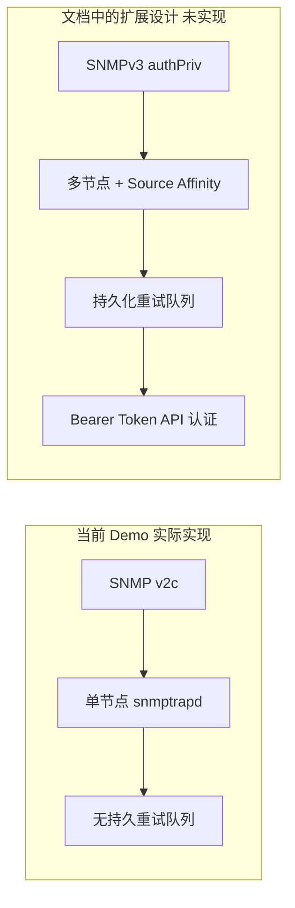

# 生产级演进方向：从演示到生产的差距

仓库里还有一份更"高配"的设计文档，描述了一套支持 SNMPv3、多节点、重试队列的方案——但请注意，这不是当前 Demo 实际运行的样子。

## 核心要点

* 重要提示：本章内容来自仓库中的另一份设计文档，描述的是一个更完整的生产方向方案，与当前 Demo 实际跑起来的行为不同，两者不能混为一谈。
* 扩展设计中提到用 SNMPv3 的 authPriv（SHA-256/AES-128）替代 v2c 的 Community 认证，解决第 22 章提到的加密和认证问题。
* 扩展设计中提到用多接收节点加 UDP 负载均衡的 source affinity，解决单点故障问题，但需要额外维护 Engine ID 和 USM key 的持久化。
* 扩展设计中提到用共享持久化重试队列和 eventId 去重，解决 API 或数据库短暂不可用时的消息丢失问题。
* 扩展设计中提到用 Bearer Token 替代无认证的 HTTP POST，为内部 API 调用增加一层身份校验。
* 这些扩展设计目前只存在于文档层面，实际代码和 docker-compose.yml 中并未实现，学习时应把它们当作"生产化时需要考虑的方向"，而不是当前系统的功能。

---

## 本章测验

本章共 5 道单项选择题。

### 第 1 题

本章讨论的 SNMPv3、多节点、重试队列等特性，与当前 Demo 的关系是什么？

- A. 这些是仓库中另一份设计文档描述的扩展方向，当前 Demo 并未实现
- B. 这些特性会在下次 git pull 后自动生效
- C. 这些特性已经在当前 Demo 中完整实现
- D. 这些特性与本项目完全无关，只是随意提及

选择答案后查看结果

正确答案：A

答案解析：本章明确说明这部分内容来自仓库中另一份设计文档，是描述生产演进方向的方案，与第 22 章确认的当前 Demo 实际行为存在差距，不应混淆。

### 第 2 题

扩展设计中，SNMPv3 的 authPriv 主要用来解决第 22 章提到的哪个限制？

- A. Oracle 数据库连接问题
- B. Thymeleaf 页面渲染问题
- C. Docker Compose 编排问题
- D. v2c Community 缺乏加密和强认证的问题

选择答案后查看结果

正确答案：D

答案解析：authPriv 提供加密（AES-128）和强认证（SHA-256），正是用来替代当前 Demo 中缺乏加密认证的 Community public 机制。

### 第 3 题

扩展设计中提到的持久化重试队列，主要解决的是什么问题？

- A. API 或数据库短暂不可用导致消息丢失的问题
- B. MIB 文件体积过大的问题
- C. 浏览器渲染速度慢的问题
- D. Simulator 无法发送多种事件类型的问题

选择答案后查看结果

正确答案：A

答案解析：第 22 章提到当前 Demo 没有重试机制，一旦下游短暂故障消息就会丢失；扩展设计用共享持久化队列加 eventId 去重来解决这个问题。

### 第 4 题

为什么本章要特别强调这些扩展设计"目前只存在于文档层面"？

- A. 因为这些特性与 SNMP 协议无关
- B. 避免学习者误以为当前 Demo 已经具备生产级可靠性和安全性，从而混淆文档设想与实际实现
- C. 因为这些特性已经被官方废弃
- D. 为了增加课程的篇幅

选择答案后查看结果

正确答案：B

答案解析：结合第 22 章的实际限制清单，如果不加区分地把设计文档中的扩展方案当作当前功能来理解，容易产生"这个 Demo 已经生产级可用"的错误认知，因此需要明确区分文档设想与代码实现。

### 第 5 题

如果团队决定把这个 Demo 真正演进为生产系统，按照本章内容，比较合理的态度是什么？

- A. 参考扩展设计文档中的方向（SNMPv3、多节点、重试队列、Bearer 认证等），但仍需结合实际环境重新设计、开发和验证，不能假设文档已经等于实现
- B. 完全抛弃当前 Demo 的字典驱动设计思路
- C. 只需要把 Oracle 换成其他数据库即可
- D. 直接把当前 docker-compose.yml 部署到生产环境，无需任何改动

选择答案后查看结果

正确答案：A

答案解析：扩展设计文档提供的是方向性参考，但它本身不是可直接运行的实现，真正生产化仍需要基于这些方向进行完整的设计、开发、测试和验证工作。

<!-- QUIZ_DATA_START
{
  "chapter": "23",
  "questions": [
    {
      "id": 1,
      "question": "本章讨论的 SNMPv3、多节点、重试队列等特性，与当前 Demo 的关系是什么？",
      "options": {
        "A": "这些是仓库中另一份设计文档描述的扩展方向，当前 Demo 并未实现",
        "B": "这些特性会在下次 git pull 后自动生效",
        "C": "这些特性已经在当前 Demo 中完整实现",
        "D": "这些特性与本项目完全无关，只是随意提及"
      },
      "answer": "A",
      "explanation": "本章明确说明这部分内容来自仓库中另一份设计文档，是描述生产演进方向的方案，与第 22 章确认的当前 Demo 实际行为存在差距，不应混淆。"
    },
    {
      "id": 2,
      "question": "扩展设计中，SNMPv3 的 authPriv 主要用来解决第 22 章提到的哪个限制？",
      "options": {
        "D": "v2c Community 缺乏加密和强认证的问题",
        "A": "Oracle 数据库连接问题",
        "B": "Thymeleaf 页面渲染问题",
        "C": "Docker Compose 编排问题"
      },
      "answer": "D",
      "explanation": "authPriv 提供加密（AES-128）和强认证（SHA-256），正是用来替代当前 Demo 中缺乏加密认证的 Community public 机制。"
    },
    {
      "id": 3,
      "question": "扩展设计中提到的持久化重试队列，主要解决的是什么问题？",
      "options": {
        "A": "API 或数据库短暂不可用导致消息丢失的问题",
        "B": "MIB 文件体积过大的问题",
        "C": "浏览器渲染速度慢的问题",
        "D": "Simulator 无法发送多种事件类型的问题"
      },
      "answer": "A",
      "explanation": "第 22 章提到当前 Demo 没有重试机制，一旦下游短暂故障消息就会丢失；扩展设计用共享持久化队列加 eventId 去重来解决这个问题。"
    },
    {
      "id": 4,
      "question": "为什么本章要特别强调这些扩展设计\"目前只存在于文档层面\"？",
      "options": {
        "B": "避免学习者误以为当前 Demo 已经具备生产级可靠性和安全性，从而混淆文档设想与实际实现",
        "A": "因为这些特性与 SNMP 协议无关",
        "C": "因为这些特性已经被官方废弃",
        "D": "为了增加课程的篇幅"
      },
      "answer": "B",
      "explanation": "结合第 22 章的实际限制清单，如果不加区分地把设计文档中的扩展方案当作当前功能来理解，容易产生\"这个 Demo 已经生产级可用\"的错误认知，因此需要明确区分文档设想与代码实现。"
    },
    {
      "id": 5,
      "question": "如果团队决定把这个 Demo 真正演进为生产系统，按照本章内容，比较合理的态度是什么？",
      "options": {
        "A": "参考扩展设计文档中的方向（SNMPv3、多节点、重试队列、Bearer 认证等），但仍需结合实际环境重新设计、开发和验证，不能假设文档已经等于实现",
        "B": "完全抛弃当前 Demo 的字典驱动设计思路",
        "C": "只需要把 Oracle 换成其他数据库即可",
        "D": "直接把当前 docker-compose.yml 部署到生产环境，无需任何改动"
      },
      "answer": "A",
      "explanation": "扩展设计文档提供的是方向性参考，但它本身不是可直接运行的实现，真正生产化仍需要基于这些方向进行完整的设计、开发、测试和验证工作。"
    }
  ]
}
QUIZ_DATA_END -->
