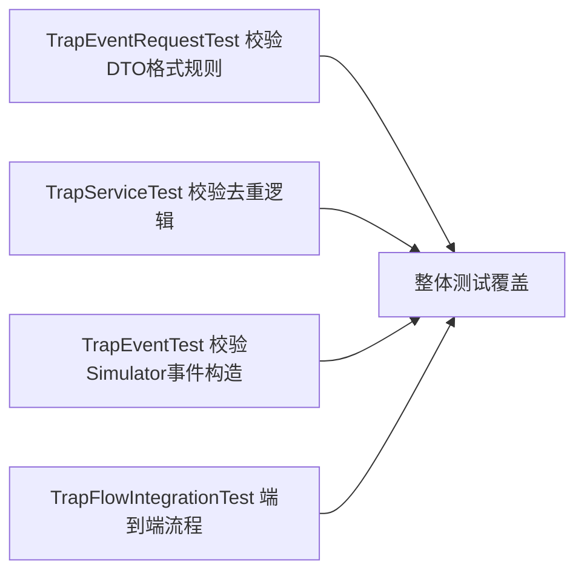

# 23. 测试策略：单元测试与集成测试

项目里既有针对单个类的单元测试，也有覆盖完整链路的集成测试，这一章看它们各自验证了什么。

## 核心要点

* TrapEventRequestTest针对DTO上的各种Pattern/Size/NotNull注解构造合法与非法输入，验证Bean Validation行为符合预期
* TrapServiceTest用Mock的Repository验证save方法在重复eventId和新eventId两种场景下的不同行为，而不需要连接真实数据库
* TrapFlowIntegrationTest是集成测试，验证从API请求进入到数据真正保存、以及重复请求被正确去重的完整链路行为
* iot-simulator模块的TrapEventTest则聚焦事件模板和PDU构造这部分独立逻辑，和monitoring-app的测试是分开维护的两套测试代码
* 验证命令文档里提供了用Maven容器执行测试的方式，不要求本地一定安装好Maven环境，降低了环境依赖门槛

---

## 本章测验

本章共 5 道单项选择题。

### 第 1 题

TrapEventRequestTest这个测试类主要覆盖的是什么内容？

- A. Kubernetes的Pod调度逻辑
- B. 数据库连接性能
- C. DTO上各字段的Bean Validation注解(如Pattern、Size、NotNull)在合法与非法输入下的校验行为
- D. nginx的负载均衡策略

选择答案后查看结果

正确答案：C

答案解析：这是针对TrapEventRequest这个record的单元测试，重点验证第12章讲过的各种正则和长度校验规则是否按预期工作。

### 第 2 题

TrapServiceTest是如何在不依赖真实Oracle数据库的情况下测试TrapService逻辑的？

- A. 直接跳过所有数据库相关的测试
- B. 用文件系统模拟数据库存储
- C. 连接到一个专门的测试用生产数据库
- D. 使用Mock的TrapEventRepository，模拟existsByEventId返回不同结果，验证save方法在重复和新增两种场景下的分支逻辑

选择答案后查看结果

正确答案：D

答案解析：这是典型的单元测试做法，通过Mock掉Repository依赖，可以精确控制existsByEventId返回true或false，从而独立验证TrapService.save里的判重逻辑，而不需要启动真实数据库。

### 第 3 题

TrapFlowIntegrationTest和TrapServiceTest最主要的区别是什么？

- A. TrapFlowIntegrationTest是集成测试，覆盖从API请求到数据持久化的完整链路；TrapServiceTest是单元测试，只隔离验证TrapService这一层逻辑
- B. TrapFlowIntegrationTest不需要启动Spring上下文，而TrapServiceTest需要
- C. 两者测试的是完全不同的项目模块
- D. 两者测试的内容完全相同，只是类名不同

选择答案后查看结果

正确答案：A

答案解析：从命名和职责上可以看出，Integration Test验证的是多个组件协作后的端到端行为(比如通过真实的API调用、真正持久化到测试数据库、再验证去重效果)，而Service层的单元测试聚焦单一类的逻辑分支，两者互补但关注点不同。

### 第 4 题

iot-simulator模块中的TrapEventTest测试的是什么？

- A. monitoring-app里的TrapService逻辑
- B. iot-simulator自身的事件模板/PDU构造相关逻辑，与monitoring-app的测试代码是分开维护的
- C. nginx网关的路由规则
- D. Oracle数据库的表结构

选择答案后查看结果

正确答案：B

答案解析：iot-simulator和monitoring-app是两个独立的Maven项目，各自有各自的测试目录和测试类，TrapEventTest聚焦的是Simulator侧构造TrapEvent和相关字段的逻辑，跟后端的TrapService测试是不同的关注点。

### 第 5 题

文档里推荐用Maven容器来执行Java测试，这样做的好处是什么？

- A. 容器化测试速度一定比本地快
- B. 测试结果会更准确
- C. 不要求开发者本地一定预装好特定版本的Maven和JDK环境，用容器统一了构建环境，降低了环境依赖门槛
- D. 这样可以跳过所有单元测试

选择答案后查看结果

正确答案：C

答案解析：文档提供的命令是用maven:3.9.11-eclipse-temurin-21-alpine这个官方镜像挂载项目目录执行mvn test，这样任何装了Docker的机器都能用完全一致的构建环境跑测试，不用担心本地Maven/JDK版本不一致带来的问题。

<!-- QUIZ_DATA_START
{
  "chapter": "23",
  "questions": [
    {
      "id": 1,
      "question": "TrapEventRequestTest这个测试类主要覆盖的是什么内容？",
      "options": {
        "A": "Kubernetes的Pod调度逻辑",
        "B": "数据库连接性能",
        "C": "DTO上各字段的Bean Validation注解(如Pattern、Size、NotNull)在合法与非法输入下的校验行为",
        "D": "nginx的负载均衡策略"
      },
      "answer": "C",
      "explanation": "这是针对TrapEventRequest这个record的单元测试，重点验证第12章讲过的各种正则和长度校验规则是否按预期工作。"
    },
    {
      "id": 2,
      "question": "TrapServiceTest是如何在不依赖真实Oracle数据库的情况下测试TrapService逻辑的？",
      "options": {
        "A": "直接跳过所有数据库相关的测试",
        "B": "用文件系统模拟数据库存储",
        "C": "连接到一个专门的测试用生产数据库",
        "D": "使用Mock的TrapEventRepository，模拟existsByEventId返回不同结果，验证save方法在重复和新增两种场景下的分支逻辑"
      },
      "answer": "D",
      "explanation": "这是典型的单元测试做法，通过Mock掉Repository依赖，可以精确控制existsByEventId返回true或false，从而独立验证TrapService.save里的判重逻辑，而不需要启动真实数据库。"
    },
    {
      "id": 3,
      "question": "TrapFlowIntegrationTest和TrapServiceTest最主要的区别是什么？",
      "options": {
        "A": "TrapFlowIntegrationTest是集成测试，覆盖从API请求到数据持久化的完整链路；TrapServiceTest是单元测试，只隔离验证TrapService这一层逻辑",
        "B": "TrapFlowIntegrationTest不需要启动Spring上下文，而TrapServiceTest需要",
        "C": "两者测试的是完全不同的项目模块",
        "D": "两者测试的内容完全相同，只是类名不同"
      },
      "answer": "A",
      "explanation": "从命名和职责上可以看出，Integration Test验证的是多个组件协作后的端到端行为(比如通过真实的API调用、真正持久化到测试数据库、再验证去重效果)，而Service层的单元测试聚焦单一类的逻辑分支，两者互补但关注点不同。"
    },
    {
      "id": 4,
      "question": "iot-simulator模块中的TrapEventTest测试的是什么？",
      "options": {
        "A": "monitoring-app里的TrapService逻辑",
        "B": "iot-simulator自身的事件模板/PDU构造相关逻辑，与monitoring-app的测试代码是分开维护的",
        "C": "nginx网关的路由规则",
        "D": "Oracle数据库的表结构"
      },
      "answer": "B",
      "explanation": "iot-simulator和monitoring-app是两个独立的Maven项目，各自有各自的测试目录和测试类，TrapEventTest聚焦的是Simulator侧构造TrapEvent和相关字段的逻辑，跟后端的TrapService测试是不同的关注点。"
    },
    {
      "id": 5,
      "question": "文档里推荐用Maven容器来执行Java测试，这样做的好处是什么？",
      "options": {
        "A": "容器化测试速度一定比本地快",
        "B": "测试结果会更准确",
        "C": "不要求开发者本地一定预装好特定版本的Maven和JDK环境，用容器统一了构建环境，降低了环境依赖门槛",
        "D": "这样可以跳过所有单元测试"
      },
      "answer": "C",
      "explanation": "文档提供的命令是用maven:3.9.11-eclipse-temurin-21-alpine这个官方镜像挂载项目目录执行mvn test，这样任何装了Docker的机器都能用完全一致的构建环境跑测试，不用担心本地Maven/JDK版本不一致带来的问题。"
    }
  ]
}
QUIZ_DATA_END -->
