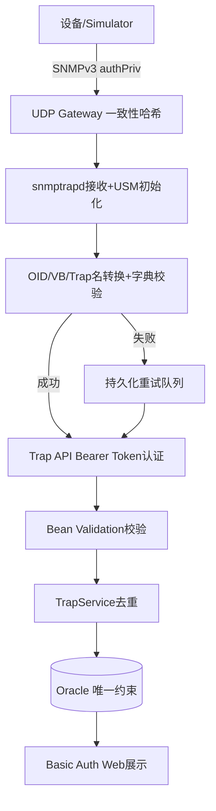

# 24. 课程总结：从设备到数据库的完整旅程

回顾整个课程，把二十三章拆解的每一个模块重新串成一条完整的数据流，并展望生产落地前还需要决定的事项。

## 核心要点

* 从第1章到第23章，我们完整走过了一条Trap数据的生命周期：发送、路由、接收认证、转换校验、持久化重试、API认证、DTO校验、去重存储、Web展示
* 安全设计贯穿了每一层：SNMPv3 authPriv、Bearer Token固定时间比较、Basic Auth+BCrypt、容器最小权限、NetworkPolicy最小访问范围
* 可靠性设计同样贯穿始终：持久化重试队列、Oracle唯一约束幂等、多节点冗余、健康检查驱动的启动顺序
* 生产落地前README特别列出了必须决定的环境固有事项：真实Enterprise OID分配、vendor MIB授权与SBOM、来源CIDR与NAT验证、证书与Secret Manager、SLO与监控告警、凭据轮换与审计流程
* 这些环境固有事项不属于代码实现范畴，而是每个部署团队必须结合自身环境做出的运维决策

---

## 本章测验

本章共 5 道单项选择题。

### 第 1 题

回顾整条数据链路，一条Trap从设备发出到最终能在Web页面看到，大致经过了哪些关键阶段？

- A. 只经过nginx一次转发就直接完成
- B. 完全跳过认证环节，直接进入数据库
- C. 设备直接写入数据库，不经过任何中间处理
- D. UDP路由、接收认证、OID/VB转换、(必要时)持久化重试、API认证、DTO校验、去重存储、Web展示

选择答案后查看结果

正确答案：D

答案解析：这正是整个课程串联起来的完整链路，每一步都在前面的章节里单独讲解过，共同构成了一个既可靠又有多层安全防护的系统。

### 第 2 题

下列哪一组最准确地概括了这套系统在\"可靠性\"方面采用的设计手段？

- A. 持久化重试队列、数据库唯一约束实现的幂等去重、多节点冗余、健康检查驱动的启动顺序
- B. 仅仅是把日志输出改成了JSON格式
- C. 完全依赖人工监控和手动重启
- D. 仅依赖网络稳定性，没有额外设计

选择答案后查看结果

正确答案：A

答案解析：这四项贯穿了从第6章到第20章的多个知识点，是这套系统能够在网络抖动、后端短暂故障、节点单点失效等场景下依然保证数据不丢失、不重复的核心设计。

### 第 3 题

下列哪一组最准确地概括了这套系统在\"安全性\"方面采用的设计手段？

- A. 仅仅关闭了不必要的端口
- B. SNMPv3 authPriv认证加密、Bearer Token固定时间比较、Basic Auth配合BCrypt、容器最小权限、NetworkPolicy最小访问范围
- C. 完全不做任何认证，依赖内网隔离
- D. 仅在Web页面加了一个验证码

选择答案后查看结果

正确答案：B

答案解析：安全设计体现在从设备接入(SNMPv3)、到内部API调用(Bearer Token)、到Web访问(Basic Auth)、到容器运行时(最小权限)、到网络访问(NetworkPolicy)的每一层，是纵深防御思路的完整体现。

### 第 4 题

README中列出的\"本番适用时必须决定的环境固有事项\"，例如真实Enterprise OID分配、来源CIDR验证、证书与Secret Manager等，这些内容的性质是什么？

- A. 这些只是可选项，生产环境可以完全忽略
- B. 属于代码bug，需要修复后才能使用
- C. 不属于代码实现范畴，而是每个部署团队需要结合自身实际环境做出的运维和合规决策
- D. 这些内容已经在production.yaml里配置好了，不需要额外处理

选择答案后查看结果

正确答案：C

答案解析：这些事项本质上是环境相关的运维决策，比如企业的真实Enterprise OID需要向IANA申请、CIDR和证书需要根据实际网络环境配置，代码和manifest提供的是可复用的实现框架，但无法替代每个组织自己的环境评估和合规流程。

### 第 5 题

总结整个课程，这套SNMP Trap Production Platform最核心的设计理念可以概括为什么？

- A. 完全依赖第三方SaaS服务，自己不做任何处理
- B. 追求最快的开发速度，牺牲其他所有目标
- C. 用最少的代码量实现基本的Trap接收功能
- D. 在数据可靠性(不丢不重)和安全性(认证、加密、最小权限)两个维度上做深入的工程化设计，并通过多层独立防护构建纵深防御

选择答案后查看结果

正确答案：D

答案解析：从最开始的问题背景，到SNMPv3认证、一致性路由、字典转换校验、持久化重试、API认证、DTO校验、幂等去重、容器与网络安全加固，每一章都在围绕可靠性和安全性这两条主线展开，这正是课程标题\"生产部署\"想要传达的核心价值。

<!-- QUIZ_DATA_START
{
  "chapter": "24",
  "questions": [
    {
      "id": 1,
      "question": "回顾整条数据链路，一条Trap从设备发出到最终能在Web页面看到，大致经过了哪些关键阶段？",
      "options": {
        "A": "只经过nginx一次转发就直接完成",
        "B": "完全跳过认证环节，直接进入数据库",
        "C": "设备直接写入数据库，不经过任何中间处理",
        "D": "UDP路由、接收认证、OID/VB转换、(必要时)持久化重试、API认证、DTO校验、去重存储、Web展示"
      },
      "answer": "D",
      "explanation": "这正是整个课程串联起来的完整链路，每一步都在前面的章节里单独讲解过，共同构成了一个既可靠又有多层安全防护的系统。"
    },
    {
      "id": 2,
      "question": "下列哪一组最准确地概括了这套系统在\\\"可靠性\\\"方面采用的设计手段？",
      "options": {
        "A": "持久化重试队列、数据库唯一约束实现的幂等去重、多节点冗余、健康检查驱动的启动顺序",
        "B": "仅仅是把日志输出改成了JSON格式",
        "C": "完全依赖人工监控和手动重启",
        "D": "仅依赖网络稳定性，没有额外设计"
      },
      "answer": "A",
      "explanation": "这四项贯穿了从第6章到第20章的多个知识点，是这套系统能够在网络抖动、后端短暂故障、节点单点失效等场景下依然保证数据不丢失、不重复的核心设计。"
    },
    {
      "id": 3,
      "question": "下列哪一组最准确地概括了这套系统在\\\"安全性\\\"方面采用的设计手段？",
      "options": {
        "A": "仅仅关闭了不必要的端口",
        "B": "SNMPv3 authPriv认证加密、Bearer Token固定时间比较、Basic Auth配合BCrypt、容器最小权限、NetworkPolicy最小访问范围",
        "C": "完全不做任何认证，依赖内网隔离",
        "D": "仅在Web页面加了一个验证码"
      },
      "answer": "B",
      "explanation": "安全设计体现在从设备接入(SNMPv3)、到内部API调用(Bearer Token)、到Web访问(Basic Auth)、到容器运行时(最小权限)、到网络访问(NetworkPolicy)的每一层，是纵深防御思路的完整体现。"
    },
    {
      "id": 4,
      "question": "README中列出的\\\"本番适用时必须决定的环境固有事项\\\"，例如真实Enterprise OID分配、来源CIDR验证、证书与Secret Manager等，这些内容的性质是什么？",
      "options": {
        "A": "这些只是可选项，生产环境可以完全忽略",
        "B": "属于代码bug，需要修复后才能使用",
        "C": "不属于代码实现范畴，而是每个部署团队需要结合自身实际环境做出的运维和合规决策",
        "D": "这些内容已经在production.yaml里配置好了，不需要额外处理"
      },
      "answer": "C",
      "explanation": "这些事项本质上是环境相关的运维决策，比如企业的真实Enterprise OID需要向IANA申请、CIDR和证书需要根据实际网络环境配置，代码和manifest提供的是可复用的实现框架，但无法替代每个组织自己的环境评估和合规流程。"
    },
    {
      "id": 5,
      "question": "总结整个课程，这套SNMP Trap Production Platform最核心的设计理念可以概括为什么？",
      "options": {
        "A": "完全依赖第三方SaaS服务，自己不做任何处理",
        "B": "追求最快的开发速度，牺牲其他所有目标",
        "C": "用最少的代码量实现基本的Trap接收功能",
        "D": "在数据可靠性(不丢不重)和安全性(认证、加密、最小权限)两个维度上做深入的工程化设计，并通过多层独立防护构建纵深防御"
      },
      "answer": "D",
      "explanation": "从最开始的问题背景，到SNMPv3认证、一致性路由、字典转换校验、持久化重试、API认证、DTO校验、幂等去重、容器与网络安全加固，每一章都在围绕可靠性和安全性这两条主线展开，这正是课程标题\\\"生产部署\\\"想要传达的核心价值。"
    }
  ]
}
QUIZ_DATA_END -->
