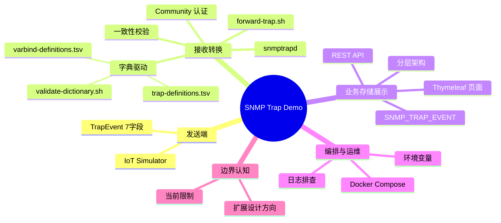

# 课程总结与延伸思考

回顾整条链路，把所有知识点重新连接成一张完整的知识地图。

## 核心要点

* 整条链路：IoT Simulator 生成事件 → snmptrapd 接收并做 Community 认证 → forward-trap.sh 依据两个字典完成转换与一致性校验 → Spring Boot 分层处理并写入 Oracle → Thymeleaf 渲染页面展示。
* 字典驱动是贯穿全项目的核心设计思想：规则和执行逻辑分离，新增或修改事件类型不需要改动脚本代码，只需要更新 MIB 和字典文件。
* 双重校验体现在两个层面：脚本层校验 SNMP 报文本身的可信度（OID 是否已知、内容是否与字典一致），API 层校验 HTTP 请求的合法性（Bean Validation）。
* 本 Demo 明确聚焦教学演示，SNMPv3、多节点、重试队列等生产级特性目前只存在于另一份设计文档中，不能等同于当前实现。
* 常见误区：把 Trap 发送成功等同于数据已保存成功；把设计文档中的扩展方案当作当前系统已具备的能力；用 eventType 反推 Trap 名而不是用权威的数值 OID。

---

## 本章测验

本章共 5 道单项选择题。

### 第 1 题

回顾整条数据链路，Trap 在到达 Oracle 数据库之前，一共经过哪几个主要组件的处理？

- A. 只经过 Spring Boot 和 Oracle 两个组件
- B. Simulator、snmptrapd、forward-trap.sh、Spring Boot
- C. 只经过 Simulator 一个组件
- D. 经过浏览器、Simulator、Oracle 三个组件

选择答案后查看结果

正确答案：B

答案解析：完整链路依次是 Simulator 发送、snmptrapd 接收认证、forward-trap.sh 转换校验、Spring Boot 处理保存，四个组件依次参与，最后才落到 Oracle。

### 第 2 题

贯穿整个项目最核心的设计思想是什么？

- A. 尽量把所有逻辑硬编码在一个脚本里以提高性能
- B. 所有组件共用同一个数据库连接
- C. 完全依赖前端 JavaScript 完成所有校验
- D. 字典驱动：把转换规则和执行逻辑分离，通过 MIB 与两个 TSV 字典描述规则

选择答案后查看结果

正确答案：D

答案解析：从第 6 到第 12 章反复强调的核心思想就是字典驱动：规则放在 MIB 和 TSV 字典里，脚本只负责按规则执行，这样修改规则不需要碰代码。

### 第 3 题

关于本 Demo 与仓库中另一份生产级设计文档的关系，最准确的描述是什么？

- A. 生产级设计文档描述的是尚未实现的演进方向，当前 Demo 是简化的 v2c/单节点版本
- B. 生产级设计文档已经过时，应该被忽略
- C. 两者描述的是完全相同的已实现系统
- D. 当前 Demo 比生产级设计文档功能更多

选择答案后查看结果

正确答案：A

答案解析：第 23 章明确强调了这一区分：文档描述的 SNMPv3、多节点、重试队列等特性是演进方向，当前实际运行的是更简单的 v2c、单节点、无重试队列版本。

### 第 4 题

以下哪一项是本课程中反复强调、容易被误解的常见误区？

- A. 认为 OID 是无意义的随机数字
- B. 认为 Oracle 数据库不需要初始化时间
- C. 把 Trap 发送成功直接等同于数据已经保存成功
- D. 认为 Thymeleaf 页面依赖 JavaScript

选择答案后查看结果

正确答案：C

答案解析：第 22 章特别指出，Trap 基于 UDP，发送成功只代表报文送出，并不保证被接收和保存，这是一个容易被忽视但很重要的认知点。

### 第 5 题

如果要在这个项目基础上新增一种 DEVICE_OFFLINE 事件，综合全课程的知识，正确的实施顺序大致是什么？

- A. 先在 MIB 中新增 OID 并遵循命名规范，再同步更新两个 TSV 字典，让 Simulator 支持生成该事件，最后跑通构建校验和端到端测试
- B. 无需任何改动，系统会自动识别新事件类型
- C. 直接修改 Oracle 表结构，其他部分自动适配
- D. 只需要修改 Thymeleaf 页面模板即可

选择答案后查看结果

正确答案：A

答案解析：综合第 7、8、9、10 章的内容，新增事件类型需要遵循 MIB 命名规范分配新 OID，同步更新字典，让发送端支持新事件，并通过构建时校验和端到端验证，这是字典驱动设计下的标准演进路径。

<!-- QUIZ_DATA_START
{
  "chapter": "24",
  "questions": [
    {
      "id": 1,
      "question": "回顾整条数据链路，Trap 在到达 Oracle 数据库之前，一共经过哪几个主要组件的处理？",
      "options": {
        "B": "Simulator、snmptrapd、forward-trap.sh、Spring Boot",
        "A": "只经过 Spring Boot 和 Oracle 两个组件",
        "C": "只经过 Simulator 一个组件",
        "D": "经过浏览器、Simulator、Oracle 三个组件"
      },
      "answer": "B",
      "explanation": "完整链路依次是 Simulator 发送、snmptrapd 接收认证、forward-trap.sh 转换校验、Spring Boot 处理保存，四个组件依次参与，最后才落到 Oracle。"
    },
    {
      "id": 2,
      "question": "贯穿整个项目最核心的设计思想是什么？",
      "options": {
        "D": "字典驱动：把转换规则和执行逻辑分离，通过 MIB 与两个 TSV 字典描述规则",
        "A": "尽量把所有逻辑硬编码在一个脚本里以提高性能",
        "B": "所有组件共用同一个数据库连接",
        "C": "完全依赖前端 JavaScript 完成所有校验"
      },
      "answer": "D",
      "explanation": "从第 6 到第 12 章反复强调的核心思想就是字典驱动：规则放在 MIB 和 TSV 字典里，脚本只负责按规则执行，这样修改规则不需要碰代码。"
    },
    {
      "id": 3,
      "question": "关于本 Demo 与仓库中另一份生产级设计文档的关系，最准确的描述是什么？",
      "options": {
        "A": "生产级设计文档描述的是尚未实现的演进方向，当前 Demo 是简化的 v2c/单节点版本",
        "B": "生产级设计文档已经过时，应该被忽略",
        "C": "两者描述的是完全相同的已实现系统",
        "D": "当前 Demo 比生产级设计文档功能更多"
      },
      "answer": "A",
      "explanation": "第 23 章明确强调了这一区分：文档描述的 SNMPv3、多节点、重试队列等特性是演进方向，当前实际运行的是更简单的 v2c、单节点、无重试队列版本。"
    },
    {
      "id": 4,
      "question": "以下哪一项是本课程中反复强调、容易被误解的常见误区？",
      "options": {
        "C": "把 Trap 发送成功直接等同于数据已经保存成功",
        "A": "认为 OID 是无意义的随机数字",
        "B": "认为 Oracle 数据库不需要初始化时间",
        "D": "认为 Thymeleaf 页面依赖 JavaScript"
      },
      "answer": "C",
      "explanation": "第 22 章特别指出，Trap 基于 UDP，发送成功只代表报文送出，并不保证被接收和保存，这是一个容易被忽视但很重要的认知点。"
    },
    {
      "id": 5,
      "question": "如果要在这个项目基础上新增一种 DEVICE_OFFLINE 事件，综合全课程的知识，正确的实施顺序大致是什么？",
      "options": {
        "A": "先在 MIB 中新增 OID 并遵循命名规范，再同步更新两个 TSV 字典，让 Simulator 支持生成该事件，最后跑通构建校验和端到端测试",
        "B": "无需任何改动，系统会自动识别新事件类型",
        "C": "直接修改 Oracle 表结构，其他部分自动适配",
        "D": "只需要修改 Thymeleaf 页面模板即可"
      },
      "answer": "A",
      "explanation": "综合第 7、8、9、10 章的内容，新增事件类型需要遵循 MIB 命名规范分配新 OID，同步更新字典，让发送端支持新事件，并通过构建时校验和端到端验证，这是字典驱动设计下的标准演进路径。"
    }
  ]
}
QUIZ_DATA_END -->
