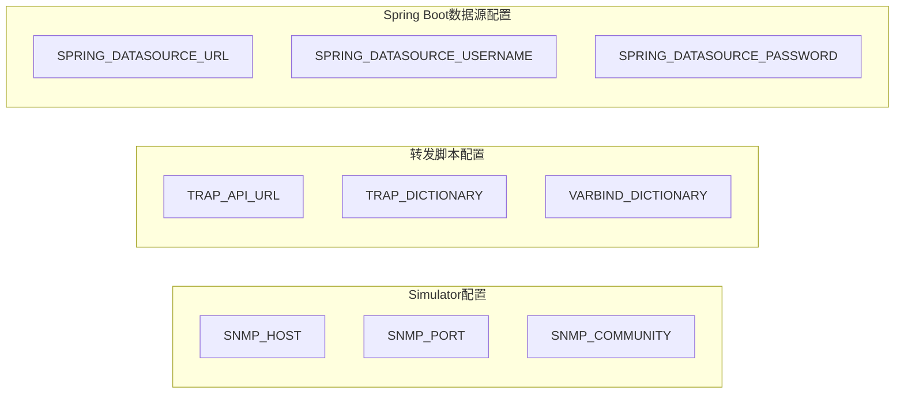

# 24 环境变量与配置管理

把散落在各章节里的环境变量集中梳理一遍，理解每个变量分别控制哪个组件的行为。

## 核心要点

* Simulator 相关变量：SNMP_HOST 默认 snmptrapd，SNMP_PORT 默认 162，SNMP_COMMUNITY 默认 public，三者共同决定 Trap 发往哪里。
* 转发脚本相关变量：TRAP_API_URL 默认指向 http://monitoring-app:8080/api/traps，TRAP_DICTIONARY 和 VARBIND_DICTIONARY 分别指向两份辞书文件的默认路径。
* Spring Boot 数据源变量：SPRING_DATASOURCE_URL 默认连接到本机 1521 端口的 FREEPDB1，用户名默认 snmpuser，密码默认 snmppassword。
* 这些默认值都写在 docker-compose.yml 里，如果需要修改发送目标或者数据库连接信息，可以直接调整对应的环境变量，不需要改代码。
* 文档反复强调这些固定的凭据和地址只是演示配置，正式环境需要通过 Secrets 管理等方式替换，不能直接沿用。

---

## 本章测验

本章共 5 道单项选择题。

### 第 1 题

IoT Simulator 用来决定发送目标端口的环境变量是什么，它的默认值是多少？

- A. SNMP_PORT，默认值 162
- B. SNMP_PORT，默认值 1521
- C. TARGET_PORT，默认值 162
- D. TRAP_PORT，默认值 8080

选择答案后查看结果

正确答案：A

答案解析：环境变量表中 SNMP_PORT 的默认值是 162，用于 Simulator 决定发送 Trap 的目标端口。

### 第 2 题

转发脚本默认将 JSON 发送到哪个地址？

- A. http://snmptrapd:162/api/traps
- B. http://oracle-db:1521/api/traps
- C. http://localhost:80/api/traps
- D. http://monitoring-app:8080/api/traps

选择答案后查看结果

正确答案：D

答案解析：环境变量表中 TRAP_API_URL 的默认值是 http://monitoring-app:8080/api/traps。

### 第 3 题

Spring Boot 连接 Oracle 数据库使用的默认用户名是什么？

- A. oracle
- B. snmpuser
- C. root
- D. sys

选择答案后查看结果

正确答案：B

答案解析：环境变量表中 SPRING_DATASOURCE_USERNAME 的默认值是 snmpuser。

### 第 4 题

如果想修改 IoT Simulator 的发送目标地址，最直接的方式是什么？

- A. 直接修改 Oracle 数据库配置
- B. 调整 docker-compose.yml 中对应的环境变量
- C. 修改 MIB 文件中的 OID 定义
- D. 修改 IotSimulator 类的源代码并重新编译

选择答案后查看结果

正确答案：B

答案解析：这些配置值都通过环境变量在 docker-compose.yml 中定义，调整环境变量即可改变行为，无需修改源代码。

### 第 5 题

文档对这些默认的凭据（如数据库用户名密码）给出了怎样的建议？

- A. 这些凭据会在每次启动时自动随机生成
- B. 这些凭据仅用于加密通信，无需替换
- C. 正式环境应通过 Secrets 管理等方式替换，不能直接沿用
- D. 可以直接用于生产环境，无需任何调整

选择答案后查看结果

正确答案：C

答案解析：文档在“制約事項”和“セキュリティ上の注意”部分反复强调，固定凭据仅为演示用途，正式环境需要替换为 Secrets 管理等更安全的方式。

<!-- QUIZ_DATA_START
{
  "chapter": "24",
  "questions": [
    {
      "id": 1,
      "question": "IoT Simulator 用来决定发送目标端口的环境变量是什么，它的默认值是多少？",
      "options": {
        "A": "SNMP_PORT，默认值 162",
        "B": "SNMP_PORT，默认值 1521",
        "C": "TARGET_PORT，默认值 162",
        "D": "TRAP_PORT，默认值 8080"
      },
      "answer": "A",
      "explanation": "环境变量表中 SNMP_PORT 的默认值是 162，用于 Simulator 决定发送 Trap 的目标端口。"
    },
    {
      "id": 2,
      "question": "转发脚本默认将 JSON 发送到哪个地址？",
      "options": {
        "A": "http://snmptrapd:162/api/traps",
        "B": "http://oracle-db:1521/api/traps",
        "C": "http://localhost:80/api/traps",
        "D": "http://monitoring-app:8080/api/traps"
      },
      "answer": "D",
      "explanation": "环境变量表中 TRAP_API_URL 的默认值是 http://monitoring-app:8080/api/traps。"
    },
    {
      "id": 3,
      "question": "Spring Boot 连接 Oracle 数据库使用的默认用户名是什么？",
      "options": {
        "A": "oracle",
        "B": "snmpuser",
        "C": "root",
        "D": "sys"
      },
      "answer": "B",
      "explanation": "环境变量表中 SPRING_DATASOURCE_USERNAME 的默认值是 snmpuser。"
    },
    {
      "id": 4,
      "question": "如果想修改 IoT Simulator 的发送目标地址，最直接的方式是什么？",
      "options": {
        "A": "直接修改 Oracle 数据库配置",
        "B": "调整 docker-compose.yml 中对应的环境变量",
        "C": "修改 MIB 文件中的 OID 定义",
        "D": "修改 IotSimulator 类的源代码并重新编译"
      },
      "answer": "B",
      "explanation": "这些配置值都通过环境变量在 docker-compose.yml 中定义，调整环境变量即可改变行为，无需修改源代码。"
    },
    {
      "id": 5,
      "question": "文档对这些默认的凭据（如数据库用户名密码）给出了怎样的建议？",
      "options": {
        "A": "这些凭据会在每次启动时自动随机生成",
        "B": "这些凭据仅用于加密通信，无需替换",
        "C": "正式环境应通过 Secrets 管理等方式替换，不能直接沿用",
        "D": "可以直接用于生产环境，无需任何调整"
      },
      "answer": "C",
      "explanation": "文档在“制約事項”和“セキュリティ上の注意”部分反复强调，固定凭据仅为演示用途，正式环境需要替换为 Secrets 管理等更安全的方式。"
    }
  ]
}
QUIZ_DATA_END -->
