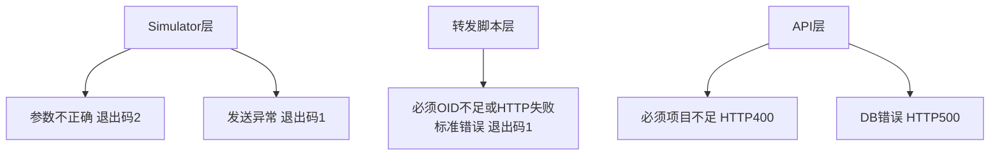

# 25 各层错误处理机制

把之前分散讲到的各层错误处理规则汇总起来，形成一张完整的“谁在什么情况下报什么错”的地图。

## 核心要点

* Simulator 层：参数不合法返回退出码 2；发送过程出现异常返回退出码 1，并输出日志说明原因。
* 转发脚本层：必须的 OID 缺失，或者调用 API 失败（非 2xx），都会把信息输出到标准错误，并以退出码 1 终止。
* API 层：必须字段缺失返回 HTTP 400；数据库层面的错误返回 HTTP 500，两种情况都会记录相应的日志。
* 文档明确指出，自动重发和隔离队列这类高级容错机制，不在这个最小化演示的范围之内，出错就是终止，不会自动重试。
* 把这些错误处理规则串起来看，可以发现一个共同点：每一层出错都会终止在本层，不会把带着问题的数据强行传递给下一层。

---

## 本章测验

本章共 5 道单项选择题。

### 第 1 题

IoT Simulator 层，命令行参数不合法时对应的退出码是多少？

- A. 1
- B. 2
- C. 3
- D. 0

选择答案后查看结果

正确答案：B

答案解析：基本设计文档明确规定 Simulator 层参数不合法返回退出码 2。

### 第 2 题

转发脚本在必须的 VB OID 缺失或调用 API 失败时，会如何处理？

- A. 记录警告但继续尝试发送其余字段
- B. 静默忽略，不做任何记录
- C. 输出到标准错误并以退出码 1 终止
- D. 自动切换到备用 API 地址

选择答案后查看结果

正确答案：C

答案解析：文档说明必须 OID 不足或 HTTP 失败时，转发脚本会将信息输出到标准错误，并以退出码 1 结束。

### 第 3 题

API 层遇到数据库错误时，返回的 HTTP 状态码是什么？

- A. 403
- B. 404
- C. 400
- D. 500

选择答案后查看结果

正确答案：D

答案解析：文档明确规定 API 层的 DB 错误返回 HTTP 500，并输出日志说明原因。

### 第 4 题

这套系统在错误处理上明确不包含哪种机制？

- A. 自动重发和隔离队列
- B. 日志记录
- C. 参数校验
- D. HTTP 状态码区分

选择答案后查看结果

正确答案：A

答案解析：基本设计文档明确指出自动再送和隔离队列不在最小化演示的范围内，这是与生产级系统的一个明显边界。

### 第 5 题

各层错误处理规则体现出的共同设计思路是什么？

- A. 只有最上层需要处理错误，下游层不需要校验
- B. 所有层的错误都统一交给浏览器处理
- C. 每一层都尽量容错，把有问题的数据传给下一层处理
- D. 每一层出错都终止在本层，不将有问题的数据传给下一层

选择答案后查看结果

正确答案：D

答案解析：从 Simulator、转发脚本到 API 层，每一层的错误处理都遵循“出错即终止本层处理”的原则，避免把不完整或不一致的数据继续向下传递。

<!-- QUIZ_DATA_START
{
  "chapter": "25",
  "questions": [
    {
      "id": 1,
      "question": "IoT Simulator 层，命令行参数不合法时对应的退出码是多少？",
      "options": {
        "A": "1",
        "B": "2",
        "C": "3",
        "D": "0"
      },
      "answer": "B",
      "explanation": "基本设计文档明确规定 Simulator 层参数不合法返回退出码 2。"
    },
    {
      "id": 2,
      "question": "转发脚本在必须的 VB OID 缺失或调用 API 失败时，会如何处理？",
      "options": {
        "A": "记录警告但继续尝试发送其余字段",
        "B": "静默忽略，不做任何记录",
        "C": "输出到标准错误并以退出码 1 终止",
        "D": "自动切换到备用 API 地址"
      },
      "answer": "C",
      "explanation": "文档说明必须 OID 不足或 HTTP 失败时，转发脚本会将信息输出到标准错误，并以退出码 1 结束。"
    },
    {
      "id": 3,
      "question": "API 层遇到数据库错误时，返回的 HTTP 状态码是什么？",
      "options": {
        "A": "403",
        "B": "404",
        "C": "400",
        "D": "500"
      },
      "answer": "D",
      "explanation": "文档明确规定 API 层的 DB 错误返回 HTTP 500，并输出日志说明原因。"
    },
    {
      "id": 4,
      "question": "这套系统在错误处理上明确不包含哪种机制？",
      "options": {
        "A": "自动重发和隔离队列",
        "B": "日志记录",
        "C": "参数校验",
        "D": "HTTP 状态码区分"
      },
      "answer": "A",
      "explanation": "基本设计文档明确指出自动再送和隔离队列不在最小化演示的范围内，这是与生产级系统的一个明显边界。"
    },
    {
      "id": 5,
      "question": "各层错误处理规则体现出的共同设计思路是什么？",
      "options": {
        "A": "只有最上层需要处理错误，下游层不需要校验",
        "B": "所有层的错误都统一交给浏览器处理",
        "C": "每一层都尽量容错，把有问题的数据传给下一层处理",
        "D": "每一层出错都终止在本层，不将有问题的数据传给下一层"
      },
      "answer": "D",
      "explanation": "从 Simulator、转发脚本到 API 层，每一层的错误处理都遵循“出错即终止本层处理”的原则，避免把不完整或不一致的数据继续向下传递。"
    }
  ]
}
QUIZ_DATA_END -->
