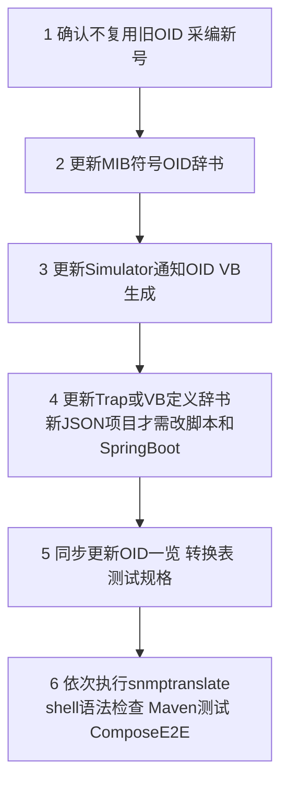

# 26 MIB变更流程与最佳实践

如果未来要新增第四种事件类型，应该按什么顺序改动？本章把变更流程完整梳理一遍。

## 核心要点

* 第一步是确认新 OID 不与任何已废弃或已使用的 OID 重复，遵循“已用 OID 的语义和类型不能变，废弃时不能重新利用编号”的原则。
* 第二步更新 MIB 里的符号和 OID 定义；第三步更新 Simulator 中通知 OID 和 VB 的生成逻辑。
* 第四步更新 Trap 定义辞书或 VB 定义辞书；只有当涉及全新的 JSON 字段时，才需要同时改动 forward-trap.sh 和 Spring Boot 相关代码。
* 第五步是保持文档同步：OID 一览表、转换表、测试规格都要在同一次变更中更新，不能只改代码不改文档。
* 第六步是按顺序执行验证：先用 snmptranslate 确认 MIB 能正确解析，再检查 shell 语法，再跑 Maven 测试，最后跑 Compose 端到端测试。
* 文档给出了具体验证命令示例，期望 temperatureHighTrap 解析结果为 .1.3.6.1.4.1.99999.0.2，这也是判断 MIB 修改是否正确的直接依据。

---

## 本章测验

本章共 5 道单项选择题。

### 第 1 题

MIB 变更流程中，关于 OID 编号的核心原则是什么？

- A. OID 编号可以随意调整，不影响系统运行
- B. 废弃的 OID 编号可以直接复用给新事件
- C. 已用 OID 的语义和类型不能改变，废弃时不重新利用编号，需采新号
- D. 所有 OID 编号每次发布都要重新分配

选择答案后查看结果

正确答案：C

答案解析：MIB 变更手順第一步明确：确认没有复用既存 OID，新 OID 需要重新采番，已用 OID 的语义和类型不得更改。

### 第 2 题

什么情况下才需要同时修改 forward-trap.sh 和 Spring Boot 代码？

- A. 只有涉及全新的 JSON 字段时才需要修改
- B. 从不需要修改，代码与辞书完全独立
- C. 任何一次辞书更新都需要修改代码
- D. 只要 MIB 文件有任何改动就需要修改代码

选择答案后查看结果

正确答案：A

答案解析：变更手順中说明，只有当出现新的 jsonField（全新 JSON 字段）时，才需要更新 forward-trap.sh 和 Spring Boot 相关代码。

### 第 3 题

MIB 变更流程的验证阶段，执行顺序大致是怎样的？

- A. 先启动浏览器手动检查页面即可，无需脚本验证
- B. 先跑 Compose E2E，再检查语法，最后用 snmptranslate
- C. 只需要跑 Maven 测试即可，无需其他验证
- D. 先用 snmptranslate，再检查 shell 语法，再跑 Maven 测试，最后跑 Compose E2E

选择答案后查看结果

正确答案：D

答案解析：MIB变更手順第六步明确验证顺序为：snmptranslate、shell构文、Mavenテスト、Compose E2E，依次执行。

### 第 4 题

文档给出的验证示例中，temperatureHighTrap 期望被 snmptranslate 解析为什么值？

- A. .1.3.6.1.4.1.99999.0.2
- B. .1.3.6.1.4.1.99999.0.1
- C. .1.3.6.1.4.1.99999.1.2
- D. .1.3.6.1.4.1.99999.0.3

选择答案后查看结果

正确答案：A

答案解析：文档中给出的确认命令示例，期望值明确写为 .1.3.6.1.4.1.99999.0.2，用来验证 MIB 修改后的解析结果是否正确。

### 第 5 题

为什么变更流程要求“OID一览、转换表、测试规格”在同一次变更中一起更新？

- A. 为了增加变更的工作量，作为审核指标
- B. 因为 Oracle 数据库要求文档与表结构绑定
- C. 因为这是 Git 工具本身的强制要求
- D. 为了防止代码改动之后文档滞后，导致文档与实际实现不一致

选择答案后查看结果

正确答案：D

答案解析：统一更新代码与相关文档的目的是避免出现“代码已变更但文档仍是旧版本”的不一致情况，保证信息始终可信。

<!-- QUIZ_DATA_START
{
  "chapter": "26",
  "questions": [
    {
      "id": 1,
      "question": "MIB 变更流程中，关于 OID 编号的核心原则是什么？",
      "options": {
        "A": "OID 编号可以随意调整，不影响系统运行",
        "B": "废弃的 OID 编号可以直接复用给新事件",
        "C": "已用 OID 的语义和类型不能改变，废弃时不重新利用编号，需采新号",
        "D": "所有 OID 编号每次发布都要重新分配"
      },
      "answer": "C",
      "explanation": "MIB 变更手順第一步明确：确认没有复用既存 OID，新 OID 需要重新采番，已用 OID 的语义和类型不得更改。"
    },
    {
      "id": 2,
      "question": "什么情况下才需要同时修改 forward-trap.sh 和 Spring Boot 代码？",
      "options": {
        "A": "只有涉及全新的 JSON 字段时才需要修改",
        "B": "从不需要修改，代码与辞书完全独立",
        "C": "任何一次辞书更新都需要修改代码",
        "D": "只要 MIB 文件有任何改动就需要修改代码"
      },
      "answer": "A",
      "explanation": "变更手順中说明，只有当出现新的 jsonField（全新 JSON 字段）时，才需要更新 forward-trap.sh 和 Spring Boot 相关代码。"
    },
    {
      "id": 3,
      "question": "MIB 变更流程的验证阶段，执行顺序大致是怎样的？",
      "options": {
        "A": "先启动浏览器手动检查页面即可，无需脚本验证",
        "B": "先跑 Compose E2E，再检查语法，最后用 snmptranslate",
        "C": "只需要跑 Maven 测试即可，无需其他验证",
        "D": "先用 snmptranslate，再检查 shell 语法，再跑 Maven 测试，最后跑 Compose E2E"
      },
      "answer": "D",
      "explanation": "MIB变更手順第六步明确验证顺序为：snmptranslate、shell构文、Mavenテスト、Compose E2E，依次执行。"
    },
    {
      "id": 4,
      "question": "文档给出的验证示例中，temperatureHighTrap 期望被 snmptranslate 解析为什么值？",
      "options": {
        "A": ".1.3.6.1.4.1.99999.0.2",
        "B": ".1.3.6.1.4.1.99999.0.1",
        "C": ".1.3.6.1.4.1.99999.1.2",
        "D": ".1.3.6.1.4.1.99999.0.3"
      },
      "answer": "A",
      "explanation": "文档中给出的确认命令示例，期望值明确写为 .1.3.6.1.4.1.99999.0.2，用来验证 MIB 修改后的解析结果是否正确。"
    },
    {
      "id": 5,
      "question": "为什么变更流程要求“OID一览、转换表、测试规格”在同一次变更中一起更新？",
      "options": {
        "A": "为了增加变更的工作量，作为审核指标",
        "B": "因为 Oracle 数据库要求文档与表结构绑定",
        "C": "因为这是 Git 工具本身的强制要求",
        "D": "为了防止代码改动之后文档滞后，导致文档与实际实现不一致"
      },
      "answer": "D",
      "explanation": "统一更新代码与相关文档的目的是避免出现“代码已变更但文档仍是旧版本”的不一致情况，保证信息始终可信。"
    }
  ]
}
QUIZ_DATA_END -->
