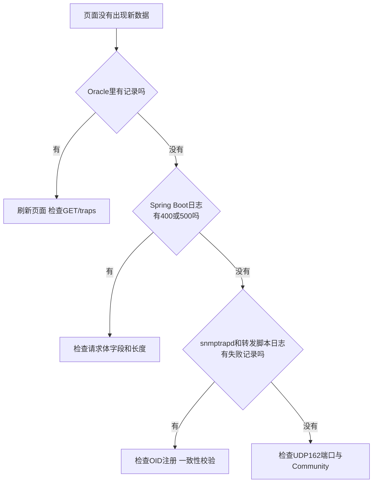

# 27 常见问题与故障排查

把前面所有章节的知识串成一份实用的排查清单，遇到问题时可以按图索骥。

## 核心要点

* 排查思路总体是“倒着走数据流”：先看页面和数据库，再看 Spring Boot 日志，再看 snmptrapd 和转发脚本日志，最后看网络和端口配置。
* 常用日志查看命令：docker compose logs oracle-db、docker compose logs monitoring-app、docker compose logs snmptrapd，也可以用 -f 参数配合多个服务名实时跟踪。
* 如果页面一直没变化，先确认是不是只是没有刷新，浏览器不会自动推送新数据，这一点在前面数据流那一章已经讲过。
* 如果怀疑辞书或者 MIB 有问题，可以单独运行 validate-dictionary.sh 做一次构建时校验，或者用 snmptranslate 手动确认某个 Trap 名对应的数值 OID 是否正确。
* 如果需要完全重置环境重新开始，用 docker compose down -v 连同数据卷一起清除，再重新执行 docker compose up -d --build。

---

## 本章测验

本章共 5 道单项选择题。

### 第 1 题

当页面上没有出现新数据时，排查思路的第一步建议是什么？

- A. 先检查 IoT Simulator 的 Java 版本
- B. 直接删除 Oracle 数据卷重来
- C. 立即重装 Docker
- D. 先确认是否只是页面未刷新，因为系统没有实时推送机制

选择答案后查看结果

正确答案：D

答案解析：由于系统没有 WebSocket 或轮询推送机制，页面数据只在浏览器主动请求时更新，因此排查的第一步应先排除“只是没刷新”这种最简单的可能性。

### 第 2 题

查看 Spring Boot（monitoring-app）日志使用的命令是什么？

- A. docker compose logs iot-simulator
- B. docker compose logs monitoring-app
- C. docker compose logs oracle-db
- D. docker compose logs snmptrapd

选择答案后查看结果

正确答案：B

答案解析：README 中列出的日志查看命令包括 docker compose logs monitoring-app，用于查看 Spring Boot 应用的日志。

### 第 3 题

如果怀疑某个 Trap 名对应的 OID 解析是否正确，可以使用什么方式验证？

- A. 直接查看 Oracle 数据库表结构
- B. 使用 snmptranslate 命令手动解析该 Trap 名对应的数值 OID
- C. 重启浏览器缓存
- D. 查看 IoT Simulator 的 Java 堆栈信息

选择答案后查看结果

正确答案：B

答案解析：文档给出了使用 snmptranslate 命令解析特定 Trap 名（如 deviceErrorTrap）对应数值 OID 的验证方式，可用于确认辞书与 MIB 是否一致。

### 第 4 题

想要连同数据库中已保存的数据一起彻底清除并重新开始，应该执行什么命令？

- A. docker compose down
- B. docker compose stop
- C. docker compose down -v
- D. docker compose restart

选择答案后查看结果

正确答案：C

答案解析：README 明确说明只有加上 -v 参数的 docker compose down -v 才会连同 Oracle 的数据卷一起删除，实现彻底重置。

### 第 5 题

整体排查思路“倒着走数据流”具体是指什么？

- A. 随机选择任意一个组件开始排查
- B. 只需要检查 Oracle 数据库即可，无需查看其他组件
- C. 从页面和数据库开始，依次往 Spring Boot、snmptrapd、网络方向排查
- D. 从 IoT Simulator 开始，依次往 Oracle 方向排查

选择答案后查看结果

正确答案：C

答案解析：排查建议是从最终结果（页面、数据库）开始，逐步往上游（Spring Boot、snmptrapd、网络配置）方向反向定位问题出现的具体环节。

<!-- QUIZ_DATA_START
{
  "chapter": "27",
  "questions": [
    {
      "id": 1,
      "question": "当页面上没有出现新数据时，排查思路的第一步建议是什么？",
      "options": {
        "A": "先检查 IoT Simulator 的 Java 版本",
        "B": "直接删除 Oracle 数据卷重来",
        "C": "立即重装 Docker",
        "D": "先确认是否只是页面未刷新，因为系统没有实时推送机制"
      },
      "answer": "D",
      "explanation": "由于系统没有 WebSocket 或轮询推送机制，页面数据只在浏览器主动请求时更新，因此排查的第一步应先排除“只是没刷新”这种最简单的可能性。"
    },
    {
      "id": 2,
      "question": "查看 Spring Boot（monitoring-app）日志使用的命令是什么？",
      "options": {
        "A": "docker compose logs iot-simulator",
        "B": "docker compose logs monitoring-app",
        "C": "docker compose logs oracle-db",
        "D": "docker compose logs snmptrapd"
      },
      "answer": "B",
      "explanation": "README 中列出的日志查看命令包括 docker compose logs monitoring-app，用于查看 Spring Boot 应用的日志。"
    },
    {
      "id": 3,
      "question": "如果怀疑某个 Trap 名对应的 OID 解析是否正确，可以使用什么方式验证？",
      "options": {
        "A": "直接查看 Oracle 数据库表结构",
        "B": "使用 snmptranslate 命令手动解析该 Trap 名对应的数值 OID",
        "C": "重启浏览器缓存",
        "D": "查看 IoT Simulator 的 Java 堆栈信息"
      },
      "answer": "B",
      "explanation": "文档给出了使用 snmptranslate 命令解析特定 Trap 名（如 deviceErrorTrap）对应数值 OID 的验证方式，可用于确认辞书与 MIB 是否一致。"
    },
    {
      "id": 4,
      "question": "想要连同数据库中已保存的数据一起彻底清除并重新开始，应该执行什么命令？",
      "options": {
        "A": "docker compose down",
        "B": "docker compose stop",
        "C": "docker compose down -v",
        "D": "docker compose restart"
      },
      "answer": "C",
      "explanation": "README 明确说明只有加上 -v 参数的 docker compose down -v 才会连同 Oracle 的数据卷一起删除，实现彻底重置。"
    },
    {
      "id": 5,
      "question": "整体排查思路“倒着走数据流”具体是指什么？",
      "options": {
        "A": "随机选择任意一个组件开始排查",
        "B": "只需要检查 Oracle 数据库即可，无需查看其他组件",
        "C": "从页面和数据库开始，依次往 Spring Boot、snmptrapd、网络方向排查",
        "D": "从 IoT Simulator 开始，依次往 Oracle 方向排查"
      },
      "answer": "C",
      "explanation": "排查建议是从最终结果（页面、数据库）开始，逐步往上游（Spring Boot、snmptrapd、网络配置）方向反向定位问题出现的具体环节。"
    }
  ]
}
QUIZ_DATA_END -->
