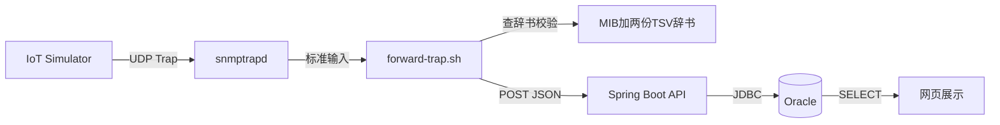

# 28 总结与延伸思考

回顾整门课程讲过的完整链路，梳理关键概念之间的关系，并展望可以继续深入的方向。

## 核心要点

* 整条链路可以概括为六个环节：设备发送 Trap，snmptrapd 接收，转发脚本查辞书并校验，Spring Boot 完成业务校验和持久化，Oracle 存储，浏览器查询展示。
* 支撑这条链路的核心设计原则是“分层校验、逐层拒绝”：Trap 名转换要校验 OID 是否注册，业务字段要校验一致性，API 层要校验必填和长度，数据库层要求全部字段非空，任何一层出问题都不会把有缺陷的数据传给下一层。
* 辞书三层分离（MIB、Trap 定义辞书、VB 定义辞书）和构建时校验（validate-dictionary.sh）共同保证了“协议层数字”和“业务层语义”之间的映射关系始终可信，不会出现代码和辞书对不上的情况。
* 该项目明确划定的边界——不支持 SNMPv3、不支持自动重试、Community 明文认证——提醒学习者：这是一套用于理解链路和排查思路的教学演示，不能直接套用到生产环境。
* 可以继续深入的方向包括：了解 SNMPv3 的 authPriv 认证机制、研究消息队列在可靠投递场景中的作用、学习如何为这类多容器系统设计自动化的端到端测试。

---

## 本章测验

本章共 5 道单项选择题。

### 第 1 题

整条数据链路从设备到网页展示，按顺序经过的六个环节是什么？

- A. 设备发送、snmptrapd接收、转发脚本处理、Spring Boot持久化、Oracle存储、浏览器展示
- B. 浏览器发送、Oracle接收、snmptrapd处理、Spring Boot展示
- C. 设备发送、Oracle接收、浏览器处理、Spring Boot展示
- D. 设备发送、浏览器接收、Oracle处理、Spring Boot存储、snmptrapd展示

选择答案后查看结果

正确答案：A

答案解析：整门课程贯穿的完整链路是：设备发送 Trap、snmptrapd 接收、转发脚本查辞书校验、Spring Boot 完成业务校验并持久化、Oracle 存储、浏览器查询展示。

### 第 2 题

贯穿整个系统的核心设计原则“分层校验、逐层拒绝”体现在哪里？

- A. 校验只发生在浏览器端，服务端不做任何校验
- B. 从 Trap 名转换、业务一致性校验、API 层校验到数据库非空约束，每一层出问题都拒绝继续传递
- C. 只有 Simulator 层做校验，后续各层都不再校验
- D. 只有数据库层做校验，其余层完全信任上游数据

选择答案后查看结果

正确答案：B

答案解析：课程反复讲到的设计思路是，每一层（OID 注册校验、业务一致性校验、API 校验、数据库约束）都独立把关，一旦发现问题就拒绝继续传递给下一层，不允许带着缺陷的数据流转。

### 第 3 题

辞书三层分离架构结合构建时校验，主要解决的问题是什么？

- A. 减少 Oracle 数据库的存储空间占用
- B. 保证协议层OID与业务层语义之间的映射关系始终可信，避免代码和辞书不一致
- C. 让 IoT Simulator 支持更多编程语言
- D. 让页面加载速度更快

选择答案后查看结果

正确答案：B

答案解析：MIB、Trap 定义辞书、VB 定义辞书的三层分离，配合 validate-dictionary.sh 的构建时校验，共同确保了协议数字与业务语义映射的一致性和可信度。

### 第 4 题

本课程为什么反复强调该项目明确不支持 SNMPv3、不支持自动重试等边界？

- A. 这些边界与学习本课程内容无关，只是随口一提
- B. 为了说明这些功能技术上无法实现
- C. 为了减少课程篇幅，不需要讲解这些功能
- D. 为了提醒学习者这是教学演示而非可直接用于生产的系统

选择答案后查看结果

正确答案：D

答案解析：明确项目边界能帮助学习者准确理解这套系统的适用范围，避免将教学演示直接套用到生产环境中造成安全或可靠性问题。

### 第 5 题

本课程总结中提到的可继续深入学习的方向，不包括以下哪一项？

- A. SNMPv3 的 authPriv 认证机制
- B. 为多容器系统设计自动化端到端测试
- C. 重新设计 Oracle 数据库的物理存储引擎
- D. 消息队列在可靠投递中的作用

选择答案后查看结果

正确答案：C

答案解析：课程总结中建议的延伸方向是 SNMPv3 认证机制、消息队列可靠投递、自动化端到端测试，并未涉及重新设计数据库物理存储引擎这类底层内容。

<!-- QUIZ_DATA_START
{
  "chapter": "28",
  "questions": [
    {
      "id": 1,
      "question": "整条数据链路从设备到网页展示，按顺序经过的六个环节是什么？",
      "options": {
        "A": "设备发送、snmptrapd接收、转发脚本处理、Spring Boot持久化、Oracle存储、浏览器展示",
        "B": "浏览器发送、Oracle接收、snmptrapd处理、Spring Boot展示",
        "C": "设备发送、Oracle接收、浏览器处理、Spring Boot展示",
        "D": "设备发送、浏览器接收、Oracle处理、Spring Boot存储、snmptrapd展示"
      },
      "answer": "A",
      "explanation": "整门课程贯穿的完整链路是：设备发送 Trap、snmptrapd 接收、转发脚本查辞书校验、Spring Boot 完成业务校验并持久化、Oracle 存储、浏览器查询展示。"
    },
    {
      "id": 2,
      "question": "贯穿整个系统的核心设计原则“分层校验、逐层拒绝”体现在哪里？",
      "options": {
        "A": "校验只发生在浏览器端，服务端不做任何校验",
        "B": "从 Trap 名转换、业务一致性校验、API 层校验到数据库非空约束，每一层出问题都拒绝继续传递",
        "C": "只有 Simulator 层做校验，后续各层都不再校验",
        "D": "只有数据库层做校验，其余层完全信任上游数据"
      },
      "answer": "B",
      "explanation": "课程反复讲到的设计思路是，每一层（OID 注册校验、业务一致性校验、API 校验、数据库约束）都独立把关，一旦发现问题就拒绝继续传递给下一层，不允许带着缺陷的数据流转。"
    },
    {
      "id": 3,
      "question": "辞书三层分离架构结合构建时校验，主要解决的问题是什么？",
      "options": {
        "A": "减少 Oracle 数据库的存储空间占用",
        "B": "保证协议层OID与业务层语义之间的映射关系始终可信，避免代码和辞书不一致",
        "C": "让 IoT Simulator 支持更多编程语言",
        "D": "让页面加载速度更快"
      },
      "answer": "B",
      "explanation": "MIB、Trap 定义辞书、VB 定义辞书的三层分离，配合 validate-dictionary.sh 的构建时校验，共同确保了协议数字与业务语义映射的一致性和可信度。"
    },
    {
      "id": 4,
      "question": "本课程为什么反复强调该项目明确不支持 SNMPv3、不支持自动重试等边界？",
      "options": {
        "A": "这些边界与学习本课程内容无关，只是随口一提",
        "B": "为了说明这些功能技术上无法实现",
        "C": "为了减少课程篇幅，不需要讲解这些功能",
        "D": "为了提醒学习者这是教学演示而非可直接用于生产的系统"
      },
      "answer": "D",
      "explanation": "明确项目边界能帮助学习者准确理解这套系统的适用范围，避免将教学演示直接套用到生产环境中造成安全或可靠性问题。"
    },
    {
      "id": 5,
      "question": "本课程总结中提到的可继续深入学习的方向，不包括以下哪一项？",
      "options": {
        "A": "SNMPv3 的 authPriv 认证机制",
        "B": "为多容器系统设计自动化端到端测试",
        "C": "重新设计 Oracle 数据库的物理存储引擎",
        "D": "消息队列在可靠投递中的作用"
      },
      "answer": "C",
      "explanation": "课程总结中建议的延伸方向是 SNMPv3 认证机制、消息队列可靠投递、自动化端到端测试，并未涉及重新设计数据库物理存储引擎这类底层内容。"
    }
  ]
}
QUIZ_DATA_END -->
