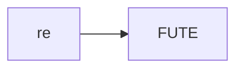
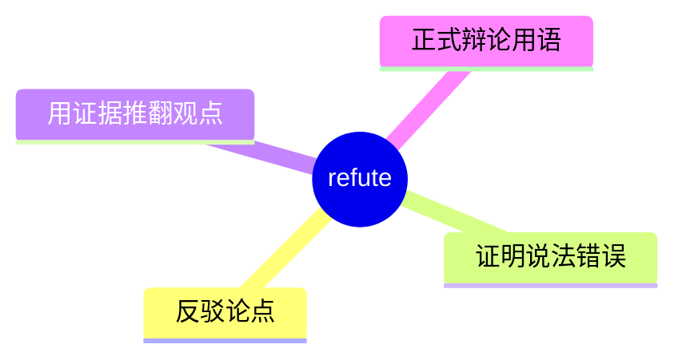
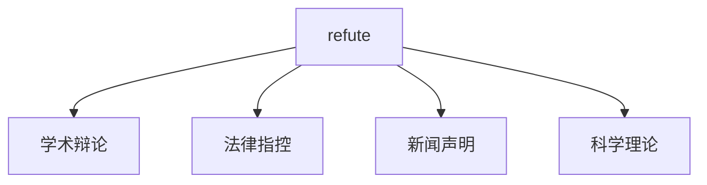
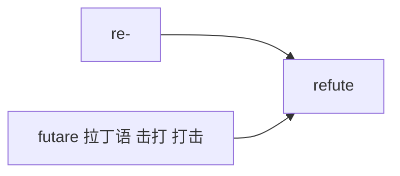

# refute

## 1. 单词卡片

| 项目 | 内容 |
|---|---|
| 单词 | refute |
| 词性 | verb |
| 英式音标 | /rɪˈfjuːt/ |
| 美式音标 | /rɪˈfjuːt/（基本相同） |
| 音节 | re-fute |
| 重音 | 第二音节 `fute` |
| 核心意思 | 反驳、驳斥；证明（观点、说法）错误 |

## 2. 发音拆解



发音提示：

* 重音在第二个音节 `FUTE`，读作 /fjuːt/，含有 /j/ 滑音和长元音 /uː/
* 第一个音节 `re` 弱读为 /rɪ/
* 词尾 `te` 要读得清晰，不要省略
* 中文近似音只能辅助记忆，不能代替标准发音：可理解为“瑞菲尤特”，但真实发音只有两个音节

## 3. 核心词义



## 4. 不同词性与用法

| 词性 | 英文含义 | 中文意思 | 常见结构 |
|---|---|---|---|
| verb | prove a statement/theory to be wrong | 反驳、驳斥 | refute an argument |
| verb | deny an accusation with evidence | 用证据否认（指控） | refute the allegations |

## 5. 常见使用语境



## 6. 常见搭配

| 搭配 | 中文意思 | 使用场景 |
|---|---|---|
| refute an argument | 反驳一个论点 | 学术、辩论 |
| refute the allegations | 驳斥指控 | 法律、新闻 |
| refute a claim | 反驳一个说法 | 正式写作 |
| attempt to refute | 试图反驳 | 学术写作 |

## 7. 基础例句

**例句 1**

```text
The scientist presented data to **refute** the earlier theory.
```

这位科学家展示了数据来反驳早先的理论。

**例句 2**

```text
The company issued a statement to **refute** the allegations of fraud.
```

这家公司发表声明以驳斥欺诈指控。

## 8. 问答例句

**Question**

```text
How did the lawyer refute the witness's testimony?
```

律师是如何反驳证人证词的？

**Answer**

```text
She refuted it by presenting a video that contradicted the witness's account.
```

她通过展示一段与证人陈述相矛盾的视频来反驳它。

## 9. 工作场景

```text
We need solid data to **refute** the client's concerns about the product.
```

我们需要可靠的数据来反驳客户对产品的担忧。

## 10. 日常生活场景

```text
He tried to **refute** his friend's claim that the movie was based on a true story.
```

他试图反驳朋友说这部电影是根据真实故事改编的说法。

## 11. 词根词缀与构词



| 单词 | 词性 | 中文意思 |
|---|---|---|
| refute | verb | 反驳、驳斥 |
| refutation | noun | 反驳、驳斥（行为） |
| refutable | adjective | 可反驳的（较少见） |

`re-` 表示“回、反”，词根 `futare` 来自拉丁语，意思是“击打”，合起来带有“回击、驳倒”的意象。

## 12. 同义词辨析

| 单词 | 主要区别 |
|---|---|
| refute | 强调用有力证据证明对方错误，语气正式、结果明确 |
| dispute | 强调对某事提出异议，不一定证明对方错误 |
| deny | 强调单纯否认，不一定提供证据 |

## 13. 反义词

| 单词 | 中文意思 |
|---|---|
| confirm | 证实 |
| support | 支持 |
| affirm | 肯定、断言 |

## 14. 易混淆点

```text
refute
```

用证据证明某说法错误，强调结果上的驳倒。

```text
refuse
```

拒绝，拼写相似但意思完全不同。

## 15. 常见错误

错误：

```text
I refute with his opinion.
```

正确：

```text
I refute his opinion.
```

说明：

`refute` 是及物动词，后面直接接宾语，不需要加介词 `with`。

## 16. 记忆方法

```text
re(回、反) + fute(击打，来自 futare) = refute（回击、驳倒）
```

场景记忆：

```text
The scientist presented data to refute the earlier theory.
这位科学家展示了数据来反驳早先的理论。
```

## 17. 快速复习

| 问题 | 答案 |
|---|---|
| 核心意思是什么 | 反驳、驳斥；证明错误 |
| 常见词性是什么 | 动词 |
| 常见搭配是什么 | refute an argument / refute the allegations |
| 容易混淆的词是什么 | refuse（拒绝） |

## 18. 选择题考试

> 请先独立选择答案，不要提前展开答案区。

### 第 1 题

`refute` 最核心的意思是什么？

- [ ] A. 支持、赞同
- [ ] B. 反驳、驳斥
- [ ] C. 拒绝、回避
- [ ] D. 忽略、无视

<details>
<summary>提交选择后查看结果</summary>

- 正确答案：**B. 反驳、驳斥**
- 对错判断：选择 B 为正确；选择 A、C 或 D 为错误。
- 解析：refute 表示用证据证明一个说法、理论或指控是错误的。

</details>

### 第 2 题

`refute` 的重音在哪个音节？

- [ ] A. 第一个音节 re
- [ ] B. 第二个音节 fute
- [ ] C. 两个音节重音相同
- [ ] D. 没有重音

<details>
<summary>提交选择后查看结果</summary>

- 正确答案：**B. 第二个音节 fute**
- 对错判断：选择 B 为正确；选择 A、C 或 D 为错误。
- 解析：refute 重音在第二个音节 fute 上，读作 /fjuːt/。

</details>

### 第 3 题

下面哪个搭配表示“驳斥指控”？

- [ ] A. refute the allegations
- [ ] B. refute the breakfast
- [ ] C. refute the weather
- [ ] D. refute the birthday

<details>
<summary>提交选择后查看结果</summary>

- 正确答案：**A. refute the allegations**
- 对错判断：选择 A 为正确；选择 B、C 或 D 为错误。
- 解析：refute the allegations 是法律和新闻语境中的常见搭配，表示用证据反驳指控。

</details>

### 第 4 题

下面哪句话语法正确？

- [ ] A. I refute with his opinion.
- [ ] B. I refute his opinion.
- [ ] C. I refute to his opinion.
- [ ] D. I refute for his opinion.

<details>
<summary>提交选择后查看结果</summary>

- 正确答案：**B. I refute his opinion.**
- 对错判断：选择 B 为正确；选择 A、C 或 D 为错误。
- 解析：refute 是及物动词，后面直接接宾语，不需要加介词。

</details>

### 第 5 题

`refute` 和 `deny` 的主要区别是什么？

- [ ] A. 完全同义，可以随意互换
- [ ] B. refute 强调用有力证据证明对方错误，deny 强调单纯否认，不一定提供证据
- [ ] C. deny 只能用于法律语境
- [ ] D. refute 是名词，deny 是动词

<details>
<summary>提交选择后查看结果</summary>

- 正确答案：**B. refute 强调用有力证据证明对方错误，deny 强调单纯否认，不一定提供证据**
- 对错判断：选择 B 为正确；选择 A、C 或 D 为错误。
- 解析：refute 语气更强，通常意味着已经用证据成功驳倒了对方；deny 只是表达否认的态度，不一定附带证据。

</details>

## 19. 考试结果汇总

完成全部题目后，根据答案区自行统计：

| 正确题数 | 掌握情况 | 建议 |
|---|---|---|
| 5 题 | 已掌握 | 进入下一个单词 |
| 4 题 | 基本掌握 | 复习答错的知识点 |
| 2～3 题 | 掌握不稳 | 重新阅读搭配、例句和易错点 |
| 0～1 题 | 尚未掌握 | 重新学习整个单词课程 |
