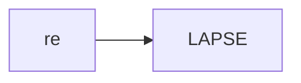
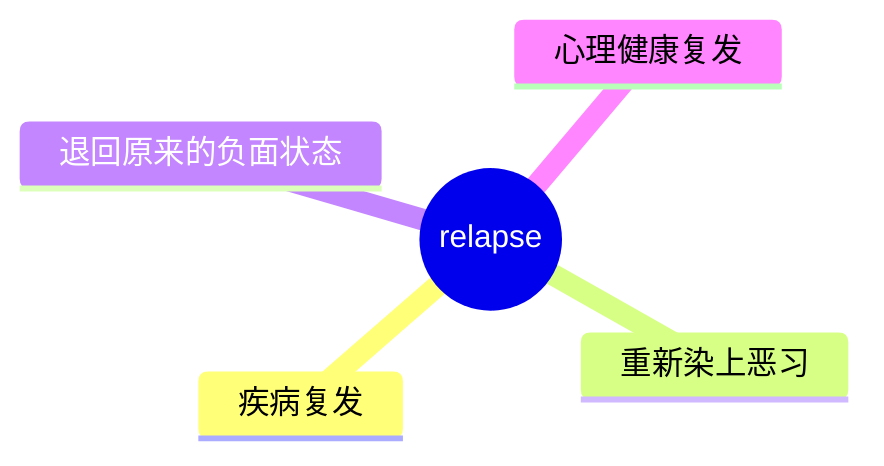
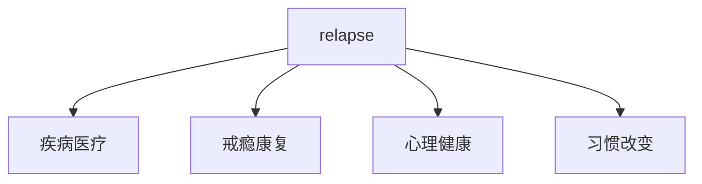
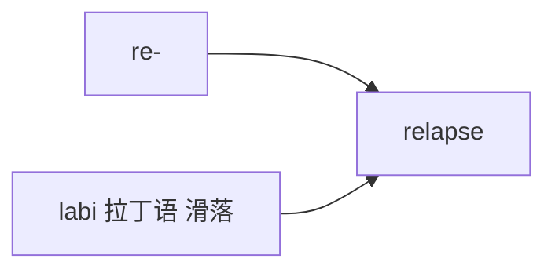

# relapse

## 1. 单词卡片

| 项目 | 内容 |
|---|---|
| 单词 | relapse |
| 词性 | verb / noun |
| 英式音标 | 动词 /rɪˈlæps/，名词 /ˈriːlæps/ |
| 美式音标 | 动词 /rɪˈlæps/，名词 /ˈriːlæps/ |
| 音节 | re-lapse |
| 重音 | 动词重音在第二音节，名词重音在第一音节 |
| 核心意思 | 复发、旧病复发；再次陷入不良状态 |

## 2. 发音拆解



发音提示：

* 作动词时重音在第二个音节 `LAPSE`，读作 /læps/
* 作名词时重音移到第一个音节 `RE`，读作 /riː/
* 这种重音随词性变化的现象和 transplant、record 类似
* 中文近似音只能辅助记忆，不能代替标准发音：可理解为“瑞拉普斯”，但要注意重音随词性变化

## 3. 核心词义



## 4. 不同词性与用法

| 词性 | 英文含义 | 中文意思 | 常见结构 |
|---|---|---|---|
| verb | fall back into illness/bad habit | 复发、再次陷入 | relapse into old habits |
| noun | an instance of relapsing | 复发（现象） | a relapse into addiction |

## 5. 常见使用语境



## 6. 常见搭配

| 搭配 | 中文意思 | 使用场景 |
|---|---|---|
| relapse into | 再次陷入…… | 医疗、习惯 |
| suffer a relapse | 遭遇复发 | 医疗 |
| risk of relapse | 复发的风险 | 医学报告 |
| prevent a relapse | 预防复发 | 医疗、康复 |

## 7. 基础例句

**例句 1**

```text
The patient **relapsed** after stopping the medication too early.
```

这位病人因为过早停药而病情复发了。

**例句 2**

```text
After months of progress, he suffered a **relapse** into old habits.
```

经过几个月的进步后，他又重新陷入了旧习惯。

## 8. 问答例句

**Question**

```text
What are the signs that someone might be about to relapse?
```

一个人可能要复发的迹象是什么？

**Answer**

```text
Increased stress and avoiding support groups are common warning signs.
```

压力增加和回避互助小组是常见的警示信号。

## 9. 工作场景

```text
The therapist helped him develop strategies to avoid a **relapse**.
```

治疗师帮助他制定了避免复发的策略。

## 10. 日常生活场景

```text
She was doing well with her diet until she **relapsed** during the holidays.
```

她的饮食控制一直很顺利，直到假期又故态复萌。

## 11. 词根词缀与构词



| 单词 | 词性 | 中文意思 |
|---|---|---|
| relapse | verb/noun | 复发；再次陷入 |
| lapse | noun/verb | 小失误、疏忽；（时间）流逝 |

`re-` 表示“再次”，词根来自拉丁语 `labi`，意思是“滑落”，和 `lapse`（失误、流逝）是同源词，合起来表示“再次滑落回原来的状态”。

## 12. 同义词辨析

| 单词 | 主要区别 |
|---|---|
| relapse | 强调回到之前的疾病或不良状态，语气较正式，常用于医疗康复语境 |
| regress | 强调整体退步，可用于能力、发展阶段等 |
| backslide | 更口语化，常用于道德或行为上的倒退 |

## 13. 反义词

| 单词 | 中文意思 |
|---|---|
| recover | 康复 |
| improve | 改善 |
| progress | 进步 |

## 14. 易混淆点

```text
relapse (verb) 动词重音在第二音节
```

```text
relapse (noun) 名词重音在第一音节
```

这是英语中常见的“动词重音后移、名词重音前移”现象。

## 15. 常见错误

错误：

```text
He relapsed to smoking after quitting for a year.
```

正确：

```text
He relapsed into smoking after quitting for a year.
```

说明：

`relapse` 表示“再次陷入”时，固定搭配介词 `into`，不用 `to`。

## 16. 记忆方法

```text
re(再次) + lapse(滑落，来自 labi) = relapse（再次滑落回原状态）
```

场景记忆：

```text
The patient relapsed after stopping the medication too early.
这位病人因为过早停药而病情复发了。
```

## 17. 快速复习

| 问题 | 答案 |
|---|---|
| 核心意思是什么 | 复发；再次陷入不良状态 |
| 常见词性是什么 | 动词、名词，重音随词性变化 |
| 常见搭配是什么 | relapse into / suffer a relapse |
| 容易犯的错误是什么 | 介词误用为 to，应为 into |

## 18. 选择题考试

> 请先独立选择答案，不要提前展开答案区。

### 第 1 题

`relapse` 最核心的意思是什么？

- [ ] A. 康复、痊愈
- [ ] B. 复发、再次陷入不良状态
- [ ] C. 进步、提高
- [ ] D. 停止、终止

<details>
<summary>提交选择后查看结果</summary>

- 正确答案：**B. 复发、再次陷入不良状态**
- 对错判断：选择 B 为正确；选择 A、C 或 D 为错误。
- 解析：relapse 表示疾病复发，或者重新陷入之前的不良习惯或状态。

</details>

### 第 2 题

`relapse` 作动词和作名词时，重音有什么区别？

- [ ] A. 完全一样，没有区别
- [ ] B. 动词重音在第二音节，名词重音在第一音节
- [ ] C. 动词重音在第一音节，名词重音在第二音节
- [ ] D. 名词和动词都没有重音

<details>
<summary>提交选择后查看结果</summary>

- 正确答案：**B. 动词重音在第二音节，名词重音在第一音节**
- 对错判断：选择 B 为正确；选择 A、C 或 D 为错误。
- 解析：这是英语中常见的“动词重音后移，名词重音前移”现象，和 transplant、record 等词类似。

</details>

### 第 3 题

下面哪个搭配表示“遭遇复发”？

- [ ] A. suffer a relapse
- [ ] B. enjoy a relapse
- [ ] C. build a relapse
- [ ] D. sell a relapse

<details>
<summary>提交选择后查看结果</summary>

- 正确答案：**A. suffer a relapse**
- 对错判断：选择 A 为正确；选择 B、C 或 D 为错误。
- 解析：suffer a relapse 是医疗语境中的常见搭配，表示遭遇了病情或问题的复发。

</details>

### 第 4 题

下面哪句话语法正确？

- [ ] A. He relapsed to smoking after quitting for a year.
- [ ] B. He relapsed into smoking after quitting for a year.
- [ ] C. He relapsed smoking after quitting for a year.
- [ ] D. He relapsed for smoking after quitting for a year.

<details>
<summary>提交选择后查看结果</summary>

- 正确答案：**B. He relapsed into smoking after quitting for a year.**
- 对错判断：选择 B 为正确；选择 A、C 或 D 为错误。
- 解析：relapse 表示“再次陷入”时固定搭配介词 into，不用 to。

</details>

### 第 5 题

`relapse` 和 `regress` 的主要区别是什么？

- [ ] A. 完全同义，可以随意互换
- [ ] B. relapse 强调回到之前的疾病或不良状态，常用于医疗康复语境；regress 强调整体退步，范围更广
- [ ] C. regress 只能用于身体疾病
- [ ] D. relapse 是名词，regress 是形容词

<details>
<summary>提交选择后查看结果</summary>

- 正确答案：**B. relapse 强调回到之前的疾病或不良状态，常用于医疗康复语境；regress 强调整体退步，范围更广**
- 对错判断：选择 B 为正确；选择 A、C 或 D 为错误。
- 解析：relapse 更常用于疾病或成瘾行为的复发；regress 使用范围更广，可以指能力、发展阶段等各方面的整体退步。

</details>

## 19. 考试结果汇总

完成全部题目后，根据答案区自行统计：

| 正确题数 | 掌握情况 | 建议 |
|---|---|---|
| 5 题 | 已掌握 | 进入下一个单词 |
| 4 题 | 基本掌握 | 复习答错的知识点 |
| 2～3 题 | 掌握不稳 | 重新阅读搭配、例句和易错点 |
| 0～1 题 | 尚未掌握 | 重新学习整个单词课程 |
