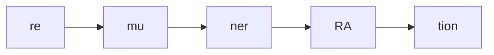
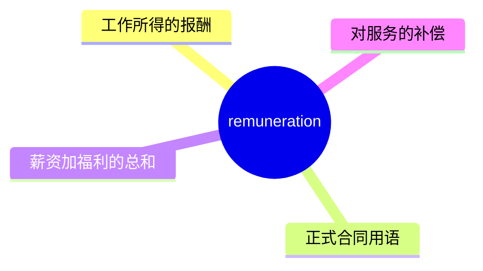
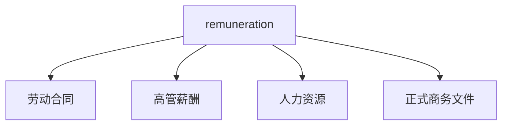
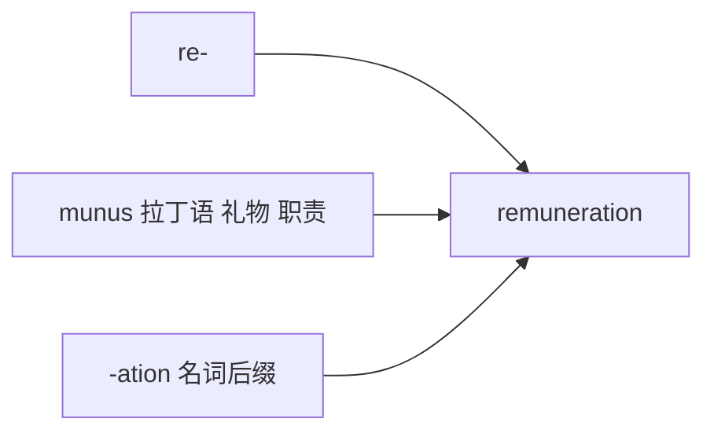

# remuneration

## 1. 单词卡片

| 项目 | 内容 |
|---|---|
| 单词 | remuneration |
| 词性 | noun |
| 英式音标 | /rɪˌmjuːnəˈreɪʃn/ |
| 美式音标 | /rɪˌmjuːnəˈreɪʃn/（基本相同） |
| 音节 | re-mu-ner-a-tion |
| 重音 | 第四音节 `ra` |
| 核心意思 | 报酬、薪酬（正式用语，指工作所得的酬劳） |

## 2. 发音拆解



发音提示：

* 这是一个五音节长单词，主重音在第四个音节 `RA`，读作 /reɪ/
* 第二个音节 `mu` 含有 /j/ 滑音，读作 /mjuː/
* 中间的音节要读得又轻又快，不要每个都用力
* 中文近似音只能辅助记忆，不能代替标准发音：可理解为“瑞缪纳瑞申”，但真实发音要连贯得多

## 3. 核心词义



## 4. 不同词性与用法

| 词性 | 英文含义 | 中文意思 | 常见结构 |
|---|---|---|---|
| noun | payment for work or services | 报酬、薪酬（正式用语） | remuneration package |

## 5. 常见使用语境



## 6. 常见搭配

| 搭配 | 中文意思 | 使用场景 |
|---|---|---|
| a remuneration package | 一份薪酬方案 | 招聘、人力资源 |
| fair remuneration | 合理的报酬 | 正式写作 |
| executive remuneration | 高管薪酬 | 公司治理 |
| remuneration for services | 服务报酬 | 合同、法律 |

## 7. 基础例句

**例句 1**

```text
The job offers a competitive **remuneration** package, including bonuses.
```

这份工作提供有竞争力的薪酬方案，包括奖金。

**例句 2**

```text
Executive **remuneration** has become a controversial topic in recent years.
```

近年来，高管薪酬已经成为一个有争议的话题。

## 8. 问答例句

**Question**

```text
What kind of remuneration can I expect for this consulting project?
```

我在这个咨询项目中能期待什么样的报酬？

**Answer**

```text
The remuneration includes an hourly rate plus a performance bonus.
```

报酬包括按小时计费的费用，加上一笔绩效奖金。

## 9. 工作场景

```text
HR is reviewing the company's **remuneration** policy this quarter.
```

人力资源部门这个季度正在审查公司的薪酬政策。

## 10. 日常生活场景

```text
She negotiated a better **remuneration** package before accepting the job offer.
```

在接受这份工作邀请之前，她协商到了更好的薪酬方案。

## 11. 词根词缀与构词



| 单词 | 词性 | 中文意思 |
|---|---|---|
| remuneration | noun | 报酬、薪酬 |
| remunerate | verb | 支付报酬给（较正式） |
| remunerative | adjective | 有报酬的、有利可图的 |

`re-` 表示“回报”，词根 `munus` 来自拉丁语，意思是“礼物、职责”，合起来表示“对所付出劳动的回报”。

## 12. 同义词辨析

| 单词 | 主要区别 |
|---|---|
| remuneration | 非常正式，常用于合同、法律和人力资源文件 |
| salary | 更常用，通常指固定的月薪或年薪 |
| pay | 最口语化、最通用，适用于任何形式的报酬 |

## 13. 反义词

没有非常固定的反义词。

## 14. 易混淆点

```text
remuneration (noun) 正式用语，泛指所有形式的报酬
```

```text
salary (noun) 更常用，通常特指固定薪资
```

`remuneration` 通常涵盖薪资、奖金、福利等所有形式的报酬总和，而 `salary` 只是其中的一部分。

## 15. 常见错误

错误：

```text
My remuneration is 5000 dollars monthly.
```

正确：

```text
My salary is 5000 dollars monthly.
```

或：

```text
My monthly remuneration package is worth 5000 dollars.
```

说明：

日常口语中描述固定月薪时，更自然的说法是用 `salary`；`remuneration` 语气过于正式，更常出现在合同或薪酬方案的整体描述中，而不是随口说的具体数字。

## 16. 记忆方法

```text
re(回报) + muner(礼物、职责，来自 munus) + ation(名词后缀) = remuneration（对付出的回报）
```

场景记忆：

```text
The job offers a competitive remuneration package, including bonuses.
这份工作提供有竞争力的薪酬方案，包括奖金。
```

## 17. 快速复习

| 问题 | 答案 |
|---|---|
| 核心意思是什么 | 报酬、薪酬（正式用语） |
| 常见词性是什么 | 名词 |
| 常见搭配是什么 | a remuneration package / fair remuneration |
| 和 salary 的区别 | remuneration 涵盖薪资、奖金、福利等总和，语气更正式 |

## 18. 选择题考试

> 请先独立选择答案，不要提前展开答案区。

### 第 1 题

`remuneration` 最核心的意思是什么？

- [ ] A. 惩罚、处罚
- [ ] B. 报酬、薪酬
- [ ] C. 辞职、离职
- [ ] D. 招聘、雇佣

<details>
<summary>提交选择后查看结果</summary>

- 正确答案：**B. 报酬、薪酬**
- 对错判断：选择 B 为正确；选择 A、C 或 D 为错误。
- 解析：remuneration 是正式用语，指工作或服务所获得的报酬，通常涵盖薪资、奖金、福利等总和。

</details>

### 第 2 题

`remuneration` 的主重音在第几个音节？

- [ ] A. 第一个音节
- [ ] B. 第二个音节
- [ ] C. 第四个音节
- [ ] D. 最后一个音节

<details>
<summary>提交选择后查看结果</summary>

- 正确答案：**C. 第四个音节**
- 对错判断：选择 C 为正确；选择 A、B 或 D 为错误。
- 解析：remuneration 是五音节词，主重音落在第四个音节 ra 上，读作 /reɪ/。

</details>

### 第 3 题

下面哪个搭配表示“一份薪酬方案”？

- [ ] A. a remuneration package
- [ ] B. a remuneration vacation
- [ ] C. a remuneration recipe
- [ ] D. a remuneration weather

<details>
<summary>提交选择后查看结果</summary>

- 正确答案：**A. a remuneration package**
- 对错判断：选择 A 为正确；选择 B、C 或 D 为错误。
- 解析：a remuneration package 是招聘和人力资源语境中的常见固定搭配。

</details>

### 第 4 题

下面哪句话更自然？

- [ ] A. My remuneration is 5000 dollars monthly.
- [ ] B. My salary is 5000 dollars monthly.
- [ ] C. My remuneration are 5000 dollars monthly.
- [ ] D. My remuneration is 5000 dollars monthly forever.

<details>
<summary>提交选择后查看结果</summary>

- 正确答案：**B. My salary is 5000 dollars monthly.**
- 对错判断：选择 B 为正确；选择 A、C 或 D 为错误。
- 解析：日常口语中描述固定月薪更自然的说法是用 salary；remuneration 语气过于正式，更常用于薪酬方案的整体描述。

</details>

### 第 5 题

`remuneration` 和 `salary` 的主要区别是什么？

- [ ] A. 完全同义，可以随意互换
- [ ] B. remuneration 涵盖薪资、奖金、福利等总和，语气更正式；salary 通常特指固定薪资
- [ ] C. salary 只能用于兼职工作
- [ ] D. remuneration 是动词，salary 是名词

<details>
<summary>提交选择后查看结果</summary>

- 正确答案：**B. remuneration 涵盖薪资、奖金、福利等总和，语气更正式；salary 通常特指固定薪资**
- 对错判断：选择 B 为正确；选择 A、C 或 D 为错误。
- 解析：remuneration 是一个更全面、更正式的概念，通常出现在合同或人力资源文件中；salary 更常用、更具体，通常指固定的月薪或年薪。

</details>

## 19. 考试结果汇总

完成全部题目后，根据答案区自行统计：

| 正确题数 | 掌握情况 | 建议 |
|---|---|---|
| 5 题 | 已掌握 | 进入下一个单词 |
| 4 题 | 基本掌握 | 复习答错的知识点 |
| 2～3 题 | 掌握不稳 | 重新阅读搭配、例句和易错点 |
| 0～1 题 | 尚未掌握 | 重新学习整个单词课程 |
