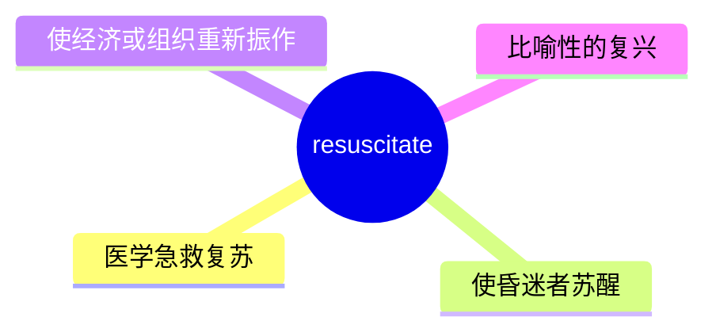
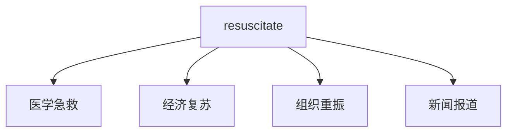
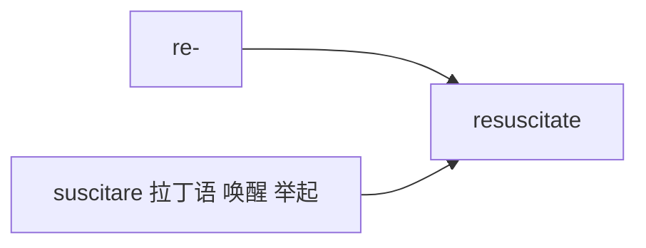

# resuscitate

## 1. 单词卡片

| 项目 | 内容 |
|---|---|
| 单词 | resuscitate |
| 词性 | verb |
| 英式音标 | /rɪˈsʌsɪteɪt/ |
| 美式音标 | /rɪˈsʌsɪteɪt/（基本相同） |
| 音节 | re-sus-ci-tate |
| 重音 | 第二音节 `sus` |
| 核心意思 | 使苏醒、使复苏（尤指从昏迷或近乎死亡的状态）；使重新振作 |

## 2. 发音拆解


发音提示：

* 重音在第二个音节 `SUS`，元音是 /ʌ/，类似单词 cup 中的元音
* 第一个音节 `re` 读作 /rɪ/
* 词尾 `-tate` 读作 /teɪt/，含有完整的双元音
* 中文近似音只能辅助记忆，不能代替标准发音：可理解为“瑞萨西泰特”，但真实发音更紧凑连贯

## 3. 核心词义



## 4. 不同词性与用法

| 词性 | 英文含义 | 中文意思 | 常见结构 |
|---|---|---|---|
| verb | revive someone from unconsciousness/near death | 使苏醒、进行心肺复苏 | resuscitate a patient |
| verb (比喻) | bring back to life/vigor (economy, plan) | 使重新振作、复兴 | resuscitate the economy |

## 5. 常见使用语境



## 6. 常见搭配

| 搭配 | 中文意思 | 使用场景 |
|---|---|---|
| resuscitate a patient | 对病人进行复苏抢救 | 医疗 |
| attempt to resuscitate | 尝试进行复苏 | 医疗新闻 |
| resuscitate the economy | 振兴经济 | 经济、政治 |
| resuscitate a failing business | 挽救一家陷入困境的企业 | 商业 |

## 7. 基础例句

**例句 1**

```text
Paramedics worked for several minutes to **resuscitate** the patient.
```

急救人员努力了好几分钟来对病人进行复苏抢救。

**例句 2**

```text
The new policies are intended to **resuscitate** the struggling economy.
```

这些新政策旨在振兴陷入困境的经济。

## 8. 问答例句

**Question**

```text
Were they able to resuscitate him after the accident?
```

事故发生后他们能让他苏醒过来吗？

**Answer**

```text
Yes, after several attempts, the paramedics successfully resuscitated him.
```

是的，经过几次尝试，急救人员成功让他苏醒了。

## 9. 工作场景

```text
The new CEO is trying to **resuscitate** the company's declining sales.
```

新任首席执行官正试图挽救公司下滑的销售业绩。

## 10. 日常生活场景

```text
He took a CPR class to learn how to **resuscitate** someone in an emergency.
```

他上了心肺复苏课程，学习如何在紧急情况下抢救他人。

## 11. 词根词缀与构词



| 单词 | 词性 | 中文意思 |
|---|---|---|
| resuscitate | verb | 使苏醒、复苏 |
| resuscitation | noun | 复苏、急救（行为） |
| CPR | abbreviation | 心肺复苏术（相关缩写） |

`re-` 表示“再次”，词根 `suscitare` 来自拉丁语，意思是“唤醒、举起”，合起来表示“重新唤醒、使复苏”。

## 12. 同义词辨析

| 单词 | 主要区别 |
|---|---|
| resuscitate | 医学专业用语，强调从近乎死亡的状态中救回，也可比喻用于经济或组织 |
| revive | 更通用，可用于人、植物或抽象事物的“复苏” |
| rescue | 强调从危险中救出，不一定涉及生理上的苏醒 |

## 13. 反义词

没有非常固定的反义词，语境中常与以下概念相对：

| 单词 | 中文意思 |
|---|---|
| kill | 杀死 |
| abandon | 放弃 |

## 14. 易混淆点

```text
resuscitate
```

使苏醒、复苏，医学专业术语，也可用于比喻。

```text
resurrect
```

使复活，常用于宗教或比喻语境，比如复活死者或让某个已经消失的事物重新出现。

两个词都有“重新使……活过来”的意思，但 `resuscitate` 更偏医学急救，`resurrect` 更偏宗教或抽象比喻。

## 15. 常见错误

错误：

```text
The doctors resuscitated to the patient.
```

正确：

```text
The doctors resuscitated the patient.
```

说明：

`resuscitate` 是及物动词，后面直接接宾语，不需要加介词 `to`。

## 16. 记忆方法

```text
re(再次) + suscitate(唤醒、举起，来自 suscitare) = resuscitate（重新唤醒、使复苏）
```

场景记忆：

```text
Paramedics worked for several minutes to resuscitate the patient.
急救人员努力了好几分钟来对病人进行复苏抢救。
```

## 17. 快速复习

| 问题 | 答案 |
|---|---|
| 核心意思是什么 | 使苏醒、复苏；使重新振作 |
| 常见词性是什么 | 动词 |
| 常见搭配是什么 | resuscitate a patient / resuscitate the economy |
| 容易混淆的词是什么 | resurrect（使复活，偏宗教或比喻） |

## 18. 选择题考试

> 请先独立选择答案，不要提前展开答案区。

### 第 1 题

`resuscitate` 最核心的意思是什么？

- [ ] A. 使昏迷、使休克
- [ ] B. 使苏醒、使复苏
- [ ] C. 使疲惫、使虚弱
- [ ] D. 使兴奋、使激动

<details>
<summary>提交选择后查看结果</summary>

- 正确答案：**B. 使苏醒、使复苏**
- 对错判断：选择 B 为正确；选择 A、C 或 D 为错误。
- 解析：resuscitate 指使人从昏迷或近乎死亡的状态中恢复过来，也可比喻用于使经济或组织重新振作。

</details>

### 第 2 题

`resuscitate` 的重音在哪个音节？

- [ ] A. 第一个音节 re
- [ ] B. 第二个音节 sus
- [ ] C. 第三个音节 ci
- [ ] D. 第四个音节 tate

<details>
<summary>提交选择后查看结果</summary>

- 正确答案：**B. 第二个音节 sus**
- 对错判断：选择 B 为正确；选择 A、C 或 D 为错误。
- 解析：resuscitate 重音在第二个音节 sus 上，元音是 /ʌ/。

</details>

### 第 3 题

下面哪个搭配表示“振兴经济”？

- [ ] A. resuscitate the economy
- [ ] B. resuscitate the breakfast
- [ ] C. resuscitate the vacation
- [ ] D. resuscitate the weather

<details>
<summary>提交选择后查看结果</summary>

- 正确答案：**A. resuscitate the economy**
- 对错判断：选择 A 为正确；选择 B、C 或 D 为错误。
- 解析：resuscitate the economy 是比喻用法，表示采取措施使陷入困境的经济重新恢复活力。

</details>

### 第 4 题

下面哪句话语法正确？

- [ ] A. The doctors resuscitated to the patient.
- [ ] B. The doctors resuscitated the patient.
- [ ] C. The doctors resuscitated for the patient.
- [ ] D. The doctors resuscitated with the patient.

<details>
<summary>提交选择后查看结果</summary>

- 正确答案：**B. The doctors resuscitated the patient.**
- 对错判断：选择 B 为正确；选择 A、C 或 D 为错误。
- 解析：resuscitate 是及物动词，后面直接接宾语，不需要加介词。

</details>

### 第 5 题

`resuscitate` 和 `resurrect` 的主要区别是什么？

- [ ] A. 完全同义，可以随意互换
- [ ] B. resuscitate 更偏医学急救，resurrect 更偏宗教或抽象比喻
- [ ] C. resurrect 只能用于医学语境
- [ ] D. resuscitate 是名词，resurrect 是动词

<details>
<summary>提交选择后查看结果</summary>

- 正确答案：**B. resuscitate 更偏医学急救，resurrect 更偏宗教或抽象比喻**
- 对错判断：选择 B 为正确；选择 A、C 或 D 为错误。
- 解析：resuscitate 通常指医学上的急救复苏；resurrect 常用于宗教语境中的“复活”，或比喻让已经消失、废弃的事物重新出现。

</details>

## 19. 考试结果汇总

完成全部题目后，根据答案区自行统计：

| 正确题数 | 掌握情况 | 建议 |
|---|---|---|
| 5 题 | 已掌握 | 进入下一个单词 |
| 4 题 | 基本掌握 | 复习答错的知识点 |
| 2～3 题 | 掌握不稳 | 重新阅读搭配、例句和易错点 |
| 0～1 题 | 尚未掌握 | 重新学习整个单词课程 |
