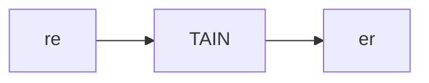
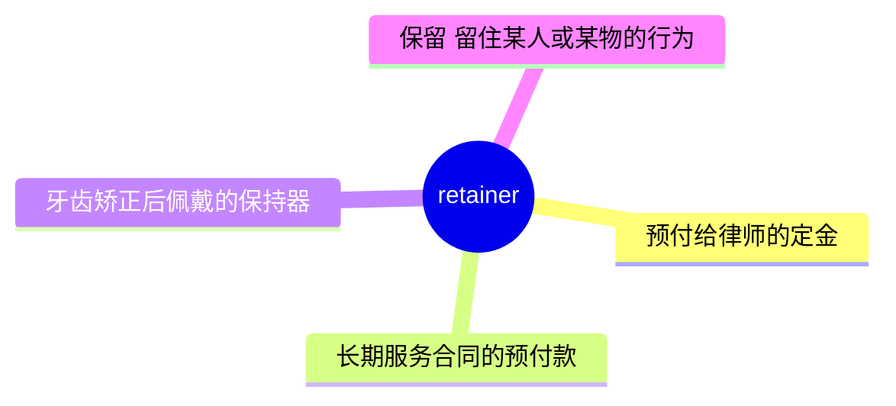
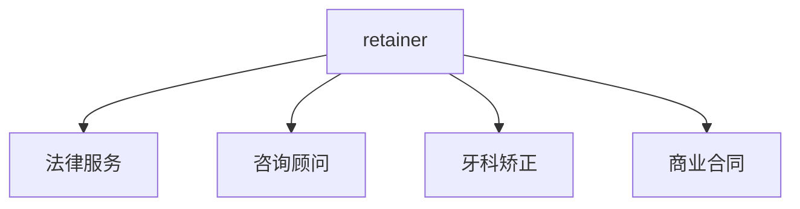
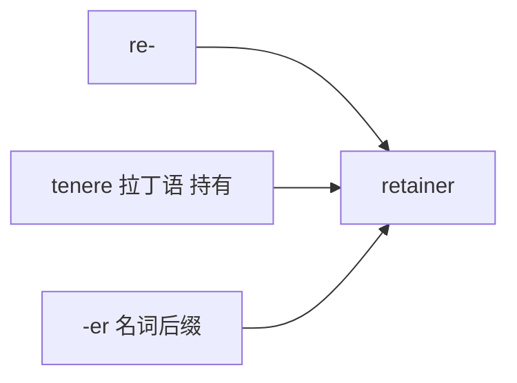

# retainer

## 1. 单词卡片

| 项目 | 内容 |
|---|---|
| 单词 | retainer |
| 词性 | noun |
| 英式音标 | /rɪˈteɪnə/ |
| 美式音标 | /rɪˈteɪnər/ |
| 音节 | re-tain-er |
| 重音 | 第二音节 `tain` |
| 核心意思 | 预付服务费、聘用定金（尤指律师）；牙齿保持器 |

## 2. 发音拆解



发音提示：

* 重音在第二个音节 `TAIN`，读作 /teɪn/，和单词 rain 韵母相同
* 第一个音节 `re` 弱读为 /rɪ/
* 词尾 `-er`，英式基本不发 r 音，读作 /ə/；美式发卷舌音 /ər/
* 中文近似音只能辅助记忆，不能代替标准发音：可理解为“瑞坦纳”，但要注意英美发音的 r 音差异

## 3. 核心词义



## 4. 不同词性与用法

| 词性 | 英文含义 | 中文意思 | 常见结构 |
|---|---|---|---|
| noun (法律/商业) | a fee paid in advance to secure services | 预付服务费、聘用定金 | pay a retainer |
| noun (牙科) | a device to keep teeth in position | 牙齿保持器 | wear a retainer |

## 5. 常见使用语境



## 6. 常见搭配

| 搭配 | 中文意思 | 使用场景 |
|---|---|---|
| pay a retainer | 支付一笔预付定金 | 法律、商业 |
| on retainer | 按预付费方式聘用 | 法律、咨询 |
| a monthly retainer | 每月的预付服务费 | 商业合同 |
| wear a retainer | 佩戴牙齿保持器 | 牙科、日常生活 |

## 7. 基础例句

**例句 1**

```text
The company keeps a lawyer **on retainer** for legal advice.
```

这家公司雇了一位律师，按预付费方式提供法律咨询。

**例句 2**

```text
She has to wear her **retainer** every night after the braces came off.
```

摘掉牙套后，她每晚都必须佩戴牙齿保持器。

## 8. 问答例句

**Question**

```text
How much is the monthly retainer for this consulting service?
```

这项咨询服务每月的预付费是多少？

**Answer**

```text
The monthly retainer is around two thousand dollars.
```

每月的预付费大约是两千美元。

## 9. 工作场景

```text
We negotiated a **retainer** agreement with the marketing agency.
```

我们和这家营销代理公司协商了一份预付服务协议。

## 10. 日常生活场景

```text
He lost his **retainer** at school and had to order a new one.
```

他在学校弄丢了牙齿保持器，不得不重新订做一个。

## 11. 词根词缀与构词



| 单词 | 词性 | 中文意思 |
|---|---|---|
| retainer | noun | 预付服务费；保持器 |
| retain | verb | 保留、留住 |
| retention | noun | 保留、保持（较正式） |

`re-` 表示“反复、持续”，词根 `tenere` 来自拉丁语“持有”，`retainer` 字面意思是“用来保留、留住的东西”，无论是留住律师的服务，还是留住牙齿的位置，都体现了这个核心含义。

## 12. 同义词辨析

| 单词 | 主要区别 |
|---|---|
| retainer | 特指预付定金以保留服务，或牙齿保持器，含义较具体 |
| deposit | 更通用，指任何形式的押金或预付款 |
| advance | 强调预付款项，不一定和“保留服务”直接相关 |

## 13. 反义词

没有非常固定的反义词。

## 14. 易混淆点

```text
retainer (预付服务费 / 牙齿保持器)
```

```text
container (容器)
```

两个词都以 `-tainer` / `-tainer` 结尾，拼写有相似之处，但词根和意思完全不同，注意不要混淆。

## 15. 常见错误

错误：

```text
The lawyer works with retainer.
```

正确：

```text
The lawyer works on retainer.
```

说明：

表示“按预付费方式提供服务”这个固定搭配使用介词 `on`，即 `on retainer`，不用 `with`。

## 16. 记忆方法

```text
re(持续) + tain(持有，来自 tenere) + er(名词后缀) = retainer（用来留住某物或某服务的东西）
```

场景记忆：

```text
The company keeps a lawyer on retainer for legal advice.
这家公司雇了一位律师，按预付费方式提供法律咨询。
```

## 17. 快速复习

| 问题 | 答案 |
|---|---|
| 核心意思是什么 | 预付服务费、聘用定金；牙齿保持器 |
| 常见词性是什么 | 名词 |
| 常见搭配是什么 | pay a retainer / on retainer |
| 容易犯的错误是什么 | 介词误用为 with，应为 on |

## 18. 选择题考试

> 请先独立选择答案，不要提前展开答案区。

### 第 1 题

`retainer` 在法律和商业语境中最核心的意思是什么？

- [ ] A. 辞退通知
- [ ] B. 预付服务费、聘用定金
- [ ] C. 罚款金额
- [ ] D. 合同终止条款

<details>
<summary>提交选择后查看结果</summary>

- 正确答案：**B. 预付服务费、聘用定金**
- 对错判断：选择 B 为正确；选择 A、C 或 D 为错误。
- 解析：retainer 在法律和商业语境中指预先支付的一笔费用，用来保留某项服务，最常见于聘用律师。

</details>

### 第 2 题

`retainer` 的重音在哪个音节？

- [ ] A. 第一个音节 re
- [ ] B. 第二个音节 tain
- [ ] C. 第三个音节 er
- [ ] D. 没有重音

<details>
<summary>提交选择后查看结果</summary>

- 正确答案：**B. 第二个音节 tain**
- 对错判断：选择 B 为正确；选择 A、C 或 D 为错误。
- 解析：retainer 重音在第二个音节 tain 上，读音和单词 rain 韵母相同。

</details>

### 第 3 题

下面哪个搭配表示“按预付费方式聘用”？

- [ ] A. on retainer
- [ ] B. in retainer
- [ ] C. at retainer
- [ ] D. by retainer

<details>
<summary>提交选择后查看结果</summary>

- 正确答案：**A. on retainer**
- 对错判断：选择 A 为正确；选择 B、C 或 D 为错误。
- 解析：on retainer 是固定搭配，表示按预付费方式聘用某人（通常是律师或顾问）提供长期服务。

</details>

### 第 4 题

下面哪句话语法正确？

- [ ] A. The lawyer works with retainer.
- [ ] B. The lawyer works on retainer.
- [ ] C. The lawyer works for retainer only.
- [ ] D. The lawyer works retainer.

<details>
<summary>提交选择后查看结果</summary>

- 正确答案：**B. The lawyer works on retainer.**
- 对错判断：选择 B 为正确；选择 A、C 或 D 为错误。
- 解析：表示“按预付费方式提供服务”固定搭配介词 on，不用 with。

</details>

### 第 5 题

`retainer` 在牙科语境中指的是什么？

- [ ] A. 一种止痛药
- [ ] B. 牙齿保持器
- [ ] C. 补牙材料
- [ ] D. 一种漱口水

<details>
<summary>提交选择后查看结果</summary>

- 正确答案：**B. 牙齿保持器**
- 对错判断：选择 B 为正确；选择 A、C 或 D 为错误。
- 解析：在牙科语境中，retainer 指矫正牙齿后用来保持牙齿位置的保持器。

</details>

## 19. 考试结果汇总

完成全部题目后，根据答案区自行统计：

| 正确题数 | 掌握情况 | 建议 |
|---|---|---|
| 5 题 | 已掌握 | 进入下一个单词 |
| 4 题 | 基本掌握 | 复习答错的知识点 |
| 2～3 题 | 掌握不稳 | 重新阅读搭配、例句和易错点 |
| 0～1 题 | 尚未掌握 | 重新学习整个单词课程 |
