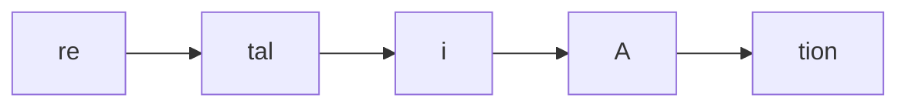
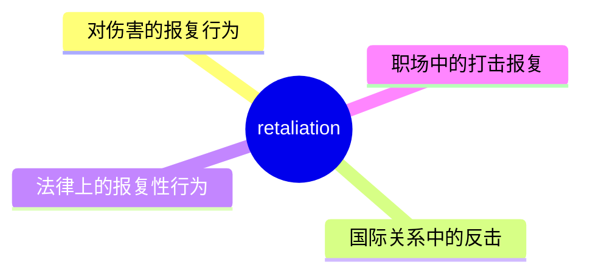
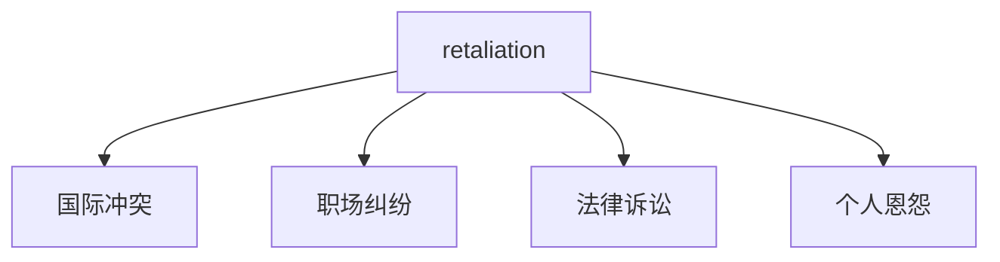
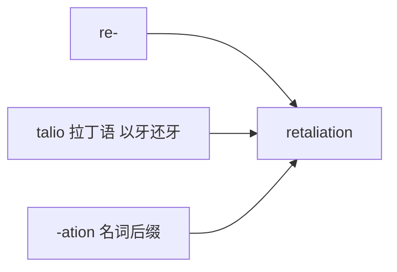

# retaliation

## 1. 单词卡片

| 项目 | 内容 |
|---|---|
| 单词 | retaliation |
| 词性 | noun |
| 英式音标 | /rɪˌtæliˈeɪʃn/ |
| 美式音标 | /rɪˌtæliˈeɪʃn/（基本相同） |
| 音节 | re-tal-i-a-tion |
| 重音 | 第四音节 `a` |
| 核心意思 | 报复、反击（针对先前受到的伤害或攻击） |

## 2. 发音拆解



发音提示：

* 这是一个五音节单词，主重音在第四个音节 `A`，读作 /eɪ/
* 第二个音节 `tal` 读作 /tæl/，元音是 /æ/
* 中间的音节要读得又轻又快
* 中文近似音只能辅助记忆，不能代替标准发音：可理解为“瑞塔利埃申”，但真实发音要连贯得多

## 3. 核心词义



## 4. 不同词性与用法

| 词性 | 英文含义 | 中文意思 | 常见结构 |
|---|---|---|---|
| noun | an act of returning harm for harm | 报复、反击（行为） | in retaliation for |

## 5. 常见使用语境



## 6. 常见搭配

| 搭配 | 中文意思 | 使用场景 |
|---|---|---|
| in retaliation for | 作为对……的报复 | 新闻、正式写作 |
| fear of retaliation | 害怕遭到报复 | 职场、法律 |
| threaten retaliation | 威胁进行报复 | 政治、国际关系 |
| swift retaliation | 迅速的报复 | 新闻报道 |

## 7. 基础例句

**例句 1**

```text
The company fired him **in retaliation for** filing a complaint.
```

公司解雇他是为了报复他提出的投诉。

**例句 2**

```text
Employees are protected by law from **retaliation** for reporting misconduct.
```

员工受到法律保护，不会因举报不当行为而遭到报复。

## 8. 问答例句

**Question**

```text
Why are employees often afraid to report retaliation?
```

为什么员工常常害怕举报打击报复行为？

**Answer**

```text
They fear it could damage their career or lead to further mistreatment.
```

他们担心这可能会损害他们的职业生涯，或导致进一步的不公平对待。

## 9. 工作场景

```text
HR must ensure that no employee faces **retaliation** for speaking up.
```

人力资源部门必须确保没有员工因为发声而遭到打击报复。

## 10. 日常生活场景

```text
He avoided confronting his neighbor for fear of **retaliation**.
```

他因为害怕遭到报复而避免与邻居对峙。

## 11. 词根词缀与构词



| 单词 | 词性 | 中文意思 |
|---|---|---|
| retaliation | noun | 报复、反击 |
| retaliate | verb | 进行报复 |
| retaliatory | adjective | 报复性的 |

`re-` 表示“回、返回”，词根 `talio` 来自拉丁语，意思是“以牙还牙”，合起来表示“对伤害以同样方式回应”。

## 12. 同义词辨析

| 单词 | 主要区别 |
|---|---|
| retaliation | 强调对先前受到的伤害进行回击，语气正式 |
| revenge | 更常用、更情感化，强调个人的报复欲望 |
| reprisal | 常用于军事或政治语境中，指对攻击的正式反击 |

## 13. 反义词

| 单词 | 中文意思 |
|---|---|
| forgiveness | 原谅 |
| reconciliation | 和解 |

## 14. 易混淆点

```text
retaliation (noun) 报复行为
```

```text
retaliate (verb) 进行报复
```

两个词词性不同，`retaliation` 是名词，`retaliate` 是动词，使用时要注意区分。

## 15. 常见错误

错误：

```text
He did retaliation against his boss.
```

正确：

```text
He retaliated against his boss.
```

说明：

表达“报复”这个动作时，应该使用动词 `retaliate`，而不是把名词 `retaliation` 硬套进动词短语里。

## 16. 记忆方法

```text
re(回) + talio(以牙还牙，拉丁语) + ation(名词后缀) = retaliation（以同样方式回击）
```

场景记忆：

```text
The company fired him in retaliation for filing a complaint.
公司解雇他是为了报复他提出的投诉。
```

## 17. 快速复习

| 问题 | 答案 |
|---|---|
| 核心意思是什么 | 报复、反击 |
| 常见词性是什么 | 名词 |
| 常见搭配是什么 | in retaliation for / fear of retaliation |
| 容易犯的错误是什么 | 误用名词代替动词，应使用 retaliate |

## 18. 选择题考试

> 请先独立选择答案，不要提前展开答案区。

### 第 1 题

`retaliation` 最核心的意思是什么？

- [ ] A. 原谅、宽恕
- [ ] B. 报复、反击
- [ ] C. 合作、协作
- [ ] D. 妥协、让步

<details>
<summary>提交选择后查看结果</summary>

- 正确答案：**B. 报复、反击**
- 对错判断：选择 B 为正确；选择 A、C 或 D 为错误。
- 解析：retaliation 指对先前受到的伤害或攻击进行回击的行为。

</details>

### 第 2 题

`retaliation` 的主重音在第几个音节？

- [ ] A. 第一个音节
- [ ] B. 第二个音节
- [ ] C. 第四个音节
- [ ] D. 最后一个音节

<details>
<summary>提交选择后查看结果</summary>

- 正确答案：**C. 第四个音节**
- 对错判断：选择 C 为正确；选择 A、B 或 D 为错误。
- 解析：retaliation 是五音节词，主重音落在第四个音节 a 上，读作 /eɪ/。

</details>

### 第 3 题

下面哪个搭配表示“作为对……的报复”？

- [ ] A. in retaliation for
- [ ] B. in celebration for
- [ ] C. in retaliation with
- [ ] D. in retaliation about

<details>
<summary>提交选择后查看结果</summary>

- 正确答案：**A. in retaliation for**
- 对错判断：选择 A 为正确；选择 B、C 或 D 为错误。
- 解析：in retaliation for 是固定搭配，表示某个行为是作为对之前某件事的报复。

</details>

### 第 4 题

下面哪句话语法正确？

- [ ] A. He did retaliation against his boss.
- [ ] B. He retaliated against his boss.
- [ ] C. He retaliation his boss.
- [ ] D. He was retaliation against his boss.

<details>
<summary>提交选择后查看结果</summary>

- 正确答案：**B. He retaliated against his boss.**
- 对错判断：选择 B 为正确；选择 A、C 或 D 为错误。
- 解析：表达“报复”这个动作应该使用动词 retaliate，而不是把名词 retaliation 硬套进动词短语中。

</details>

### 第 5 题

`retaliation` 和 `revenge` 的主要区别是什么？

- [ ] A. 完全同义，可以随意互换
- [ ] B. retaliation 语气更正式，revenge 更常用、更情感化，强调个人报复欲望
- [ ] C. revenge 只能用于法律文件
- [ ] D. retaliation 是动词，revenge 是形容词

<details>
<summary>提交选择后查看结果</summary>

- 正确答案：**B. retaliation 语气更正式，revenge 更常用、更情感化，强调个人报复欲望**
- 对错判断：选择 B 为正确；选择 A、C 或 D 为错误。
- 解析：retaliation 语气更正式，常出现在法律、职场、国际关系语境中；revenge 更口语化，往往带有强烈的个人情感色彩。

</details>

## 19. 考试结果汇总

完成全部题目后，根据答案区自行统计：

| 正确题数 | 掌握情况 | 建议 |
|---|---|---|
| 5 题 | 已掌握 | 进入下一个单词 |
| 4 题 | 基本掌握 | 复习答错的知识点 |
| 2～3 题 | 掌握不稳 | 重新阅读搭配、例句和易错点 |
| 0～1 题 | 尚未掌握 | 重新学习整个单词课程 |
