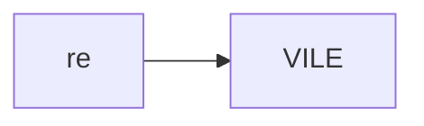
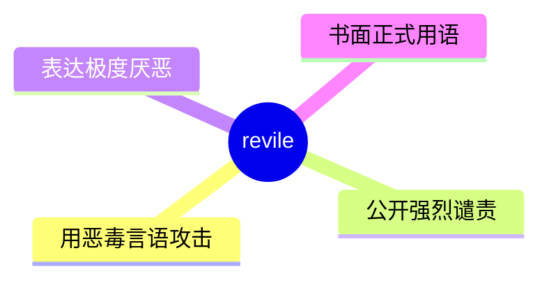
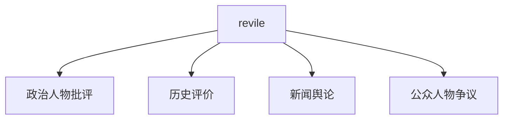
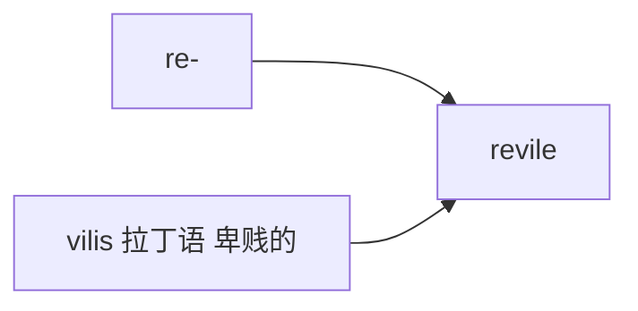

# revile

## 1. 单词卡片

| 项目 | 内容 |
|---|---|
| 单词 | revile |
| 词性 | verb |
| 英式音标 | /rɪˈvaɪl/ |
| 美式音标 | /rɪˈvaɪl/（基本相同） |
| 音节 | re-vile |
| 重音 | 第二音节 `vile` |
| 核心意思 | 辱骂、恶语中伤；强烈谴责 |

## 2. 发音拆解



发音提示：

* 重音在第二个音节 `VILE`，读作 /vaɪl/，和单词 vile（卑劣的）拼写相关、发音相同
* 第一个音节 `re` 弱读为 /rɪ/
* 整体只有两个音节，发音短促
* 中文近似音只能辅助记忆，不能代替标准发音：可理解为“瑞瓦尔”，但真实发音更紧凑

## 3. 核心词义



## 4. 不同词性与用法

| 词性 | 英文含义 | 中文意思 | 常见结构 |
|---|---|---|---|
| verb | criticize in an abusive way | 辱骂、恶语中伤 | revile someone |
| verb (被动常用) | be widely criticized/hated | 被广泛谴责、被唾弃 | be reviled for |

## 5. 常见使用语境



## 6. 常见搭配

| 搭配 | 中文意思 | 使用场景 |
|---|---|---|
| be reviled for | 因……而被唾弃 | 新闻、历史 |
| widely reviled | 被广泛谴责的 | 正式写作 |
| revile someone as | 辱骂某人是…… | 政治、社会评论 |
| a reviled figure | 一个遭人唾弃的人物 | 历史、新闻 |

## 7. 基础例句

**例句 1**

```text
The dictator was **reviled** by his own people for decades of oppression.
```

这名独裁者因数十年的压迫统治而遭到本国人民的唾弃。

**例句 2**

```text
Critics **reviled** the film for its offensive stereotypes.
```

评论家们因这部电影中冒犯性的刻板印象而对其大加抨击。

## 8. 问答例句

**Question**

```text
Why is this historical figure so widely reviled today?
```

为什么这位历史人物今天会遭到如此广泛的唾弃？

**Answer**

```text
He is reviled for the atrocities committed under his rule.
```

他因在其统治期间犯下的暴行而遭到唾弃。

## 9. 工作场景

```text
The company was **reviled** in the press for its poor labor practices.
```

这家公司因其糟糕的劳工做法而遭到媒体的强烈谴责。

## 10. 日常生活场景

```text
He was **reviled** by his neighbors after the incident became public.
```

事件曝光后，他遭到了邻居们的辱骂。

## 11. 词根词缀与构词



| 单词 | 词性 | 中文意思 |
|---|---|---|
| revile | verb | 辱骂、恶语中伤 |
| vile | adjective | 卑劣的、令人厌恶的 |
| reviled | adjective/past tense | 被唾弃的 |

`re-` 在这里加强语气，词根来自拉丁语 `vilis`，意思是“卑贱的”，和形容词 `vile`（卑劣的）是同源词，合起来表示“用言语把某人说得很卑贱”。

## 12. 同义词辨析

| 单词 | 主要区别 |
|---|---|
| revile | 强调用言语猛烈攻击或公开谴责，语气非常强烈，多用于书面语 |
| insult | 更常用、更口语化，程度可轻可重 |
| condemn | 强调正式谴责某种行为，不一定带有辱骂色彩 |

## 13. 反义词

| 单词 | 中文意思 |
|---|---|
| praise | 赞扬 |
| admire | 钦佩 |
| revere | 尊敬、崇敬 |

## 14. 易混淆点

```text
revile (辱骂、猛烈抨击)
```

```text
revive (使复苏)
```

两个词拼写开头相似，中间字母不同，意思完全不同，容易被初学者看错。

## 15. 常见错误

错误：

```text
He was reviled to be a traitor.
```

正确：

```text
He was reviled as a traitor.
```

说明：

`be reviled as` 表示“被斥责为、被骂成”，后面接身份或称呼时使用介词 `as`，不用 `to be`。

## 16. 记忆方法

```text
re(加强) + vile(卑劣的，来自 vilis) = revile（用言语把人说得很卑贱，即辱骂）
```

场景记忆：

```text
The dictator was reviled by his own people for decades of oppression.
这名独裁者因数十年的压迫统治而遭到本国人民的唾弃。
```

## 17. 快速复习

| 问题 | 答案 |
|---|---|
| 核心意思是什么 | 辱骂、恶语中伤；强烈谴责 |
| 常见词性是什么 | 动词 |
| 常见搭配是什么 | be reviled for / widely reviled |
| 容易混淆的词是什么 | revive（使复苏） |

## 18. 选择题考试

> 请先独立选择答案，不要提前展开答案区。

### 第 1 题

`revile` 最核心的意思是什么？

- [ ] A. 赞扬、称赞
- [ ] B. 辱骂、恶语中伤
- [ ] C. 复苏、复活
- [ ] D. 邀请、招待

<details>
<summary>提交选择后查看结果</summary>

- 正确答案：**B. 辱骂、恶语中伤**
- 对错判断：选择 B 为正确；选择 A、C 或 D 为错误。
- 解析：revile 表示用恶毒的言语攻击或公开强烈谴责某人。

</details>

### 第 2 题

`revile` 的重音在哪个音节？

- [ ] A. 第一个音节 re
- [ ] B. 第二个音节 vile
- [ ] C. 两个音节重音相同
- [ ] D. 没有重音

<details>
<summary>提交选择后查看结果</summary>

- 正确答案：**B. 第二个音节 vile**
- 对错判断：选择 B 为正确；选择 A、C 或 D 为错误。
- 解析：revile 重音在第二个音节 vile 上，和形容词 vile（卑劣的）发音相同。

</details>

### 第 3 题

下面哪个搭配表示“因……而被唾弃”？

- [ ] A. be reviled for
- [ ] B. be praised for
- [ ] C. be reviled from
- [ ] D. be reviled about

<details>
<summary>提交选择后查看结果</summary>

- 正确答案：**A. be reviled for**
- 对错判断：选择 A 为正确；选择 B、C 或 D 为错误。
- 解析：be reviled for 是常见搭配，表示因某个原因而被广泛谴责或唾弃。

</details>

### 第 4 题

下面哪句话语法正确？

- [ ] A. He was reviled to be a traitor.
- [ ] B. He was reviled as a traitor.
- [ ] C. He was reviled a traitor.
- [ ] D. He was reviled for be a traitor.

<details>
<summary>提交选择后查看结果</summary>

- 正确答案：**B. He was reviled as a traitor.**
- 对错判断：选择 B 为正确；选择 A、C 或 D 为错误。
- 解析：be reviled as 表示“被斥责为、被骂成”，后面接身份或称呼时使用介词 as。

</details>

### 第 5 题

`revile` 和 `revive` 的主要区别是什么？

- [ ] A. 完全同义，可以随意互换
- [ ] B. revile 表示辱骂、猛烈抨击，revive 表示使复苏、使恢复
- [ ] C. revive 只能用于书面语
- [ ] D. revile 是名词，revive 是动词

<details>
<summary>提交选择后查看结果</summary>

- 正确答案：**B. revile 表示辱骂、猛烈抨击，revive 表示使复苏、使恢复**
- 对错判断：选择 B 为正确；选择 A、C 或 D 为错误。
- 解析：revile 和 revive 拼写开头相似，但意思完全不同，revile 是负面攻击性的词，revive 则表示让某事物重新恢复活力。

</details>

## 19. 考试结果汇总

完成全部题目后，根据答案区自行统计：

| 正确题数 | 掌握情况 | 建议 |
|---|---|---|
| 5 题 | 已掌握 | 进入下一个单词 |
| 4 题 | 基本掌握 | 复习答错的知识点 |
| 2～3 题 | 掌握不稳 | 重新阅读搭配、例句和易错点 |
| 0～1 题 | 尚未掌握 | 重新学习整个单词课程 |
