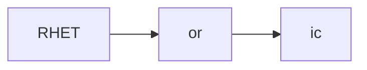
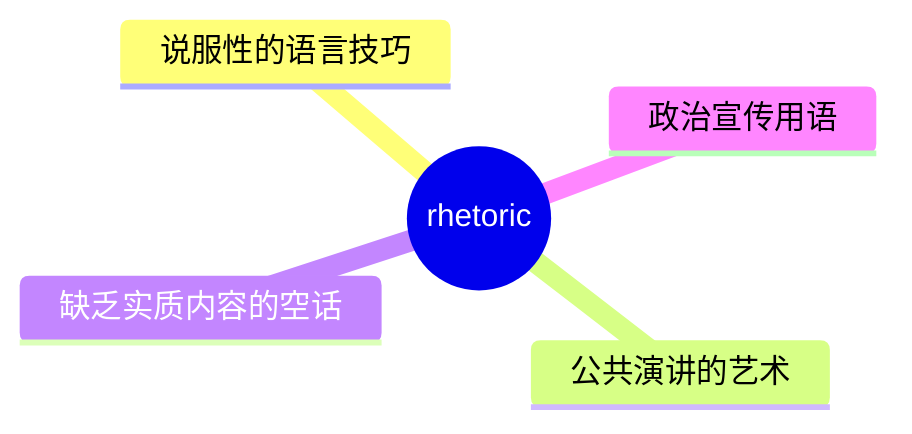
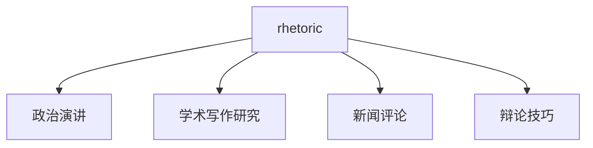
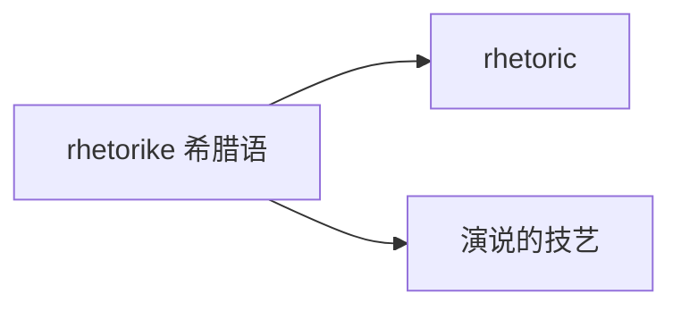

# rhetoric

## 1. 单词卡片

| 项目 | 内容 |
|---|---|
| 单词 | rhetoric |
| 词性 | noun |
| 英式音标 | /ˈretərɪk/ |
| 美式音标 | /ˈretərɪk/（基本相同） |
| 音节 | rhet-or-ic |
| 重音 | 第一音节 `rhet` |
| 核心意思 | 修辞、修辞学；（尤指缺乏实质内容的）花言巧语 |

## 2. 发音拆解



发音提示：

* 重音在第一个音节 `RHET`，元音是短元音 /e/
* 开头的 `rh` 只发一个 /r/ 音，`h` 不发音
* 词尾 `-ic` 读作 /ɪk/
* 中文近似音只能辅助记忆，不能代替标准发音：可理解为“瑞托瑞克”，但真实发音更紧凑

## 3. 核心词义



## 4. 不同词性与用法

| 词性 | 英文含义 | 中文意思 | 常见结构 |
|---|---|---|---|
| noun | the art of persuasive speaking/writing | 修辞（学）、演说艺术 | the art of rhetoric |
| noun (贬义) | language that sounds impressive but lacks substance | 花言巧语、空话 | empty rhetoric |

## 5. 常见使用语境



## 6. 常见搭配

| 搭配 | 中文意思 | 使用场景 |
|---|---|---|
| empty rhetoric | 空洞的花言巧语 | 政治评论 |
| political rhetoric | 政治言辞 | 新闻、政治 |
| the art of rhetoric | 修辞的艺术 | 学术、教育 |
| heated rhetoric | 激烈的言辞 | 新闻报道 |

## 7. 基础例句

**例句 1**

```text
Voters are tired of empty **rhetoric** with no real solutions.
```

选民们已经厌倦了没有实际解决方案的空洞言辞。

**例句 2**

```text
She studied classical **rhetoric** as part of her literature degree.
```

作为文学学位课程的一部分，她学习了古典修辞学。

## 8. 问答例句

**Question**

```text
Why do politicians rely so heavily on rhetoric during campaigns?
```

为什么政治人物在竞选期间如此依赖修辞手法？

**Answer**

```text
Persuasive rhetoric helps them connect emotionally with voters, even without concrete policies.
```

有说服力的修辞能帮助他们在情感上与选民产生共鸣，即使没有具体的政策。

## 9. 工作场景

```text
The CEO's speech was full of **rhetoric** but offered few concrete plans.
```

首席执行官的演讲充满了华丽辞藻，但几乎没有提供具体的计划。

## 10. 日常生活场景

```text
He can see through political **rhetoric** and focuses on actual results.
```

他能看穿政治上的花言巧语，只关注实际的结果。

## 11. 词根词缀与构词



| 单词 | 词性 | 中文意思 |
|---|---|---|
| rhetoric | noun | 修辞、花言巧语 |
| rhetorical | adjective | 修辞性的 |
| rhetorician | noun | 修辞学家、雄辩家（较少见） |

`rhetoric` 来自希腊语 `rhetorike`，意思是“演说的技艺”，古希腊时期这是一门专门研究如何有效说服听众的学科。

## 12. 同义词辨析

| 单词 | 主要区别 |
|---|---|
| rhetoric | 可以是中性的“修辞学”，也可以带贬义指“空话”，取决于语境 |
| eloquence | 强调表达流畅优美，通常是褒义 |
| propaganda | 强调带有偏见或误导性的宣传，贬义更明显 |

## 13. 反义词

没有非常固定的反义词，语境中常与以下概念相对：

| 单词 | 中文意思 |
|---|---|
| substance | 实质内容 |
| action | 实际行动 |

## 14. 易混淆点

```text
rhetoric (noun) 修辞、花言巧语
```

```text
rhetorical (adjective) 修辞性的，比如 rhetorical question 反问句
```

两者词性不同，`rhetoric` 是名词，`rhetorical` 是形容词。

## 15. 常见错误

错误：

```text
His speech was very rhetoric.
```

正确：

```text
His speech was very rhetorical.
```

说明：

`rhetoric` 是名词，不能直接放在系动词后面作表语；表示“……很有修辞色彩的”应使用形容词 `rhetorical`。

## 16. 记忆方法

```text
rhetorike（希腊语，演说的技艺）→ rhetoric（修辞、演说的艺术，也可指空话）
```

场景记忆：

```text
Voters are tired of empty rhetoric with no real solutions.
选民们已经厌倦了没有实际解决方案的空洞言辞。
```

## 17. 快速复习

| 问题 | 答案 |
|---|---|
| 核心意思是什么 | 修辞（学）；花言巧语 |
| 常见词性是什么 | 名词 |
| 常见搭配是什么 | empty rhetoric / political rhetoric |
| 容易混淆的词是什么 | rhetorical（修辞性的，形容词） |

## 18. 选择题考试

> 请先独立选择答案，不要提前展开答案区。

### 第 1 题

`rhetoric` 最核心的意思是什么？

- [ ] A. 沉默、无言
- [ ] B. 修辞（学）；花言巧语
- [ ] C. 数据、统计
- [ ] D. 法律、法规

<details>
<summary>提交选择后查看结果</summary>

- 正确答案：**B. 修辞（学）；花言巧语**
- 对错判断：选择 B 为正确；选择 A、C 或 D 为错误。
- 解析：rhetoric 可以指中性的“修辞学”，也可以带贬义指听起来动人但缺乏实质内容的“空话”。

</details>

### 第 2 题

`rhetoric` 开头的 `rh` 应该怎么读？

- [ ] A. 读作 /r/，h 不发音
- [ ] B. 读作 /h/，r 不发音
- [ ] C. 两个字母都发音
- [ ] D. 都不发音

<details>
<summary>提交选择后查看结果</summary>

- 正确答案：**A. 读作 /r/，h 不发音**
- 对错判断：选择 A 为正确；选择 B、C 或 D 为错误。
- 解析：rhetoric 开头的 rh 组合只发一个 /r/ 音，h 是不发音字母。

</details>

### 第 3 题

下面哪个搭配表示“空洞的花言巧语”？

- [ ] A. empty rhetoric
- [ ] B. full rhetoric
- [ ] C. heavy rhetoric of
- [ ] D. rhetoric empty

<details>
<summary>提交选择后查看结果</summary>

- 正确答案：**A. empty rhetoric**
- 对错判断：选择 A 为正确；选择 B、C 或 D 为错误。
- 解析：empty rhetoric 是常见搭配，形容听起来动人但没有实际内容的言辞。

</details>

### 第 4 题

下面哪句话语法正确？

- [ ] A. His speech was very rhetoric.
- [ ] B. His speech was very rhetorical.
- [ ] C. His speech was very rhetorician.
- [ ] D. His speech was rhetoric very.

<details>
<summary>提交选择后查看结果</summary>

- 正确答案：**B. His speech was very rhetorical.**
- 对错判断：选择 B 为正确；选择 A、C 或 D 为错误。
- 解析：rhetoric 是名词，不能直接放在系动词后面作表语，表示形容词含义应使用 rhetorical。

</details>

### 第 5 题

`rhetoric` 和 `propaganda` 的主要区别是什么？

- [ ] A. 完全同义，可以随意互换
- [ ] B. rhetoric 可以是中性的修辞学，也可以带贬义；propaganda 贬义更明显，强调带偏见或误导性的宣传
- [ ] C. propaganda 只能用于褒义
- [ ] D. rhetoric 是动词，propaganda 是名词

<details>
<summary>提交选择后查看结果</summary>

- 正确答案：**B. rhetoric 可以是中性的修辞学，也可以带贬义；propaganda 贬义更明显，强调带偏见或误导性的宣传**
- 对错判断：选择 B 为正确；选择 A、C 或 D 为错误。
- 解析：rhetoric 的褒贬取决于语境，可以是中性的修辞学研究，也可以贬义指空话；propaganda 几乎总是带有负面色彩，强调有意误导或偏袒的宣传。

</details>

## 19. 考试结果汇总

完成全部题目后，根据答案区自行统计：

| 正确题数 | 掌握情况 | 建议 |
|---|---|---|
| 5 题 | 已掌握 | 进入下一个单词 |
| 4 题 | 基本掌握 | 复习答错的知识点 |
| 2～3 题 | 掌握不稳 | 重新阅读搭配、例句和易错点 |
| 0～1 题 | 尚未掌握 | 重新学习整个单词课程 |
