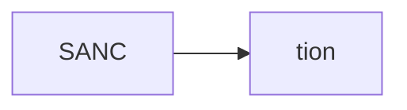
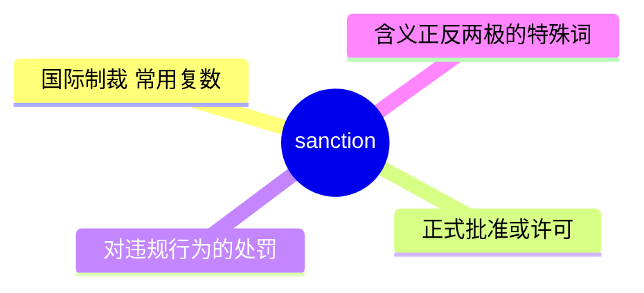
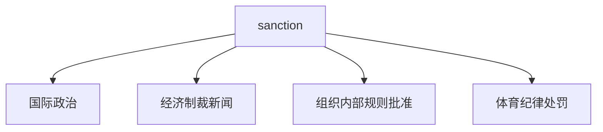
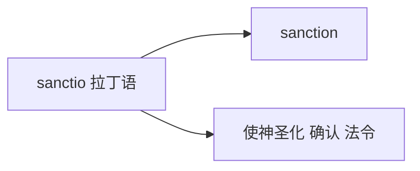

# sanction

## 1. 单词卡片

| 项目 | 内容 |
|---|---|
| 单词 | sanction |
| 词性 | noun / verb |
| 英式音标 | /ˈsæŋkʃn/ |
| 美式音标 | /ˈsæŋkʃn/（基本相同） |
| 音节 | sanc-tion |
| 重音 | 第一音节 `sanc` |
| 核心意思 | 制裁、处罚（常用复数）；正式批准、许可 |

## 2. 发音拆解



发音提示：

* 重音在第一个音节 `SANC`，读作 /sæŋk/，注意 `n` 在这里读作鼻音 /ŋ/，和 `bank` 中的 n 类似
* 词尾 `-tion` 读作 /ʃn/
* 整体只有两个音节
* 中文近似音只能辅助记忆，不能代替标准发音：可理解为“桑克申”，但真实发音更紧凑连贯

## 3. 核心词义



## 4. 不同词性与用法

| 词性 | 英文含义 | 中文意思 | 常见结构 |
|---|---|---|---|
| noun (常用复数) | official penalties against a country/entity | 制裁 | impose sanctions on |
| noun | official approval or permission | 批准、许可（较少见） | with the sanction of |
| verb | to give official approval | 批准、认可 | sanction an action |
| verb | to impose a penalty | 对……实施制裁 | sanction a country |

## 5. 常见使用语境



## 6. 常见搭配

| 搭配 | 中文意思 | 使用场景 |
|---|---|---|
| impose sanctions on | 对……实施制裁 | 国际政治、新闻 |
| lift sanctions | 解除制裁 | 国际政治 |
| economic sanctions | 经济制裁 | 新闻报道 |
| with official sanction | 得到官方批准 | 正式写作 |

## 7. 基础例句

**例句 1**

```text
The UN imposed **sanctions** on the country over human rights violations.
```

联合国因人权侵犯问题对该国实施了制裁。

**例句 2**

```text
The project could not proceed without the government's **sanction**.
```

没有政府的批准，这个项目无法推进。

## 8. 问答例句

**Question**

```text
When were the sanctions against this country first imposed?
```

对这个国家的制裁最初是什么时候实施的？

**Answer**

```text
The sanctions were first imposed several years ago after the conflict began.
```

制裁是在冲突开始后几年前首次实施的。

## 9. 工作场景

```text
The new policy must be **sanctioned** by senior management before rollout.
```

新政策必须先获得高层管理人员的批准才能推行。

## 10. 日常生活场景

```text
The referee **sanctioned** the player for the foul during the match.
```

裁判因这名球员在比赛中的犯规而对其进行了处罚。

## 11. 词根词缀与构词



| 单词 | 词性 | 中文意思 |
|---|---|---|
| sanction | noun/verb | 制裁；批准 |
| sanctity | noun | 神圣性（相关词） |
| sacred | adjective | 神圣的（相关词） |

`sanction` 来自拉丁语 `sanctio`，最初与“使神圣化、正式确认”有关，后来引申出两个看似相反的含义：正式批准，以及对违规的正式处罚。

## 12. 同义词辨析

| 单词 | 主要区别 |
|---|---|
| sanction (制裁义) | 强调正式的、有组织的惩罚措施，常用于国际关系 |
| penalty | 更通用，指任何形式的处罚，范围更广 |
| sanction (批准义) | 强调正式认可或许可，语气较正式 |
| approve | 更常用、更通用的“批准”表达 |

## 13. 反义词

| 单词 | 中文意思 |
|---|---|
| ban（作为惩罚的反义） | 完全禁止（含义上不完全对立，视语境而定） |
| approval（制裁义的反义） | 认可 |

## 14. 易混淆点

```text
sanction 作“制裁”解时通常带负面色彩，常用复数 sanctions
```

```text
sanction 作“批准”解时带正面色彩，通常用单数
```

这是英语中少见的“一词兼具褒贬两义”的例子，必须根据上下文判断具体含义。

## 15. 常见错误

错误：

```text
The country was sanction by the UN.
```

正确：

```text
The country was sanctioned by the UN.
```

说明：

`sanction` 作动词的被动语态需要加 `-ed`，写作 `sanctioned`，不能直接用原形做被动语态。

## 16. 记忆方法

```text
sanctio（拉丁语，正式确认）→ sanction（可以是正式批准，也可以是正式的惩罚措施）
```

场景记忆：

```text
The UN imposed sanctions on the country over human rights violations.
联合国因人权侵犯问题对该国实施了制裁。
```

## 17. 快速复习

| 问题 | 答案 |
|---|---|
| 核心意思是什么 | 制裁（常用复数）；正式批准 |
| 常见词性是什么 | 名词、动词 |
| 常见搭配是什么 | impose sanctions on / with official sanction |
| 特殊之处是什么 | 一个词同时具有“惩罚”和“批准”两个相反含义 |

## 18. 选择题考试

> 请先独立选择答案，不要提前展开答案区。

### 第 1 题

`sanction` 用复数形式 `sanctions` 时，最核心的意思是什么？

- [ ] A. 奖励
- [ ] B. 制裁
- [ ] C. 邀请
- [ ] D. 建议

<details>
<summary>提交选择后查看结果</summary>

- 正确答案：**B. 制裁**
- 对错判断：选择 B 为正确；选择 A、C 或 D 为错误。
- 解析：sanctions 常用复数形式，指国家或组织之间正式的处罚性制裁措施。

</details>

### 第 2 题

`sanction` 中的 `n` 在第一个音节里应该怎么读？

- [ ] A. 读作 /n/
- [ ] B. 读作鼻音 /ŋ/
- [ ] C. 不发音
- [ ] D. 读作 /m/

<details>
<summary>提交选择后查看结果</summary>

- 正确答案：**B. 读作鼻音 /ŋ/**
- 对错判断：选择 B 为正确；选择 A、C 或 D 为错误。
- 解析：sanction 第一个音节中的 n 在 k 音前读作鼻音 /ŋ/，和 bank 中的 n 发音方式相同。

</details>

### 第 3 题

下面哪个搭配表示“对……实施制裁”？

- [ ] A. impose sanctions on
- [ ] B. impose breakfast on
- [ ] C. impose sanctions to
- [ ] D. impose sanctions with

<details>
<summary>提交选择后查看结果</summary>

- 正确答案：**A. impose sanctions on**
- 对错判断：选择 A 为正确；选择 B、C 或 D 为错误。
- 解析：impose sanctions on 是国际政治新闻中的常见固定搭配。

</details>

### 第 4 题

下面哪句话语法正确？

- [ ] A. The country was sanction by the UN.
- [ ] B. The country was sanctioned by the UN.
- [ ] C. The country was sanctioning by the UN.
- [ ] D. The country sanction by the UN.

<details>
<summary>提交选择后查看结果</summary>

- 正确答案：**B. The country was sanctioned by the UN.**
- 对错判断：选择 B 为正确；选择 A、C 或 D 为错误。
- 解析：sanction 作动词的被动语态需要用过去分词 sanctioned，不能直接用原形。

</details>

### 第 5 题

`sanction` 这个词的特殊之处是什么？

- [ ] A. 它只能作动词使用
- [ ] B. 它同时具有“惩罚性制裁”和“正式批准”两个相反的含义
- [ ] C. 它是一个不能用于正式写作的俚语
- [ ] D. 它没有任何常见搭配

<details>
<summary>提交选择后查看结果</summary>

- 正确答案：**B. 它同时具有“惩罚性制裁”和“正式批准”两个相反的含义**
- 对错判断：选择 B 为正确；选择 A、C 或 D 为错误。
- 解析：sanction 是英语中少见的“一词兼具褒贬两义”的例子，既可以表示正式的处罚性制裁，也可以表示正式的批准或许可，需要根据上下文判断。

</details>

## 19. 考试结果汇总

完成全部题目后，根据答案区自行统计：

| 正确题数 | 掌握情况 | 建议 |
|---|---|---|
| 5 题 | 已掌握 | 进入下一个单词 |
| 4 题 | 基本掌握 | 复习答错的知识点 |
| 2～3 题 | 掌握不稳 | 重新阅读搭配、例句和易错点 |
| 0～1 题 | 尚未掌握 | 重新学习整个单词课程 |
